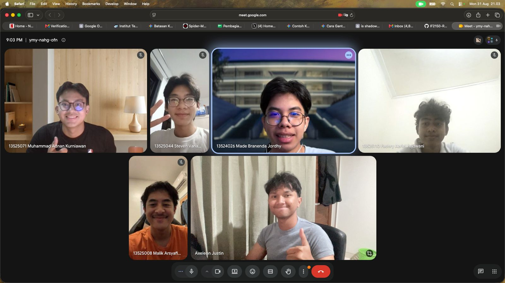
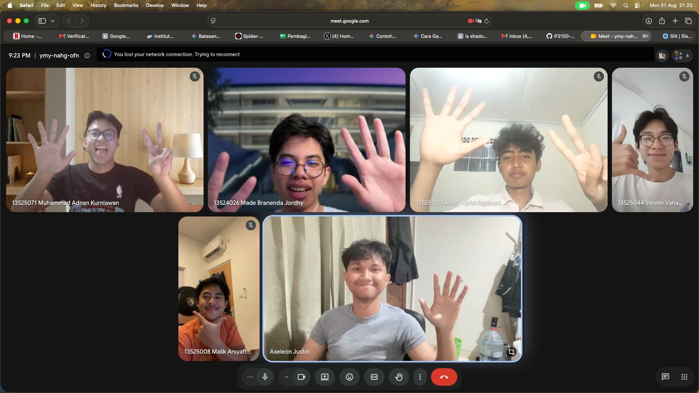

# Form Asistensi

## Tugas Besar IF2150 - Rekayasa Perangkat Lunak

| Informasi | Keterangan |
| --- | --- |
| **Hari** | Senin |
| **Tanggal** | 31/08/2026 |
| **Kelas** | K02 |
| **Nomor Kelompok** | G09 |
| **Nama Kelompok** | Cumlaude |
| **Nama Perangkat Lunak** | SEHATI (Sistem Elektronik Pelayanan Kesehatan Terintegrasi)  |
| **Dokumen** | K02_G09_TB.md (Tugas 1 - Topic Brainstorming)  |

### Anggota Kelompok

| NIM | Nama |
| --- | --- |
| 13525008 | Malik Arsyafiandra Madani |
| 13525044 | Steven Vanako |
| 13525071 | Muhammad Adnan Kurniawan |
| 13525074 | Axeleon Justin Algianto |
| 13525110 | Fachry Azriel Fajdwani |

### Catatan

| Catatan |
| --- |
| 1. Scope permasalahan yang ingin diselesaikan diperkecil karena nanti akan diminta banyak kasus-kasus. Kalau terlalu luas scopenya, takut terlalu bercabang |
| 2. Fokus hanya ke 2-3 aktor saja, terutama mereka yang langsung berhubungan dengan sistem|
| 3. Milestone-milestone selanjutnya bakal makin mengerucut |
| 4. Kebutuhan awal-pengguna berjumlah di bawah 20, belasan saja |
| 5. Produk selesai sebelum UAS |

## Dokumentasi

  

  <i>Gambar 1. Dokumentasi awal.</i>

  

  <i>Gambar 2. Dokumentasi akhir.</i>

