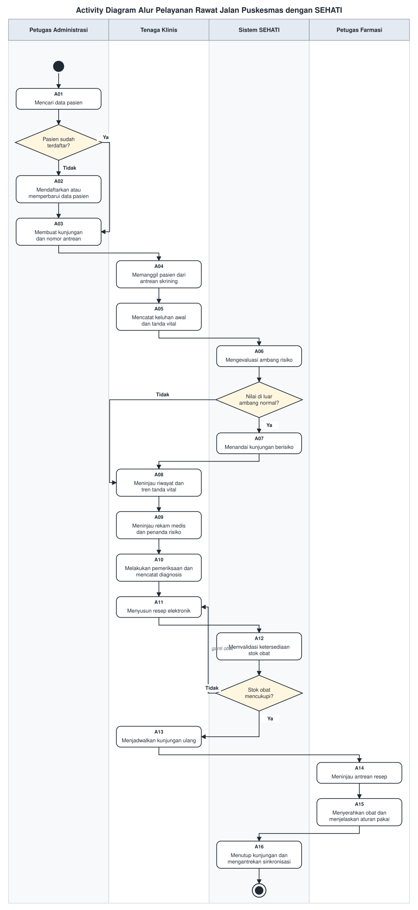

<h1>
IF2150 REKAYASA PERANGKAT LUNAK
 
TUGAS 1
 
TOPIC BRAINSTORMING
</h1>
 

## SEHATI - Sistem Elektronik Pelayanan Kesehatan Terintegrasi

### Untuk: *[Nama Asisten]*

Dipersiapkan oleh:
| Informasi | Keterangan |
| --- | --- |
| Kelas | K02 |
| Kelompok | G09 |

| NIM | Nama |
|---|---|
| 13525008 | Malik Arsyafiandra Madani |
| 13525044 | Steven Vanako |
| 13525071 | Muhammad Adnan Kurniawan |
| 13525074 | Axeleon Justin Algianto |
| *[NIM 5]* | *[Nama Anggota 5]* |
---

 
 

# BAB 1: Analisis Permasalahan

## 1.1 Latar Belakang Masalah

Pusat Kesehatan Masyarakat (Puskesmas) merupakan ujung tombak Fasilitas Kesehatan Tingkat Pertama (FKTP) di Indonesia. Berdasarkan Profil Kesehatan Indonesia 2024 yang diterbitkan Kementerian Kesehatan, terdapat 10.268 puskesmas yang tersebar di seluruh Indonesia, terdiri atas 6.016 puskesmas non rawat inap dan 4.252 puskesmas rawat inap. Fasilitas inilah yang menjadi titik kontak pertama masyarakat dengan layanan kesehatan, sekaligus tempat sebagian besar kegiatan promotif dan preventif dijalankan.

Sayangnya, kapasitas administratif puskesmas belum sebanding dengan beban tugas tersebut. Sebagian besar puskesmas, terutama di kabupaten dan daerah kepulauan, masih mengandalkan **pencatatan berbasis kertas** untuk rekam medis, pengelolaan antrean, resep, dan stok obat. Berkas rekam medis disimpan dalam rak *family folder*, ditulis tangan oleh dokter, lalu diketik ulang secara manual ketika laporan bulanan harus dikirim ke dinas kesehatan. Model kerja seperti ini menimbulkan tiga persoalan yang saling berkait: waktu tunggu pasien menjadi panjang, riwayat kesehatan pasien terputus antar-kunjungan, dan data agregat yang seharusnya bisa dipakai untuk deteksi dini justru tidak pernah terbentuk.

Dampak paling nyata dari terputusnya riwayat kesehatan pasien terlihat pada penanganan **Penyakit Tidak Menular (PTM)**. Riset Kesehatan Dasar (Riskesdas) 2018 mencatat prevalensi hipertensi pada penduduk berusia 18 tahun ke atas mencapai **34,1%** berdasarkan hasil pengukuran tekanan darah. Namun dari angka tersebut, hanya **8,8%** yang benar-benar terdiagnosis. Artinya, sebagian besar penderita hipertensi di Indonesia tidak pernah tahu bahwa dirinya sakit, sehingga tidak pernah menjalani pengobatan. Lebih jauh lagi, di antara mereka yang sudah terdiagnosis, 13,3% tidak meminum obat sama sekali dan 32,3% tidak meminum obat secara teratur. Sebagian besar penderita ini sebenarnya *pernah* datang ke puskesmas dan *pernah* diukur tekanan darahnya, tetapi karena hasil pengukuran hanya dicatat di lembar kertas kunjungan hari itu, tidak ada mekanisme apa pun yang menghubungkan angka tinggi hari ini dengan angka tinggi tiga bulan lalu.

Persoalan serupa terjadi pada kesehatan ibu. Hasil Long Form Sensus Penduduk 2020 (BPS) menunjukkan Angka Kematian Ibu (AKI) Indonesia sebesar **189 per 100.000 kelahiran hidup**, masih jauh dari target SDGs 3.1 yaitu di bawah 70 per 100.000 kelahiran hidup pada 2030. Pemantauan kehamilan berisiko sangat bergantung pada kelengkapan dan kesinambungan catatan kunjungan, sesuatu yang sulit dijamin dengan berkas kertas yang mudah terselip atau hilang.

### Keterkaitan dengan SDGs

Kelompok kami memilih **SDG 3: *Good Health and Well-being* (Kehidupan Sehat dan Sejahtera)** sebagai landasan solusi. Secara spesifik, perangkat lunak yang kami usulkan menyasar tiga target berikut:

| Target SDG 3 | Rumusan Target | Keterkaitan dengan Solusi |
| :--- | :--- | :--- |
| **3.4** | Mengurangi sepertiga angka kematian dini akibat penyakit tidak menular melalui pencegahan dan pengobatan | Sistem menyimpan riwayat tanda vital lintas kunjungan dan secara otomatis menandai pasien yang hasil pengukurannya berada di luar ambang normal, sehingga deteksi dini tidak lagi bergantung pada ingatan petugas |
| **3.8** | Mencapai cakupan kesehatan semesta (*Universal Health Coverage*), termasuk akses pelayanan kesehatan dasar yang bermutu | Sistem memangkas waktu administrasi di FKTP sehingga waktu tenaga kesehatan dapat dialihkan untuk pelayanan, dan mutu pencatatan menjadi seragam |
| **3.1** | Mengurangi Angka Kematian Ibu hingga di bawah 70 per 100.000 kelahiran hidup | Riwayat kunjungan yang tersimpan utuh dan dapat ditelusuri memudahkan pemantauan pasien dengan kondisi berisiko, termasuk ibu hamil |

### Urgensi

Masalah ini sangat mendesak untuk segera diselesaikan, terutama karena adanya tuntutan regulasi. Peraturan Menteri Kesehatan Nomor 24 Tahun 2022 mewajibkan **seluruh** fasilitas pelayanan kesehatan (termasuk puskesmas, klinik, dan praktik mandiri) untuk menyelenggarakan Rekam Medis Elektronik (RME) selambat-lambatnya **31 Desember 2023**. Mengingat tenggat waktu tersebut sudah terlewat, fasilitas yang belum siap berisiko mendapat sanksi administratif hingga pencabutan akreditasi.

Di samping masalah regulasi, penundaan digitalisasi juga memperburuk celah deteksi dini Penyakit Tidak Menular (PTM). Dengan prevalensi hipertensi sebesar 34,1% dan tingkat diagnosis yang hanya 8,8%, setiap data pasien yang tidak dicatat dengan baik berarti hilangnya kesempatan deteksi dini. Akibatnya, komplikasi penyakit seperti stroke atau gagal ginjal berisiko meningkat dan memakan biaya penanganan yang jauh lebih mahal. 

Meskipun kebutuhannya sangat mendesak, solusi yang tersedia saat ini belum sepenuhnya ramah untuk puskesmas kecil. Sebagian besar Sistem Informasi Manajemen Puskesmas (SIMPUS) komersial membebankan biaya langganan dan sangat bergantung pada internet yang stabil. Hal ini tentu menyulitkan puskesmas di daerah yang infrastrukturnya masih terbatas.

## 1.2 Analisis Kondisi Saat Ini

### Alur proses yang berjalan saat ini

Berdasarkan pengamatan terhadap praktik umum di puskesmas non rawat inap, alur pelayanan rawat jalan berjalan sebagai berikut.

1. **Pendaftaran.** Pasien datang, mengantre di loket, lalu menyebutkan nama atau menyerahkan kartu berobat. Petugas mencari berkas rekam medis pasien secara manual di rak penyimpanan. Untuk pasien baru, petugas menuliskan data diri pada formulir kertas dan membuatkan berkas baru. Nomor antrean poli diberikan secara manual.
2. **Skrining awal.** Perawat memanggil pasien, mengukur tanda vital (tekanan darah, berat badan, tinggi badan, suhu), lalu menuliskan hasilnya pada lembar kunjungan hari itu.
3. **Pemeriksaan.** Dokter membaca berkas, melakukan pemeriksaan, lalu menuliskan anamnesis, diagnosis, dan tindakan dengan tulisan tangan. Resep ditulis pada lembar terpisah dan diserahkan kepada pasien.
4. **Farmasi.** Pasien membawa resep ke apotek puskesmas. Apoteker membaca resep, mengecek ketersediaan obat di lemari secara fisik, menyiapkan obat, lalu mencatat pengeluaran obat di buku stok.
5. **Pelaporan.** Pada akhir bulan, petugas merekap seluruh lembar kunjungan secara manual, lalu mengetik ulang angkanya ke dalam format laporan yang diminta dinas kesehatan.

### Kesenjangan (*gap*) yang teridentifikasi

Dari alur di atas, kami mengidentifikasi tujuh kesenjangan yang akan menjadi sasaran perangkat lunak kami.

| Kode | Kesenjangan | Penjelasan | Dampak |
| :--- | :--- | :--- | :--- |
| **G-01** | Pencarian berkas rekam medis lambat | Berkas dicari manual di rak berdasarkan nomor atau nama; kesalahan penempatan membuat berkas sulit ditemukan | Waktu tunggu pasien bertambah, antrean menumpuk di jam sibuk |
| **G-02** | Berkas hilang, rusak, atau tidak terbaca | Kertas rentan terhadap kelembapan dan kehilangan; tulisan tangan dokter sering sulit dibaca oleh apoteker | Risiko kesalahan pemberian obat dan riwayat pasien yang tidak dapat direkonstruksi |
| **G-03** | Riwayat kesehatan tidak berkesinambungan | Setiap kunjungan dicatat sebagai lembar terpisah tanpa mekanisme membandingkan antar-waktu | Tren kondisi pasien (misal tekanan darah yang terus naik) tidak pernah terlihat |
| **G-04** | Tidak ada mekanisme deteksi dini | Penandaan pasien berisiko sepenuhnya bergantung pada kejelian dan ingatan petugas | Pasien berisiko PTM lolos dari pemantauan, sejalan dengan temuan Riskesdas 2018 |
| **G-05** | Stok obat tidak terpantau secara *real-time* | Pengecekan stok dilakukan secara fisik dan pencatatan dilakukan menyusul | Terjadi kekosongan obat mendadak dan obat kedaluwarsa yang tidak terdeteksi |
| **G-06** | Rekapitulasi laporan manual dan lambat | Data harus dibaca ulang dari ratusan lembar kertas, lalu diketik ulang | Laporan terlambat, rawan salah hitung, dan menyita waktu tenaga kesehatan |
| **G-07** | Solusi digital eksisting kurang sesuai konteks | SIMPUS komersial umumnya berbasis awan, berlangganan, dan mengasumsikan internet stabil | Puskesmas kecil dan daerah dengan internet terbatas tidak dapat mengadopsinya |

### Perbandingan dengan solusi yang sudah ada

| Solusi | Kelebihan | Keterbatasan terhadap konteks masalah |
| :--- | :--- | :--- |
| **Pencatatan manual (kertas)** | Tidak butuh perangkat, tidak butuh pelatihan, tidak bergantung listrik | Seluruh kesenjangan G-01 sampai G-06 berasal dari model ini |
| **SIMPUS komersial berbasis awan** | Fitur lengkap, terintegrasi dengan sistem nasional, ada dukungan teknis | Berbayar per bulan, membutuhkan internet stabil, layanan terhenti saat koneksi putus (G-07) |
| **Spreadsheet mandiri (Excel)** | Gratis, sudah dikuasai sebagian petugas | Tidak ada validasi data, tidak ada relasi antar-tabel, tidak ada kendali akses, rawan tertimpa; tidak menyelesaikan G-03 dan G-04 |
| **SATUSEHAT (platform Kemenkes)** | Standar interoperabilitas nasional, memungkinkan pertukaran data antar-fasilitas | Merupakan platform pertukaran data, bukan aplikasi operasional harian; fasilitas tetap membutuhkan sistem sendiri untuk mencatat |

Kesimpulannya, celah yang belum terisi adalah **sistem operasional harian yang ringan, dapat berjalan tanpa internet, dan memiliki kemampuan deteksi dini bawaan**, bukan sekadar aplikasi pencatatan administratif. Celah inilah yang akan diisi oleh perangkat lunak kami.

---

# BAB 2: Analisis Solusi

## 2.1 Deskripsi Perangkat Lunak

**SEHATI (Sistem Elektronik Pelayanan Kesehatan Terintegrasi)** adalah aplikasi *desktop* pengelolaan pelayanan rawat jalan untuk puskesmas dan klinik pratama. SEHATI menyatukan seluruh rantai pelayanan (mulai dari pendaftaran pasien, skrining tanda vital, pemeriksaan dokter, peresepan elektronik, penyerahan obat, hingga rekapitulasi laporan) ke dalam satu aplikasi yang dipakai bersama oleh seluruh petugas di satu fasilitas kesehatan.

### Gambaran dari sudut pandang pengguna

Aplikasi ini dirancang untuk mempermudah alur kerja seluruh petugas fasilitas kesehatan. **Petugas pendaftaran** tidak perlu lagi membongkar rak berkas secara manual, karena pencarian pasien bisa dilakukan secara instan lewat NIK atau nomor rekam medis untuk mencetak nomor antrean. Selanjutnya, **perawat** tinggal menginput data skrining tanda vital ke dalam formulir digital. Sistem akan langsung membandingkan nilai tersebut dengan batas normal dan menampilkan grafik riwayat kunjungan pasien.

Bagi **dokter**, seluruh riwayat kesehatan (mulai dari diagnosis lampau, obat yang dikonsumsi, hingga tren tekanan darah) akan langsung tersaji dalam satu layar sebelum pemeriksaan. Jika ada indikasi risiko penyakit tertentu, sistem akan langsung memberikan peringatan otomatis. Setelah diperiksa, dokter bisa langsung menyusun resep secara digital. Resep ini kemudian otomatis terkirim ke **apoteker** dalam bentuk teks yang jelas dan stoknya juga sudah divalidasi oleh sistem.

Pada akhirnya, pekerjaan **kepala puskesmas** juga menjadi jauh lebih ringan. Rekapitulasi laporan kunjungan maupun daftar pasien berisiko sudah dibuatkan secara otomatis oleh sistem tanpa perlu mengumpulkan dan mengetik ulang data dari kertas.

### Target platform dan alasan pemilihannya

SEHATI dikembangkan sebagai **aplikasi desktop** yang dipasang pada komputer di lingkungan puskesmas. Pemilihan ini didasarkan pada empat pertimbangan.

1. **Kemandirian terhadap koneksi internet.** Kesenjangan G-07 menunjukkan bahwa ketergantungan pada internet adalah penghalang utama adopsi di daerah. Aplikasi desktop dengan basis data lokal tetap berfungsi penuh saat jaringan terputus, suatu kondisi yang tidak boleh menghentikan pelayanan kesehatan.
2. **Kesesuaian dengan perangkat yang sudah tersedia.** Puskesmas umumnya sudah memiliki komputer atau laptop di loket pendaftaran dan ruang periksa. Aplikasi desktop yang ringan dapat memanfaatkan perangkat tersebut tanpa pengadaan baru.
3. **Kesesuaian dengan pola kerja.** Pendaftaran, pemeriksaan, dan farmasi dilakukan di meja kerja tetap dengan intensitas pengetikan yang tinggi. Antarmuka desktop dengan papan ketik penuh dan pintasan papan ketik lebih efisien untuk pola kerja seperti ini dibandingkan antarmuka sentuh.
4. **Kendali atas data sensitif.** Data rekam medis tersimpan di dalam lingkungan fasilitas itu sendiri, sehingga kendali dan tanggung jawab penyimpanan tetap berada di tangan fasilitas, sejalan dengan kewajiban menjaga kerahasiaan rekam medis.

### Nilai unik dan inovasi inti

Pembeda utama SEHATI dari SIMPUS pada umumnya terletak pada tiga hal berikut.

**1. Modul Deteksi Dini dan Pemantauan PTM (inovasi inti).**
Berbeda dengan SIMPUS konvensional yang umumnya hanya berfungsi sebagai tempat penyimpanan data, SEHATI dilengkapi dengan fitur pemantauan risiko. Setiap kali data tanda vital diinput, sistem akan otomatis membandingkannya dengan ambang batas klinis dan riwayat kunjungan pasien. Jika terdeteksi anomali, sistem akan memberikan penanda risiko pada data kunjungan tersebut. Pasien dengan indikasi risiko (misalnya tekanan darah tinggi berulang) akan terangkum ke dalam **daftar pantau** agar dapat ditindaklanjuti. Fitur ini diharapkan dapat meminimalkan celah antara pasien yang "pernah diukur" dan yang benar-benar "terdiagnosis" (berdasarkan celah 34,1% versus 8,8% pada data Riskesdas) secara sistematis.

**2. Arsitektur *offline-first*.**
Seluruh fungsi inti aplikasi berjalan menggunakan basis data lokal sehingga tidak bergantung pada koneksi internet. Pendekatan ini dipilih agar SEHATI tetap dapat beroperasi secara optimal di fasilitas kesehatan daerah yang sering mengalami kendala jaringan.

**3. Alur kerja terpadu dari pendaftaran hingga farmasi.**
Data mengalir dalam satu aplikasi tanpa penyalinan ulang antar-tahap. Resep yang disusun dokter langsung tervalidasi terhadap stok apotek pada saat penyusunan, sehingga penggantian obat karena stok kosong terjadi di ruang periksa, bukan setelah pasien mengantre di apotek.

## 2.2 Asumsi dan Batasan

### Asumsi

**Asumsi teknis**

| Kode | Asumsi |
| :--- | :--- |
| AT-01 | Fasilitas kesehatan memiliki minimal satu komputer atau laptop dengan sistem operasi Windows/Linux 64-bit, RAM minimal 4 GB, dan ruang penyimpanan kosong minimal 2 GB |
| AT-02 | Perangkat memperoleh pasokan listrik yang memadai selama jam pelayanan; pemadaman singkat tidak menyebabkan kerusakan basis data karena setiap transaksi disimpan secara *atomic* |
| AT-03 | Basis data disimpan secara lokal pada perangkat, sehingga aplikasi tidak memerlukan koneksi internet untuk menjalankan seluruh fungsi intinya |
| AT-04 | Bila digunakan oleh beberapa petugas secara bersamaan, seluruh perangkat berada dalam satu jaringan lokal (LAN) yang sama dengan satu perangkat berperan sebagai penyimpan basis data |
| AT-05 | Prosedur pencadangan (*backup*) basis data dijalankan secara berkala oleh pihak fasilitas sesuai panduan yang disediakan aplikasi |

**Asumsi pengguna**

| Kode | Asumsi |
| :--- | :--- |
| AP-01 | Seluruh pengguna mampu mengoperasikan komputer pada tingkat dasar (mengetik, menggunakan tetikus, mengelola berkas) |
| AP-02 | Pengguna adalah tenaga kesehatan atau tenaga administrasi resmi fasilitas yang memiliki wewenang mengakses data pasien sesuai perannya |
| AP-03 | Pengukuran tanda vital dilakukan menggunakan alat medis terpisah; sistem hanya menerima dan mengolah hasil yang dimasukkan secara manual, bukan membaca alat secara langsung |
| AP-04 | Keputusan klinis sepenuhnya berada di tangan tenaga medis; penanda risiko yang dihasilkan sistem berperan sebagai alat bantu pengingat, bukan sebagai diagnosis |
| AP-05 | Setiap pengguna memiliki akun sendiri dan tidak membagikan kredensialnya kepada pengguna lain |

### Batasan

**Batasan regulasi dan hukum**

| Kode | Batasan |
| :--- | :--- |
| BR-01 | Sistem harus tunduk pada Peraturan Menteri Kesehatan Nomor 24 Tahun 2022 tentang Rekam Medis, khususnya kewajiban penyelenggaraan rekam medis elektronik |
| BR-02 | Data pasien merupakan data pribadi bersifat spesifik menurut Undang-Undang Nomor 27 Tahun 2022 tentang Pelindungan Data Pribadi, sehingga akses harus dibatasi berdasarkan peran dan setiap perubahan data harus terekam dalam jejak audit |
| BR-03 | Kerahasiaan rekam medis wajib dijaga; data pasien tidak dikirimkan ke pihak ketiga mana pun dan tidak keluar dari lingkungan fasilitas |
| BR-04 | Sistem tidak menggantikan kewenangan klinis tenaga medis dan tidak menerbitkan diagnosis secara mandiri |

**Batasan sumber daya**

| Kode | Batasan |
| :--- | :--- |
| BS-01 | Pengembangan dilakukan oleh 5 orang anggota kelompok dalam rentang waktu satu semester perkuliahan |
| BS-02 | Tidak tersedia anggaran untuk layanan berbayar, sehingga seluruh pustaka dan perkakas yang digunakan bersifat sumber terbuka atau gratis |
| BS-03 | Pengujian dilakukan menggunakan data sintetis (bukan data pasien sungguhan) untuk menghindari pelanggaran kerahasiaan rekam medis |
| BS-04 | Verifikasi kebutuhan dilakukan melalui studi literatur dan regulasi; wawancara lapangan dengan tenaga kesehatan dilakukan sejauh dapat dijangkau selama masa pengerjaan |

**Batasan ruang lingkup**

| Kode | Batasan |
| :--- | :--- |
| BL-01 | Sistem hanya mencakup pelayanan **rawat jalan**; rawat inap, gawat darurat, dan tindakan bedah berada di luar lingkup |
| BL-02 | Sistem tidak melakukan integrasi dengan sistem eksternal seperti SATUSEHAT, P-Care BPJS Kesehatan, atau sistem informasi dinas kesehatan; keluaran laporan disediakan dalam bentuk berkas yang dapat diunggah secara manual |
| BL-03 | Sistem tidak menangani pemeriksaan laboratorium kompleks maupun radiologi; hanya hasil pemeriksaan sederhana yang dapat dicatat sebagai teks |
| BL-04 | Sistem tidak memproses transaksi pembayaran, klaim asuransi, maupun penggajian |
| BL-05 | Sistem digunakan untuk satu fasilitas kesehatan; sinkronisasi data antar-fasilitas berada di luar lingkup |
| BL-06 | Penanda risiko dibatasi pada penyakit tidak menular yang parameternya dapat diukur secara rutin di puskesmas (hipertensi, obesitas, dan indikasi diabetes berdasarkan gula darah sewaktu bila tersedia) |
| BL-07 | Pasien tidak berinteraksi langsung dengan sistem; seluruh masukan data dilakukan oleh petugas fasilitas |

---

# BAB 3: Spesifikasi Kebutuhan dan Proses Bisnis

## 3.1 Identifikasi Aktor

| Aktor | Deskripsi |
| :--- | :--- |
| **Petugas Pendaftaran** | Pengguna yang bertugas di loket sebagai titik kontak pertama pasien. Bertanggung jawab mendaftarkan pasien baru, mencari data pasien lama, membuat data kunjungan, dan mengelola antrean poli. Karakteristiknya adalah bekerja di bawah tekanan antrean pada jam sibuk, sehingga mengutamakan kecepatan pencarian data dan minimnya jumlah langkah untuk menyelesaikan satu pendaftaran. |
| **Perawat** | Tenaga kesehatan yang melakukan skrining awal sebelum pasien diperiksa dokter. Bertanggung jawab mencatat keluhan awal dan hasil pengukuran tanda vital (tekanan darah, berat badan, tinggi badan, suhu, nadi). Karakteristiknya adalah menangani banyak pasien dalam waktu singkat dan membutuhkan formulir masukan yang ringkas serta memiliki validasi nilai agar tidak terjadi salah ketik angka. |
| **Dokter** | Tenaga medis yang melakukan pemeriksaan, menegakkan diagnosis, menentukan tindakan, dan meresepkan obat. Karakteristiknya adalah membutuhkan gambaran riwayat pasien yang utuh dalam waktu singkat, dan menuntut agar sistem tidak memperlambat proses pemeriksaan. Dokter merupakan pengguna dengan kewenangan tertinggi atas isi rekam medis pasien. |
| **Apoteker** | Tenaga kefarmasian yang menyiapkan dan menyerahkan obat kepada pasien serta mengelola persediaan obat puskesmas. Karakteristiknya adalah membutuhkan resep yang terbaca jelas dan informasi stok yang akurat, serta bertanggung jawab atas ketertelusuran pengeluaran obat. |
| **Kepala Puskesmas** | Pengguna yang bertanggung jawab atas kinerja fasilitas secara keseluruhan sekaligus berperan sebagai administrator sistem. Bertugas memantau laporan kunjungan, menindaklanjuti daftar pasien berisiko, serta mengelola akun pengguna dan data master (daftar obat, daftar poli, ambang risiko). Karakteristiknya adalah lebih banyak membaca ringkasan agregat dibandingkan data per pasien. |

> **Catatan.** Pasien merupakan pemangku kepentingan utama yang memperoleh manfaat dari sistem, namun bukan aktor karena tidak berinteraksi langsung dengan perangkat lunak (lihat batasan BL-07). Seluruh masukan data dilakukan oleh petugas fasilitas.

## 3.2 Kebutuhan Pengguna Awal

| ID | Aktor | Kebutuhan / Aktivitas | Tujuan / Nilai |
| :--- | :--- | :--- | :--- |
| US-01 | Petugas Pendaftaran | Mencari data pasien berdasarkan NIK, nama, atau nomor rekam medis | Berkas pasien ditemukan dalam hitungan detik tanpa perlu mencari di rak |
| US-02 | Petugas Pendaftaran | Mendaftarkan pasien baru beserta data diri dan data wali | Pasien baru langsung memiliki rekam medis elektronik sejak kunjungan pertama |
| US-03 | Petugas Pendaftaran | Membuat data kunjungan dan memilih poli tujuan | Setiap kedatangan pasien tercatat dan terhubung dengan riwayatnya |
| US-04 | Petugas Pendaftaran | Mencetak nomor antrean poli secara otomatis | Urutan pelayanan menjadi jelas dan tidak terjadi perselisihan antrean |
| US-05 | Petugas Pendaftaran | Memperbarui data diri pasien yang berubah | Data kontak dan alamat pasien tetap mutakhir untuk keperluan tindak lanjut |
| US-06 | Perawat | Melihat daftar antrean pasien yang menunggu skrining | Pemanggilan pasien berjalan tertib sesuai urutan |
| US-07 | Perawat | Mencatat keluhan awal dan hasil pengukuran tanda vital pasien | Hasil pengukuran tersimpan permanen dan langsung tersedia bagi dokter |
| US-08 | Perawat | Melihat grafik tren tanda vital pasien dari kunjungan sebelumnya | Perubahan kondisi pasien antar-waktu dapat dikenali sejak tahap skrining |
| US-09 | Perawat | Memperoleh peringatan otomatis saat nilai yang dimasukkan berada di luar ambang normal | Pasien berisiko tidak terlewat meskipun antrean sedang padat |
| US-10 | Dokter | Melihat rekam medis dan riwayat kunjungan pasien dalam satu tampilan | Keputusan klinis diambil berdasarkan gambaran kondisi pasien yang utuh |
| US-11 | Dokter | Melihat penanda risiko penyakit tidak menular pada pasien yang sedang diperiksa | Pasien berisiko dapat langsung ditindaklanjuti pada kunjungan yang sama |
| US-12 | Dokter | Mencatat anamnesis, diagnosis, dan tindakan pada kunjungan berjalan | Hasil pemeriksaan terdokumentasi rapi dan terbaca oleh seluruh petugas |
| US-13 | Dokter | Menyusun resep elektronik dengan pilihan obat dari daftar obat puskesmas | Kesalahan penulisan nama dan dosis obat dapat dihindari |
| US-14 | Dokter | Mengetahui ketersediaan stok obat pada saat menyusun resep | Penggantian obat karena stok kosong dilakukan saat pasien masih di ruang periksa |
| US-15 | Dokter | Menjadwalkan kunjungan ulang bagi pasien yang perlu dipantau | Pemantauan pasien berisiko berlanjut dan tidak berhenti pada satu kunjungan |
| US-16 | Apoteker | Melihat antrean resep yang masuk dari ruang pemeriksaan | Penyiapan obat dapat dimulai sebelum pasien tiba di apotek |
| US-17 | Apoteker | Menandai resep yang obatnya telah diserahkan kepada pasien | Status pelayanan setiap pasien terpantau hingga tuntas |
| US-18 | Apoteker | Mencatat penerimaan obat masuk beserta nomor bets dan tanggal kedaluwarsa | Persediaan obat tertelusur dan obat kedaluwarsa dapat dicegah beredar |
| US-19 | Apoteker | Memperoleh peringatan saat stok obat menipis atau mendekati kedaluwarsa | Pengadaan ulang dilakukan sebelum terjadi kekosongan obat |
| US-20 | Kepala Puskesmas | Melihat rekapitulasi jumlah kunjungan dan diagnosis terbanyak per periode | Laporan bulanan tersusun tanpa perlu menghitung ulang dari berkas kertas |
| US-21 | Kepala Puskesmas | Melihat daftar pasien yang ditandai berisiko penyakit tidak menular | Program pemantauan PTM dapat disasarkan pada pasien yang tepat |
| US-22 | Kepala Puskesmas | Mengekspor laporan ke dalam berkas yang dapat dicetak atau diunggah | Pelaporan ke dinas kesehatan berjalan cepat dan bebas salah ketik |
| US-23 | Kepala Puskesmas | Mengelola akun pengguna beserta hak aksesnya | Akses terhadap data pasien terbatas pada petugas yang berwenang |
| US-24 | Kepala Puskesmas | Mengelola data master obat, poli, dan ambang nilai risiko | Sistem dapat disesuaikan dengan kondisi dan kebijakan fasilitas |
| US-25 | Kepala Puskesmas | Melihat jejak audit perubahan data rekam medis | Setiap perubahan data dapat dipertanggungjawabkan sesuai ketentuan pelindungan data pribadi |

## 3.3 Model Proses Bisnis

Diagram berikut memodelkan proses bisnis pelayanan rawat jalan di puskesmas ketika dijalankan dengan bantuan SEHATI. Diagram disusun dalam bentuk *swimlane activity diagram* dengan lima lajur: empat lajur untuk aktor manusia (Petugas Pendaftaran, Perawat, Dokter, Apoteker) dan satu lajur untuk sistem perangkat lunak.

Ada tiga titik dalam alur ini yang menunjukkan peningkatan efisiensi dibandingkan proses manual pada Subbab 1.2:

1. **Pencarian data pasien dilakukan oleh sistem**, menggantikan pencarian berkas fisik di rak (menutup kesenjangan G-01 dan G-02).
2. **Evaluasi ambang risiko dilakukan otomatis** setelah tanda vital dimasukkan, sehingga penandaan pasien berisiko tidak lagi bergantung pada kejelian petugas (menutup kesenjangan G-03 dan G-04).
3. **Validasi stok obat terjadi saat resep disusun**, bukan setelah pasien mengantre di apotek, sehingga penggantian obat dilakukan tanpa pasien perlu bolak-balik (menutup kesenjangan G-05).

Pada akhir alur, sistem memperbarui rekam medis dan rekapitulasi laporan secara langsung, sehingga tidak diperlukan lagi pengetikan ulang di akhir bulan (menutup kesenjangan G-06).

 

<i>Gambar 1. Activity Diagram proses pelayanan rawat jalan puskesmas dengan SEHATI</i>

 

### Penjelasan alur

1. **Pendaftaran.** Petugas Pendaftaran menerima pasien dan meminta NIK atau kartu berobat. Sistem mencari data pasien pada basis data. Bila pasien belum terdaftar, petugas mendaftarkan pasien baru dan sistem membuatkan berkas rekam medis elektronik. Selanjutnya petugas membuat data kunjungan, dan sistem menyimpan kunjungan tersebut serta menampilkannya pada daftar antrean poli.
2. **Skrining.** Perawat memanggil pasien sesuai antrean, mencatat keluhan awal, dan memasukkan hasil pengukuran tanda vital. Sistem menyimpan data tersebut lalu mengevaluasinya terhadap ambang risiko. Bila terdapat nilai di luar ambang normal, sistem menandai kunjungan tersebut sebagai berisiko penyakit tidak menular.
3. **Pemeriksaan.** Dokter membuka rekam medis pasien beserta riwayat kunjungan dan penanda risiko yang dihasilkan sistem, melakukan pemeriksaan, mencatat diagnosis dan tindakan, lalu menyusun resep elektronik. Sistem memeriksa ketersediaan stok setiap obat yang diresepkan. Bila stok tidak mencukupi, dokter mengganti obat pada saat itu juga. Bila mencukupi, sistem meneruskan resep ke antrean pelayanan farmasi.
4. **Farmasi.** Apoteker menyiapkan obat, menyerahkannya kepada pasien, dan menjelaskan aturan pakai.
5. **Penutupan.** Sistem mengurangi stok obat sesuai jumlah yang diserahkan, menutup kunjungan, dan memperbarui rekapitulasi laporan harian.

 

# Referensi

**Regulasi**
1. Peraturan Menteri Kesehatan Republik Indonesia Nomor 24 Tahun 2022 tentang Rekam Medis.
2. Undang-Undang Republik Indonesia Nomor 27 Tahun 2022 tentang Pelindungan Data Pribadi.

**Data dan statistik**

3. Kementerian Kesehatan Republik Indonesia. (2025). *Profil Kesehatan Indonesia 2024*. Jakarta: Kementerian Kesehatan RI. https://kemkes.go.id/id/profil-kesehatan-indonesia-2024
4. Kementerian Kesehatan Republik Indonesia. (2019). *Laporan Nasional Riskesdas 2018*. Jakarta: Lembaga Penerbit Badan Litbang Kesehatan. https://repository.badankebijakan.kemkes.go.id/id/eprint/3514/
5. Badan Pusat Statistik. *Angka Kematian Ibu (AKI) Hasil Long Form SP2020 Menurut Provinsi*. https://www.bps.go.id/id/statistics-table/1/MjIxOSMx/angka-kematian-ibu-aki-maternal-mortality-rate-mmr-hasil-long-form-sp2020-menurut-provinsi-2020.html
6. United Nations. *Sustainable Development Goal 3: Ensure healthy lives and promote well-being for all at all ages*. https://sdgs.un.org/goals/goal3

**Perkakas**

7. Diagram UML: https://www.drawio.com/, https://staruml.io/
