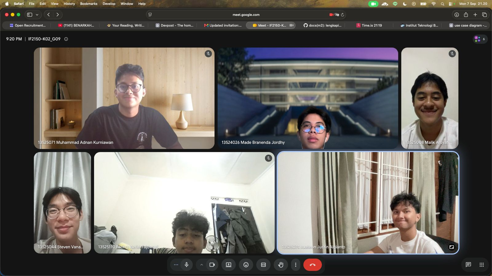

# Form Asistensi

## Tugas Besar IF2150 - Rekayasa Perangkat Lunak

| Informasi | Keterangan |
| --- | --- |
| **Hari** | *\[Hari\]* |
| **Tanggal** | *\[DD/MM/YYYY\]* |
| **Kelas** | K02 |
| **Nomor Kelompok** | G09  |
| **Nama Kelompok** | Cumlaude  |
| **Nama Perangkat Lunak** | SEHATI (Sistem Elektronik Pelayanan Kesehatan Terintegrasi)  |
| **Dokumen** | K02_G09_RG.md (Tugas 2 - Requirement Gathering)  |

### Anggota Kelompok

| NIM | Nama |
| --- | --- |
| 13525008 | Malik Arsyafiandra Madani |
| 13525044 | Steven Vanako |
| 13525071 | Muhammad Adnan Kurniawan |
| 13525074 | Axeleon Justin Algianto |
| 13525110 | Fachry Azriel Fajdwani |

### Catatan

| Catatan |
| --- |
| 1. Gambar terkait penjelasan kebutuhan tidak diperlukan, melainkan spesifikasi lebih lanjut menggunakan format tabel |
| 2. Deskripsi lebih lanjut terkait keputusan P/L  |
| 3. Implementasi Framework EARS di tabel Kebutuhan Fungsional dan Kebutuhan Non-Fungsional |
| 4. Setiap KF boleh mencakup beberapa kebutuhan yang telah diusulkan |
| 5. Id Kebutuhan di tabel (R) yang ditandai sebagai "Ya" wajib disertakan dalam tabel KF/KNF |

## Dokumentasi

  

  <i>Gambar 1. Dokumentasi kegiatan asistensi.</i>

