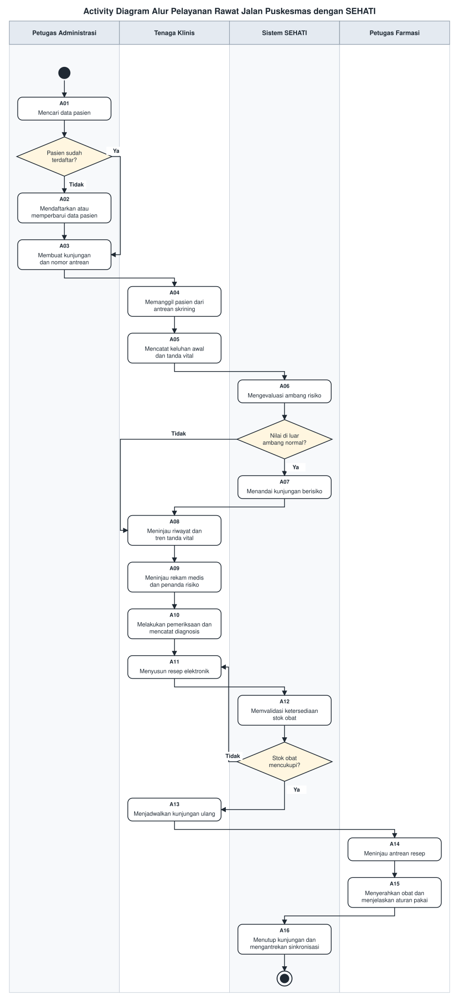
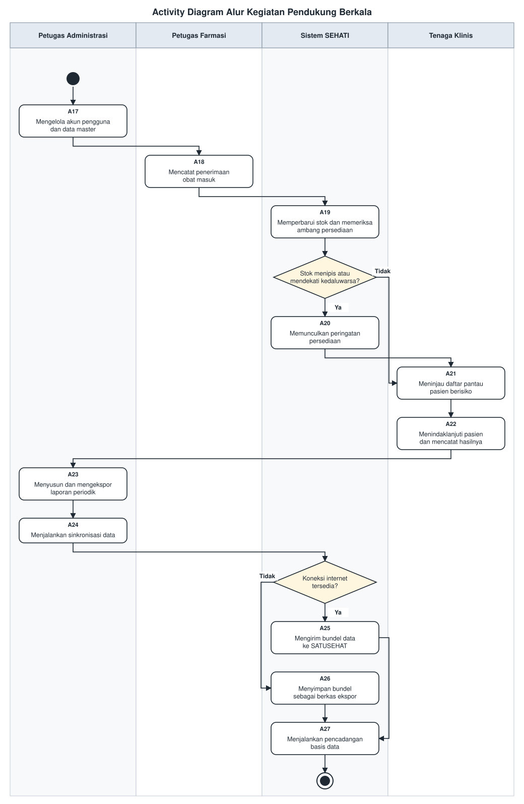

<h1>
IF2150 REKAYASA PERANGKAT LUNAK
 
TUGAS 2
 
REQUIREMENT GATHERING
</h1>
 

## SEHATI - Sistem Elektronik Pelayanan Kesehatan Terintegrasi

### Untuk: Made Branenda Jordhy

Dipersiapkan oleh:

| Informasi | Keterangan |
| --- | --- |
| Kelas | K02 |
| Kelompok | G09 |

| NIM | Nama |
| --- | --- |
| 13525008 | Malik Arsyafiandra Madani |
| 13525044 | Steven Vanako |
| 13525071 | Muhammad Adnan Kurniawan |
| 13525074 | Axeleon Justin Algianto |
| 13525110 | Fachry Azriel Fajdwani |

---

## Daftar Perubahan

| Revisi | Deskripsi |
| :--- | :--- |
| A | Dokumen awal Requirement Gathering berdasarkan hasil Topic Brainstorming (M1) |
| B | |
| C | |

 
 

# BAB 1: Deskripsi Umum

## 1.1 Deskripsi Umum Sistem

SEHATI (Sistem Elektronik Pelayanan Kesehatan Terintegrasi) adalah aplikasi desktop pengelolaan pelayanan rawat jalan untuk puskesmas yang menyatukan seluruh rantai pelayanan, mulai dari pendaftaran pasien, skrining tanda vital, pemeriksaan dokter, peresepan elektronik, penyerahan obat, hingga rekapitulasi laporan, ke dalam satu aplikasi yang dipakai bersama oleh seluruh petugas di satu fasilitas.

**Petugas Administrasi** di loket menemukan data pasien secara instan lewat NIK atau nomor rekam medis, lalu menerbitkan nomor antrean tanpa membongkar rak berkas. Di luar jam pelayanan, peran yang sama menyusun rekapitulasi kunjungan, mengekspor laporan, dan menjalankan sinkronisasi ke SATUSEHAT. **Tenaga Klinis** (perawat dan dokter) di ruang periksa memasukkan hasil skrining tanda vital, dan sistem langsung membandingkannya dengan ambang klinis serta riwayat pengukuran pasien antar-waktu. Diagnosis lampau, obat yang pernah diberikan, dan tren tekanan darah tersaji dalam satu layar. Resep disusun secara elektronik dengan stok yang tervalidasi saat itu juga. Tenaga klinis juga memegang daftar pantau pasien berisiko dan mencatat hasil upaya tindak lanjut. **Petugas Farmasi** menerima resep sebagai teks yang tidak mungkin salah baca, dengan stok tervalidasi sejak di ruang periksa, serta mengelola obat masuk beserta peringatan stok menipis dan mendekati kedaluwarsa.

Pembeda utama SEHATI dari SIMPUS pada umumnya adalah kemampuannya membandingkan hasil pengukuran pasien antar-waktu, menandai yang polanya mengarah ke risiko penyakit tidak menular (hipertensi, obesitas, indikasi diabetes), lalu menyusunnya menjadi daftar pantau yang ditindaklanjuti petugas. Seluruh fungsi berjalan penuh di atas basis data lokal tanpa memerlukan internet (*offline-first*), sementara sinkronisasi ke SATUSEHAT dijalankan secara tunda ketika koneksi tersedia, sehingga kewajiban regulasi tetap terpenuhi.

## 1.2 Deskripsi Pengguna Perangkat Lunak

| Aktor | Deskripsi |
| :--- | :--- |
| **Petugas Administrasi** | Bertugas di loket pendaftaran sekaligus menangani administrasi sistem. Bertanggung jawab mendaftarkan pasien, membuat kunjungan dan antrean, menyusun laporan periodik, mengelola akun pengguna beserta data master, dan menjalankan sinkronisasi ke SATUSEHAT. Bekerja di bawah tekanan antrean pada jam sibuk sehingga mengutamakan kecepatan pencarian data dan sedikitnya langkah per pendaftaran. |
| **Tenaga Klinis** | Mencakup perawat dan dokter di ruang periksa. Bertugas memanggil pasien dari antrean, mencatat keluhan awal dan tanda vital, meninjau tren pengukuran, memeriksa pasien, menegakkan diagnosis, menyusun resep, menjadwalkan kunjungan ulang, serta memegang daftar pantau beserta hasil tindak lanjutnya. Menangani banyak pasien dalam waktu singkat sehingga menuntut riwayat pasien tersaji utuh dalam satu layar. Hanya pengguna berstatus dokter yang dapat menegakkan diagnosis dan menyusun resep. |
| **Petugas Farmasi** | Mencakup apoteker dan tenaga teknis kefarmasian di apotek puskesmas. Meninjau antrean resep, menyiapkan serta menyerahkan obat kepada pasien, dan mengelola persediaan obat puskesmas. Membutuhkan resep yang terbaca jelas dan informasi stok yang akurat, serta bertanggung jawab atas ketertelusuran pengeluaran obat. |

---

# BAB 2: Deskripsi Kebutuhan Perangkat Lunak

## 2.1 Kebutuhan Pengguna Awal

| ID | Aktor | Kebutuhan / Aktivitas | Tujuan / Nilai |
| :--- | :--- | :--- | :--- |
| US-01 | Petugas Administrasi | Mencari data pasien berdasarkan NIK, nama, atau nomor rekam medis | Data pasien ditemukan dalam hitungan detik tanpa perlu merangkainya dari rak berkas atau dari dua media terpisah |
| US-02 | Petugas Administrasi | Mendaftarkan pasien baru dan memperbarui data pasien yang berubah | Setiap pasien memiliki satu rekam medis elektronik yang datanya tetap mutakhir |
| US-03 | Petugas Administrasi | Membuat data kunjungan beserta poli tujuan dan nomor antreannya | Setiap kedatangan pasien tercatat, terhubung dengan riwayatnya, dan urutan pelayanan menjadi jelas |
| US-04 | Petugas Administrasi | Melihat rekapitulasi kunjungan dan diagnosis per periode lalu mengekspornya sebagai berkas laporan | Laporan periodik tersusun tanpa perlu menghitung dan mengetik ulang data |
| US-05 | Petugas Administrasi | Mengelola akun pengguna beserta hak aksesnya dan data master obat, poli, serta ambang nilai risiko | Akses data pasien terbatas pada petugas berwenang, dan sistem dapat disesuaikan dengan kebijakan fasilitas |
| US-06 | Petugas Administrasi | Menjalankan sinkronisasi data kunjungan ke SATUSEHAT ketika koneksi internet tersedia | Kewajiban pelaporan rekam medis elektronik terpenuhi tanpa membuat pelayanan bergantung pada internet |
| US-07 | Petugas Administrasi | Memperoleh cadangan basis data secara otomatis beserta peringatan bila pencadangan gagal | Rekam medis tidak hilang seluruhnya bila terjadi kerusakan perangkat penyimpanan |
| US-08 | Tenaga Klinis | Melihat daftar antrean pasien yang menunggu skrining | Pemanggilan pasien berjalan tertib sesuai urutan |
| US-09 | Tenaga Klinis | Mencatat keluhan awal dan tanda vital pasien, termasuk gula darah sewaktu bila tersedia, serta memperoleh peringatan otomatis bila nilainya di luar ambang normal | Hasil pengukuran tersimpan permanen dan pasien berisiko tidak terlewat meskipun antrean sedang padat |
| US-10 | Tenaga Klinis | Melihat tren tanda vital pasien dari kunjungan-kunjungan sebelumnya | Perubahan kondisi pasien antar-waktu dapat dikenali sejak tahap skrining |
| US-11 | Tenaga Klinis | Melihat daftar pantau pasien berisiko dan mencatat hasil upaya tindak lanjutnya | Pemantauan pasien berisiko benar-benar berlanjut dan tidak berhenti pada penandaan saja |
| US-12 | Tenaga Klinis | Melihat rekam medis, riwayat kunjungan, dan penanda risiko pasien dalam satu tampilan | Keputusan klinis diambil berdasarkan gambaran kondisi pasien yang utuh, dan pasien berisiko langsung ditindaklanjuti pada kunjungan yang sama |
| US-13 | Tenaga Klinis | Mencatat anamnesis, diagnosis, dan tindakan pada kunjungan berjalan | Hasil pemeriksaan terdokumentasi rapi dan terbaca oleh seluruh petugas |
| US-14 | Tenaga Klinis | Menyusun resep elektronik dari daftar obat puskesmas sekaligus mengetahui ketersediaan stoknya | Kesalahan penulisan obat dihindari, dan penggantian obat karena stok kosong dilakukan saat pasien masih di ruang periksa |
| US-15 | Tenaga Klinis | Menjadwalkan kunjungan ulang bagi pasien yang perlu dipantau | Pemantauan pasien berisiko berlanjut dan tidak berhenti pada satu kunjungan |
| US-16 | Petugas Farmasi | Melihat antrean resep yang masuk dari ruang pemeriksaan | Penyiapan obat dapat dimulai sebelum pasien tiba di apotek |
| US-17 | Petugas Farmasi | Menandai resep yang obatnya telah diserahkan kepada pasien | Status pelayanan setiap pasien terpantau hingga tuntas dan stok terpotong secara otomatis |
| US-18 | Petugas Farmasi | Mencatat penerimaan obat masuk serta memperoleh peringatan saat stok menipis atau mendekati kedaluwarsa | Persediaan obat tertelusur dan kekosongan obat dapat dicegah sebelum terjadi |

## 2.2 Deskripsi Aktivitas

Setiap aktivitas berpasangan satu lawan satu dengan satu simpul pada activity diagram, yang disalin dari dokumen Topic Brainstorming (M1) ke `assets/diagram/`. Gambar 1 memuat A01 sampai A16, Gambar 2 memuat A17 sampai A27. Simpul keputusan tidak memiliki ID karena hanya menentukan percabangan tanpa mengubah keadaan sistem.

<i>Gambar 1. Alur pelayanan rawat jalan (A01 s.d. A16)</i>

<i>Gambar 2. Alur kegiatan pendukung berkala (A17 s.d. A27)</i>

**Alur pelayanan rawat jalan**

| ID | Aktivitas | Penjelasan | ID User Story |
| :--- | :--- | :--- | :--- |
| A01 | Mencari Data Pasien | Petugas Administrasi memasukkan NIK, nama, atau nomor rekam medis, lalu sistem menampilkan data pasien yang cocok | US-01 |
| A02 | Mendaftarkan atau Memperbarui Data Pasien | Petugas Administrasi mengisi data diri pasien baru sehingga sistem menerbitkan nomor rekam medis, atau menyunting data pasien lama yang berubah | US-02 |
| A03 | Membuat Kunjungan dan Nomor Antrean | Petugas Administrasi mencatat kedatangan pasien beserta poli tujuan, lalu sistem menerbitkan nomor antrean | US-03 |
| A04 | Memanggil Pasien dari Antrean Skrining | Perawat membuka daftar pasien yang menunggu pemeriksaan tanda vital, lalu memanggil pasien sesuai urutan antrean | US-08 |
| A05 | Mencatat Keluhan Awal dan Tanda Vital | Perawat memasukkan keluhan awal serta hasil pengukuran tekanan darah, berat badan, tinggi badan, suhu, nadi, dan gula darah sewaktu bila tersedia | US-09 |
| A06 | Mengevaluasi Ambang Risiko | Sistem membandingkan nilai yang baru dimasukkan terhadap ambang klinis dan terhadap riwayat pengukuran pasien pada kunjungan sebelumnya | US-09 |
| A07 | Menandai Kunjungan Berisiko | Sistem memberi penanda risiko penyakit tidak menular pada kunjungan yang nilainya berada di luar ambang normal | US-09 |
| A08 | Meninjau Riwayat dan Tren Tanda Vital | Perawat membaca grafik hasil pengukuran pasien dari kunjungan-kunjungan sebelumnya untuk mengenali perubahan kondisi antar-waktu | US-10 |
| A09 | Meninjau Rekam Medis dan Penanda Risiko | Dokter membaca data pasien, diagnosis lampau, riwayat obat, dan penanda risiko hasil skrining sebelum memulai pemeriksaan | US-12 |
| A10 | Melakukan Pemeriksaan dan Mencatat Diagnosis | Dokter memeriksa pasien lalu mencatat anamnesis, diagnosis, dan tindakan pada kunjungan berjalan | US-13 |
| A11 | Menyusun Resep Elektronik | Dokter memilih obat, dosis, dan aturan pakai dari data master obat puskesmas | US-14 |
| A12 | Memvalidasi Ketersediaan Stok Obat | Sistem memeriksa kecukupan stok setiap obat yang diresepkan dan memberi tahu dokter bila tidak mencukupi | US-14 |
| A13 | Menjadwalkan Kunjungan Ulang | Dokter menetapkan rencana kunjungan ulang bagi pasien yang perlu dipantau | US-15 |
| A14 | Meninjau Antrean Resep | Petugas Farmasi membuka antrean resep yang telah tervalidasi dan diteruskan sistem dari ruang periksa, lalu mulai menyiapkan obat | US-16 |
| A15 | Menyerahkan Obat dan Menjelaskan Aturan Pakai | Petugas Farmasi menyiapkan obat sesuai resep, menyerahkannya kepada pasien, lalu menandai resep sebagai selesai dilayani | US-17 |
| A16 | Menutup Kunjungan dan Mengantrekan Sinkronisasi | Sistem memotong stok obat sesuai jumlah yang diserahkan, menutup kunjungan, lalu menyusunnya menjadi bundel HL7 FHIR pada antrean sinkronisasi | US-06, US-17 |

**Alur kegiatan pendukung berkala**

| ID | Aktivitas | Penjelasan | ID User Story |
| :--- | :--- | :--- | :--- |
| A17 | Mengelola Akun Pengguna dan Data Master | Petugas Administrasi menambah atau menonaktifkan akun beserta hak aksesnya, serta memperbarui data obat, poli, dan ambang nilai risiko | US-05 |
| A18 | Mencatat Penerimaan Obat Masuk | Petugas Farmasi memasukkan data obat yang diterima puskesmas beserta nomor bets dan tanggal kedaluwarsa | US-18 |
| A19 | Memperbarui Stok dan Memeriksa Ambang Persediaan | Sistem menambahkan jumlah obat yang diterima ke persediaan lalu membandingkannya terhadap ambang minimum dan tanggal kedaluwarsa | US-18 |
| A20 | Memunculkan Peringatan Persediaan | Sistem menampilkan peringatan bagi obat yang jumlahnya di bawah ambang minimum atau mendekati kedaluwarsa | US-18 |
| A21 | Meninjau Daftar Pantau Pasien Berisiko | Perawat membuka daftar berisi pasien yang pernah ditandai berisiko maupun yang dijadwalkan kunjungan ulang, lalu menentukan siapa yang perlu dihubungi | US-11 |
| A22 | Menindaklanjuti Pasien dan Mencatat Hasilnya | Perawat menghubungi pasien pada daftar pantau lalu mencatat hasil upaya tersebut beserta status kedatangannya | US-11 |
| A23 | Menyusun dan Mengekspor Laporan Periodik | Petugas Administrasi memilih periode, sistem menghitung rekapitulasi kunjungan dan diagnosis terbanyak, lalu menghasilkan berkas laporan yang dapat dicetak atau diunggah | US-04 |
| A24 | Menjalankan Sinkronisasi Data | Petugas Administrasi memerintahkan pengiriman antrean sinkronisasi yang telah terkumpul | US-06 |
| A25 | Mengirim Bundel Data ke SATUSEHAT | Sistem mengirim bundel HL7 FHIR ke platform SATUSEHAT lalu menandai data yang berhasil terkirim | US-06 |
| A26 | Menyimpan Bundel sebagai Berkas Ekspor | Sistem menyimpan antrean sinkronisasi sebagai berkas apabila koneksi tidak tersedia, agar dapat diunggah dari lokasi lain yang berjaringan | US-06 |
| A27 | Menjalankan Pencadangan Basis Data | Sistem membuat salinan basis data menurut jadwal, menyimpannya pada media terpisah, dan memperingatkan pengguna bila pencadangan gagal | US-07 |

## 2.3 Pemetaan Kebutuhan

| ID Kebutuhan | ID Aktivitas | Jenis Kebutuhan | Deskripsi Kebutuhan | P/L |
| :--- | :--- | :--- | :--- | :--- |
| R01 | A01 | User | Pengguna dapat mencari data pasien berdasarkan NIK, nama, atau nomor rekam medis secara parsial dan memperoleh hasilnya dalam hitungan detik | Ya |
| R02 | A02 | User | Pengguna dapat mendaftarkan pasien baru (NIK, nama, tanggal lahir, jenis kelamin, alamat, nomor telepon) dan memperbarui data pasien lama yang berubah | Ya |
| R03 | A02 | Business | Setiap pasien harus memiliki tepat satu nomor rekam medis yang unik; NIK harus valid (16 digit numerik) dan tidak boleh terduplikasi | Ya |
| R04 | A03 | User | Pengguna dapat membuat kunjungan baru dengan memilih poli tujuan sehingga sistem menerbitkan nomor antrean berurutan per poli per hari | Ya |
| R05 | A04 | User | Pengguna dapat melihat daftar antrean skrining yang terurut dan memanggil pasien berikutnya | Ya |
| R06 | A05 | User | Pengguna dapat mencatat keluhan awal dan tanda vital pasien (tekanan darah sistolik/diastolik, berat badan, tinggi badan, suhu, nadi, gula darah sewaktu) pada formulir skrining | Ya |
| R07 | A05 | System | Sistem harus memvalidasi bahwa nilai tanda vital berada dalam rentang fisiologis yang wajar untuk mencegah kesalahan ketik | Ya |
| R08 | A06, A07 | System | Sistem harus membandingkan nilai tanda vital terhadap ambang klinis yang dapat dikonfigurasi serta riwayat pengukuran pasien, lalu secara otomatis menandai kunjungan sebagai "berisiko" bila terlampaui | Ya |
| R09 | A07 | Business | Penanda risiko bersifat alat bantu pengingat dan tidak menggantikan kewenangan klinis tenaga medis | Tidak |
| R10 | A08 | User | Pengguna dapat melihat grafik tren tanda vital pasien dari kunjungan-kunjungan sebelumnya | Ya |
| R11 | A09 | User | Pengguna dapat melihat ringkasan rekam medis pasien (data diri, diagnosis lampau, riwayat obat, penanda risiko aktif) dalam satu tampilan | Ya |
| R12 | A10 | User | Pengguna (dokter) dapat mencatat anamnesis, diagnosis berkode (ICD-10), dan tindakan pada kunjungan yang sedang berjalan | Ya |
| R13 | A10 | Business | Diagnosis harus menggunakan kode standar ICD-10 sesuai ketentuan rekam medis | Ya |
| R14 | A11 | User | Pengguna (dokter) dapat menyusun resep elektronik dengan memilih obat dari data master, menentukan dosis, jumlah, dan aturan pakai | Ya |
| R15 | A12 | System | Sistem harus memeriksa kecukupan stok setiap obat yang diresepkan dan menampilkan peringatan bila stok tidak mencukupi | Ya |
| R16 | A13 | User | Pengguna (dokter) dapat menjadwalkan kunjungan ulang bagi pasien dengan menetapkan tanggal atau rentang waktu | Ya |
| R17 | A14, A15 | User | Pengguna (Petugas Farmasi) dapat melihat antrean resep dan menandai resep sebagai "obat telah diserahkan" setelah obat diberikan kepada pasien | Ya |
| R18 | A16 | System | Sistem harus secara otomatis memotong stok obat, menutup kunjungan, dan menyusun data kunjungan menjadi bundel HL7 FHIR pada antrean sinkronisasi | Ya |
| R19 | A17 | User | Pengguna (Petugas Administrasi) dapat mengelola akun pengguna beserta perannya, serta data master obat, poli, dan ambang nilai risiko | Ya |
| R20 | A17 | Business | Akses data pasien harus dibatasi berdasarkan peran pengguna sesuai UU Pelindungan Data Pribadi; setiap perubahan data harus terekam pada jejak audit | Ya |
| R21 | A18, A19, A20 | User | Pengguna (Petugas Farmasi) dapat mencatat penerimaan obat masuk (nomor bets, jumlah, tanggal kedaluwarsa), dan sistem secara otomatis memperbarui stok serta menampilkan peringatan bila stok menipis atau mendekati kedaluwarsa | Ya |
| R22 | A21, A22 | User | Pengguna (Tenaga Klinis) dapat melihat dan memfilter daftar pantau pasien berisiko, serta mencatat hasil tindak lanjut beserta status kedatangan pasien | Ya |
| R23 | A23 | User | Pengguna dapat memilih periode dan menghasilkan rekapitulasi kunjungan serta diagnosis terbanyak dalam bentuk berkas laporan yang dapat dicetak atau diunggah | Ya |
| R24 | A24, A25, A26 | User | Pengguna dapat memerintahkan pengiriman data ke SATUSEHAT; sistem mengirim bundel HL7 FHIR bila koneksi tersedia, atau menyimpannya sebagai berkas ekspor bila tidak | Ya |
| R25 | A24, A25 | Business | Pengiriman data harus mematuhi PMK 24/2022 mengenai kewajiban RME yang terhubung ke SATUSEHAT | Tidak |
| R26 | A27 | System | Sistem harus menjalankan pencadangan basis data secara terjadwal, menampilkan statusnya, dan memperingatkan pengguna bila pencadangan gagal | Ya |
| R27 | A02, A10 | Legal | Pencatatan data pasien harus mematuhi ketentuan kerahasiaan rekam medis sesuai PMK 24/2022 dan UU PDP | Tidak |
| R28 | A01 s.d. A16 | System | Seluruh aktivitas pelayanan rawat jalan harus dapat dijalankan penuh di atas basis data lokal tanpa koneksi internet, karena putusnya jaringan tidak boleh menghentikan pelayanan pasien | Ya |
| R29 | A03, A05, A11, A14 | System | Beberapa petugas pada satu jaringan lokal harus dapat mengakses dan mengubah data secara bersamaan tanpa saling menimpa, terutama pada antrean kunjungan dan stok obat | Ya |
| R30 | A05, A09, A21 | User | Pengguna harus dapat menyelesaikan pencatatan dan peninjauan hanya dengan papan ketik, tanpa berpindah ke tetikus, karena volume pengetikan pada jam sibuk sangat tinggi | Ya |

## 2.4 Kebutuhan Fungsional (KF)

| ID KF | ID Kebutuhan | Penjelasan |
| :--- | :--- | :--- |
| KF01 | R01 | Perangkat lunak menyediakan kolom pencarian pada layar pendaftaran yang menerima masukan NIK, nama, atau nomor rekam medis, dan menampilkan daftar pasien yang cocok secara langsung (termasuk pencarian parsial) saat petugas mengetik |
| KF02 | R02, R03 | Perangkat lunak menyediakan formulir pendaftaran pasien baru (NIK, nama lengkap, tanggal lahir, jenis kelamin, alamat, nomor telepon) dengan validasi format NIK dan pencegahan duplikasi; data pasien lama dapat disunting dari layar profil |
| KF03 | R04 | Perangkat lunak menyediakan antarmuka untuk membuat kunjungan baru dengan memilih poli tujuan, lalu menerbitkan nomor antrean berurutan per poli per hari yang direset di awal hari berikutnya |
| KF04 | R05 | Perangkat lunak menampilkan daftar antrean skrining berisi pasien yang menunggu, diurutkan berdasarkan nomor antrean, dan menyediakan tombol "Panggil Berikutnya" yang mengubah status pasien menjadi "sedang dilayani" |
| KF05 | R06 | Perangkat lunak menyediakan formulir skrining dengan kolom teks bebas untuk keluhan awal dan kolom input numerik untuk setiap tanda vital (tekanan darah sistolik/diastolik dalam mmHg, berat badan dalam kg, tinggi badan dalam cm, suhu dalam °C, nadi dalam bpm, gula darah sewaktu dalam mg/dL opsional) |
| KF06 | R07 | Perangkat lunak memvalidasi bahwa setiap nilai tanda vital berada dalam rentang fisiologis yang wajar dan menampilkan peringatan bila di luar rentang |
| KF07 | R08 | Perangkat lunak membandingkan nilai tanda vital terhadap ambang klinis dari data master dan riwayat pengukuran pasien, menampilkan peringatan visual (ikon/warna) bila terlampaui, dan secara otomatis menandai kunjungan sebagai "berisiko" dengan label jenis risiko (hipertensi, obesitas, indikasi diabetes) |
| KF08 | R10 | Perangkat lunak menampilkan grafik garis (*line chart*) tren tanda vital pasien (tekanan darah, berat badan, gula darah) berdasarkan data kunjungan sebelumnya dengan sumbu waktu pada sumbu-x |
| KF09 | R11 | Perangkat lunak menampilkan layar ringkasan rekam medis pasien yang memuat data diri, daftar diagnosis lampau, riwayat obat, dan penanda risiko aktif dalam satu tampilan |
| KF10 | R12, R13 | Perangkat lunak menyediakan formulir pemeriksaan untuk dokter dengan kolom anamnesis (teks bebas), diagnosis berkode (dengan pencarian kode ICD-10), dan tindakan |
| KF11 | R14, R15 | Perangkat lunak menyediakan antarmuka penyusunan resep elektronik: dokter dapat mencari dan memilih obat dari data master, menentukan dosis, jumlah, dan aturan pakai; sistem menampilkan indikator ketersediaan stok dan peringatan bila stok tidak mencukupi |
| KF12 | R16 | Perangkat lunak menyediakan antarmuka bagi dokter untuk menjadwalkan kunjungan ulang pasien dengan menetapkan tanggal atau rentang waktu |
| KF13 | R17 | Perangkat lunak menampilkan antrean resep pada layar apotek (diurutkan berdasarkan waktu masuk, dengan detail nama pasien, obat, dosis, dan jumlah) dan menyediakan tombol "Obat Diserahkan" pada setiap resep |
| KF14 | R18 | Perangkat lunak secara otomatis mengurangi stok obat sesuai jumlah pada resep yang diserahkan, menutup kunjungan, dan menyusun data kunjungan menjadi bundel HL7 FHIR pada antrean sinkronisasi |
| KF15 | R19 | Perangkat lunak menyediakan antarmuka manajemen pengguna (tambah, sunting peran, nonaktifkan akun) dan manajemen data master (daftar obat, daftar poli, ambang nilai risiko) |
| KF16 | R20 | Perangkat lunak membatasi akses menu dan fitur berdasarkan peran pengguna dan mencatat setiap perubahan data pada tabel audit log (ID pengguna, waktu, deskripsi perubahan) |
| KF17 | R21 | Perangkat lunak menyediakan formulir penerimaan obat (nama obat, nomor bets, jumlah, tanggal kedaluwarsa), secara otomatis menambahkan stok, dan menampilkan notifikasi peringatan pada dashboard apotek untuk obat yang stoknya di bawah ambang minimum atau mendekati kedaluwarsa (90 hari) |
| KF18 | R22 | Perangkat lunak menampilkan daftar pantau pasien berisiko dan pasien dengan jadwal kunjungan ulang, dengan filter berdasarkan jenis risiko, rentang tanggal, dan status tindak lanjut, serta menyediakan formulir pencatatan tindak lanjut (jenis kontak, hasil, status kedatangan) |
| KF19 | R23 | Perangkat lunak menyediakan antarmuka pembuatan laporan periodik: pengguna memilih rentang tanggal, sistem menghitung rekapitulasi secara otomatis, lalu mengekspornya dalam format PDF atau Excel |
| KF20 | R24 | Perangkat lunak menyediakan tombol "Sinkronisasi" yang mengirim bundel HL7 FHIR ke SATUSEHAT dan menampilkan status per bundel, serta opsi "Ekspor Bundel" yang menyimpan antrean sebagai berkas bila koneksi tidak tersedia |
| KF21 | R26 | Perangkat lunak menjalankan pencadangan basis data secara otomatis sesuai jadwal ke lokasi terpisah, menampilkan informasi pencadangan terakhir pada dashboard administrasi, dan memperingatkan bila pencadangan gagal |
| KF22 | R28 | Perangkat lunak menyimpan seluruh data pelayanan pada basis data lokal di dalam lingkungan fasilitas, sehingga pendaftaran, skrining, pemeriksaan, peresepan, dan penyerahan obat tetap dapat dijalankan ketika koneksi internet terputus; status koneksi ditampilkan sebagai indikator pada bilah aplikasi |
| KF23 | R29 | Perangkat lunak menangani akses bersamaan dari beberapa perangkat dalam satu jaringan lokal melalui penguncian pada tingkat baris, sehingga perubahan nomor antrean dan pemotongan stok obat tidak saling menimpa |
| KF24 | R30 | Perangkat lunak menyediakan pintasan papan ketik untuk berpindah antar-kolom, menyimpan formulir, dan memanggil pasien berikutnya pada layar pendaftaran, skrining, dan pemeriksaan |

## 2.5 Kebutuhan Non-Fungsional (KNF)

| ID KNF | ID Kebutuhan | Parameter | Deskripsi Kebutuhan |
| :--- | :--- | :--- | :--- |
| KNF01 | R01 | Response Time | Hasil pencarian data pasien harus tampil dalam waktu kurang dari 2 detik setelah pengguna memasukkan kata kunci, meskipun basis data sudah berisi 50.000 rekam medis |
| KNF02 | R07 | Reliability | Validasi tanda vital harus selalu aktif dan tidak dapat dilewati, sehingga data yang tersimpan selalu berada dalam rentang fisiologis yang wajar |
| KNF03 | R18 | Reliability | Penyusunan bundel HL7 FHIR harus bersifat atomik: bila proses gagal di tengah jalan, tidak boleh ada bundel parsial yang masuk ke antrean sinkronisasi |
| KNF04 | R20 | Security | Setiap pengguna harus melakukan autentikasi (login) sebelum mengakses sistem; kata sandi harus disimpan dalam bentuk hash (minimal bcrypt) dan tidak dalam bentuk plain-text |
| KNF05 | R20 | Security | Sistem harus menerapkan otorisasi berbasis peran (*role-based access control*) dan mencatat setiap perubahan data pasien pada jejak audit yang tidak dapat dihapus oleh pengguna biasa |
| KNF06 | R26 | Reliability | Pencadangan otomatis harus bersifat konsisten (*point-in-time snapshot*) dan tidak mengganggu ketersediaan sistem bagi pengguna |
| KNF07 | R24 | Portability | Format bundel sinkronisasi harus sesuai standar HL7 FHIR R4 sehingga dapat diterima oleh platform SATUSEHAT tanpa konversi tambahan |
| KNF08 | R08 | Ergonomy | Peringatan ambang risiko harus ditampilkan secara visual yang jelas (warna merah, ikon peringatan) tanpa memerlukan langkah tambahan dari pengguna |
| KNF09 | R28 | Availability | Seluruh fungsi pelayanan rawat jalan harus tetap tersedia 100% selama jam pelayanan tanpa koneksi internet; ketiadaan jaringan hanya boleh menunda sinkronisasi ke SATUSEHAT, bukan menghentikan pelayanan |
| KNF10 | R28 | Portability | Aplikasi harus dapat dipasang dan dijalankan pada Windows dan Linux 64-bit dengan RAM 4 GB serta ruang penyimpanan kosong 2 GB, tanpa memerlukan pengadaan perangkat keras baru |
| KNF11 | R29 | Reliability | Sistem harus melayani sedikitnya 5 perangkat secara bersamaan dalam satu jaringan lokal tanpa kehilangan data (*lost update*) pada nomor antrean maupun stok obat |
| KNF12 | R30 | Ergonomy | Pencatatan satu formulir skrining harus dapat diselesaikan tanpa berpindah ke tetikus, dan seluruh pintasan papan ketik ditampilkan pada layar bantuan aplikasi |

 

# Referensi
- Diagram UML: https://www.drawio.com/, https://staruml.io/
- PMK Nomor 24 Tahun 2022 tentang Rekam Medis
- Undang-Undang Nomor 27 Tahun 2022 tentang Pelindungan Data Pribadi
- Dokumen Topic Brainstorming (M1) K02_G09
- HL7 FHIR R4: https://hl7.org/fhir/R4/
- ICD-10: https://icd.who.int/browse10/
