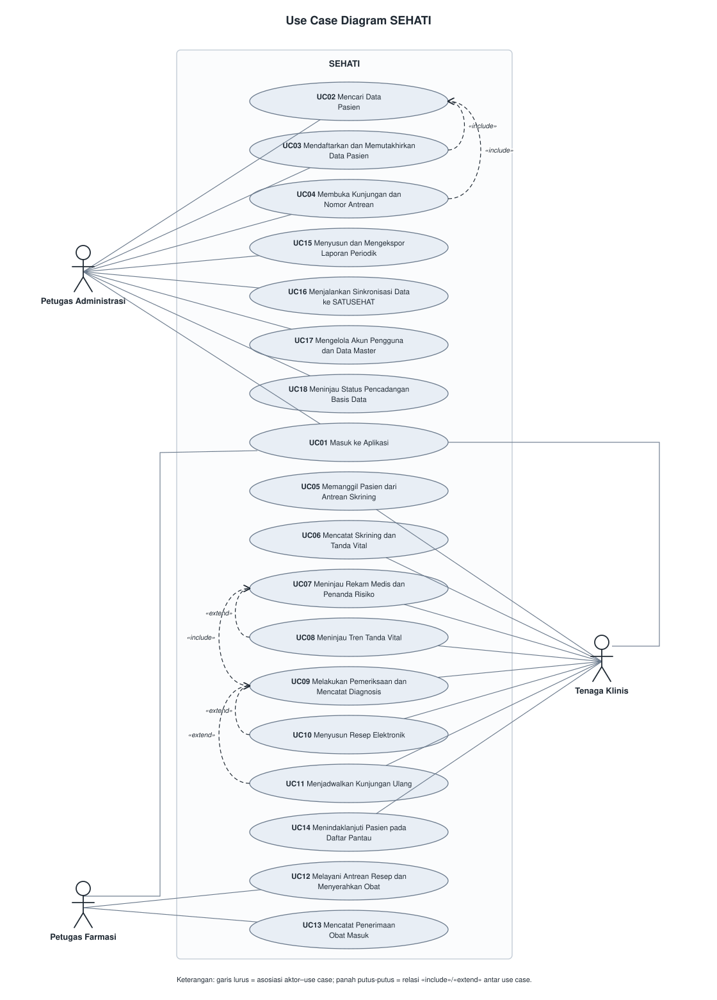

<h1>
IF2150 REKAYASA PERANGKAT LUNAK
 
TUGAS 3
 
USE CASE & SCENARIO USE CASE
</h1>
 

## SEHATI - Sistem Elektronik Pelayanan Kesehatan Terintegrasi

### Untuk: Made Branenda Jordhy

Dipersiapkan oleh:

| Informasi | Keterangan |
| --- | --- |
| Kelas | K02 |
| Kelompok | G09 |

| NIM | Nama |
| --- | --- |
| 13525008 | Malik Arsyafiandra Madani |
| 13525044 | Steven Vanako |
| 13525071 | Muhammad Adnan Kurniawan |
| 13525074 | Axeleon Justin Algianto |
| 13525110 | Fachry Azriel Fajdwani |

---

## Daftar Perubahan

| Revisi | Deskripsi |
| :--- | :--- |
| A | Penyusunan awal dokumen: Bab 1 disalin dari Subbab 1.1 dokumen *Requirement Gathering*, Bab 2 menyalin KF01 s.d. KF24 versi terbaru, dan Bab 3 memodelkan 18 use case beserta skenarionya |
| B | Perbaikan berdasarkan hasil asistensi: Menambahkan batasan ruang lingkup sistem, menciutkan use case menjadi 12 UC terpadu dengan coverase KF 100%, memperbaiki format penulisan skenario menjadi sekuensial interaktif dengan pendefinisian handling yang lebih baik. |
| C | Penyelarasan skenario use case (3.5.1 s.d. 3.5.12) sesuai konsolidasi 12 Use Case baru dengan cakupan KF 100% serta penyusunan skenario normal dan alternatif interaktif. |

 
 

# BAB 1: Deskripsi Perangkat Lunak

SEHATI (Sistem Elektronik Pelayanan Kesehatan Terintegrasi) adalah aplikasi desktop yang menangani pelayanan rawat jalan puskesmas dari ujung ke ujung. Satu aplikasi menampung pendaftaran pasien, skrining tanda vital, pemeriksaan dokter, peresepan elektronik, penyerahan obat, sampai rekapitulasi laporan, lalu dipakai bersama oleh seluruh petugas pada satu fasilitas kesehatan.

Yang membedakan SEHATI dari SIMPUS kebanyakan adalah kemampuannya membandingkan hasil pengukuran seorang pasien antar-waktu. Sistem mengenali pola yang mengarah ke penyakit tidak menular (hipertensi, obesitas, indikasi diabetes), lalu menyusun pasien tersebut menjadi daftar pantau yang ditindaklanjuti petugas. Basis data lokal menopang seluruh fungsi tanpa memerlukan internet (*offline-first*), sedangkan pengiriman data ke SATUSEHAT menyusul ketika koneksi tersedia sehingga kewajiban regulasi tetap terpenuhi.

Cakupan sistem mengikuti perjalanan pasien melewati tiga titik layanan puskesmas. Di loket, petugas menelusuri data pasien, mendaftarkan pasien baru, dan membuka kunjungan beserta nomor antrean poli. Di ruang periksa, perawat mencatat keluhan awal dan tanda vital yang langsung dievaluasi sistem terhadap ambang klinis dan riwayat pengukuran pasien, lalu dokter membaca rekam medis beserta penanda risiko pada satu layar, mencatat diagnosis, menyusun resep elektronik yang stoknya tervalidasi saat itu juga, dan menjadwalkan kunjungan ulang. Di apotek, petugas melayani antrean resep dan menandai penyerahan obat, yang menjadi pemicu sistem memotong stok, menutup kunjungan, dan mengantrekan data kunjungan sebagai bundel HL7 FHIR. Di luar jam pelayanan, sistem menopang kegiatan pendukung berkala berupa pengelolaan akun dan data master, pencatatan obat masuk beserta peringatan persediaan, penindaklanjutan pasien pada daftar pantau, penyusunan laporan periodik, sinkronisasi ke SATUSEHAT, dan pencadangan basis data terjadwal.

---

# BAB 2: Kebutuhan Fungsional (KF)

Tabel berikut menyalin seluruh kebutuhan fungsional dari Subbab 2.4 dokumen *Requirement Gathering* (M2) beserta penulisannya dalam pola **EARS**. Kolom *Penjelasan* dipertahankan apa adanya agar penelusuran antar-dokumen tetap terjaga, sedangkan setiap use case pada Bab 3 ditelusuri kembali ke ID KF di tabel ini.

| ID KF | Kebutuhan | Penjelasan |
| :--- | :--- | :--- |
| KF01 | Pencarian data pasien | **Ketika** petugas mengetikkan NIK, nama, atau nomor rekam medis pada kolom pencarian di layar pendaftaran, baik utuh maupun sebagian (parsial), perangkat lunak harus menampilkan daftar pasien yang cocok saat itu juga |
| KF02 | Pendaftaran dan pemutakhiran data pasien | Perangkat lunak harus menyediakan formulir pendaftaran pasien baru (NIK, nama lengkap, tanggal lahir, jenis kelamin, alamat, nomor telepon) serta penyuntingan data pasien lama dari layar profil.   **Ketika** pendaftaran pasien baru tersimpan, perangkat lunak harus menerbitkan tepat satu nomor rekam medis yang unik bagi pasien tersebut.   **Jika** NIK yang masuk bukan 16 digit numerik atau sudah terpakai pasien lain, **maka** perangkat lunak harus menolak penyimpanan dan menampilkan pesan kesalahan pada kolom NIK |
| KF03 | Pembukaan kunjungan dan nomor antrean | **Ketika** petugas membuka kunjungan baru dengan memilih poli tujuan, perangkat lunak harus menerbitkan nomor antrean yang berurutan per poli per hari.   **Ketika** hari pelayanan berganti, perangkat lunak harus memulai ulang urutan nomor antrean setiap poli dari awal |
| KF04 | Antrean skrining dan pemanggilan pasien | Perangkat lunak harus menampilkan daftar antrean skrining berisi pasien yang menunggu, terurut menurut nomor antrean.   **Ketika** petugas menekan tombol "Panggil Berikutnya", perangkat lunak harus mengubah status pasien pada urutan terdepan menjadi "sedang dilayani" |
| KF05 | Formulir skrining dan tanda vital | Perangkat lunak harus menyediakan formulir skrining dengan kolom teks bebas untuk keluhan awal dan kolom numerik untuk tekanan darah sistolik/diastolik (mmHg), berat badan (kg), tinggi badan (cm), suhu (°C), dan nadi (bpm).   **Apabila** hasil pemeriksaan gula darah sewaktu tersedia, perangkat lunak harus menerima nilainya (mg/dL) sebagai isian opsional pada formulir yang sama |
| KF06 | Validasi rentang nilai tanda vital | **Ketika** petugas menyimpan formulir skrining, perangkat lunak harus memeriksa setiap nilai tanda vital terhadap rentang fisiologis yang wajar.   **Jika** terdapat nilai di luar rentang tersebut, **maka** perangkat lunak harus menolak penyimpanan dan menampilkan peringatan pada kolom yang bersangkutan |
| KF07 | Evaluasi ambang dan penandaan risiko | **Ketika** nilai tanda vital tersimpan, perangkat lunak harus membandingkannya terhadap ambang klinis pada data master dan terhadap riwayat pengukuran pasien pada kunjungan-kunjungan sebelumnya.   **Jika** ambang klinis terlampaui atau tiga kunjungan berturut-turut atau lebih menunjukkan nilai di atas ambang yang dapat dikonfigurasi pada data master, **maka** perangkat lunak harus menandai kunjungan sebagai "berisiko" beserta label jenis risikonya (hipertensi, obesitas, indikasi diabetes) dan menampilkan peringatan visual berupa ikon dan warna |
| KF08 | Grafik tren tanda vital | **Ketika** petugas membuka riwayat pengukuran seorang pasien, perangkat lunak harus menampilkan grafik garis (*line chart*) tren tanda vital (tekanan darah, berat badan, gula darah) dari kunjungan-kunjungan sebelumnya dengan waktu pada sumbu-x |
| KF09 | Ringkasan rekam medis pada satu tampilan | **Ketika** petugas membuka ringkasan rekam medis seorang pasien, perangkat lunak harus menampilkan data diri, daftar diagnosis lampau, riwayat obat, dan penanda risiko aktif pada satu tampilan tanpa berpindah layar |
| KF10 | Pencatatan pemeriksaan dan diagnosis ICD-10 | Perangkat lunak harus menyediakan formulir pemeriksaan dengan kolom anamnesis (teks bebas), diagnosis, dan tindakan, yang hanya terbuka bagi pengguna berstatus dokter.   **Ketika** dokter mengisi kolom diagnosis, perangkat lunak harus menyediakan pencarian kode ICD-10 dan menyimpan diagnosis sebagai kode standar tersebut |
| KF11 | Penyusunan resep elektronik dan validasi stok | **Ketika** dokter menyusun resep elektronik, perangkat lunak harus menyediakan pencarian obat dari data master beserta isian dosis, jumlah, dan aturan pakai, sekaligus menampilkan indikator ketersediaan stok setiap obat yang terpilih.   **Jika** stok obat yang diresepkan kurang, **maka** perangkat lunak harus menampilkan peringatan dan meminta dokter memperbaiki resep sebelum resep diteruskan ke antrean apotek |
| KF12 | Penjadwalan kunjungan ulang | **Ketika** dokter menjadwalkan kunjungan ulang, perangkat lunak harus menyimpan tanggal atau rentang waktu yang ditetapkan dan menautkan jadwal tersebut ke daftar pantau pasien |
| KF13 | Antrean resep dan penandaan penyerahan obat | Perangkat lunak harus menampilkan antrean resep pada layar apotek, terurut menurut waktu masuk, beserta nama pasien, daftar obat, dosis, dan jumlahnya.   **Ketika** petugas menekan tombol "Obat Diserahkan" pada sebuah resep, perangkat lunak harus mengubah status resep tersebut menjadi selesai dilayani |
| KF14 | Pemotongan stok, penutupan kunjungan, dan pembundelan HL7 FHIR | **Ketika** sebuah resep ditandai selesai dilayani dan petugas mengonfirmasi penyerahan, perangkat lunak harus memotong stok setiap obat sebanyak jumlah yang diserahkan, menutup kunjungan yang bersangkutan, dan menyusun data kunjungan tersebut menjadi bundel HL7 FHIR pada antrean sinkronisasi |
| KF15 | Manajemen akun pengguna dan data master | Perangkat lunak harus menyediakan antarmuka manajemen pengguna (menambah akun, menyunting peran, menonaktifkan akun) serta manajemen data master (daftar obat, daftar poli, ambang nilai risiko) |
| KF16 | Pembatasan akses per peran dan jejak audit | **Selama** seorang pengguna masuk ke aplikasi, perangkat lunak harus membatasi menu dan fitur yang terbuka baginya menurut peran akun tersebut.   **Ketika** terjadi perubahan data, perangkat lunak harus mencatatnya pada jejak audit yang memuat identitas pengguna, waktu, dan deskripsi perubahan |
| KF17 | Penerimaan obat masuk dan peringatan persediaan | **Ketika** petugas menyimpan formulir penerimaan obat (nama obat, nomor bets, jumlah, tanggal kedaluwarsa), perangkat lunak harus menambahkan jumlah tersebut ke stok obat yang bersangkutan.   **Jika** stok suatu obat berada di bawah ambang minimum atau suatu bets berjarak 90 hari atau kurang dari tanggal kedaluwarsanya, **maka** perangkat lunak harus menampilkan peringatan persediaan pada dasbor apotek |
| KF18 | Daftar pantau dan pencatatan tindak lanjut | Perangkat lunak harus menampilkan daftar pantau berisi pasien yang pernah ditandai berisiko dan pasien yang dijadwalkan kunjungan ulang, dengan penyaring jenis risiko, rentang tanggal, dan status tindak lanjut.   **Ketika** petugas mencatat tindak lanjut, perangkat lunak harus menyimpan jenis kontak, hasil upaya, dan status kedatangan pasien pada entri daftar pantau tersebut |
| KF19 | Rekapitulasi dan ekspor laporan periodik | **Ketika** pengguna memilih rentang tanggal pelaporan, perangkat lunak harus menghitung rekapitulasi kunjungan dan diagnosis terbanyak tanpa perintah tambahan, lalu menghasilkan berkas laporan dalam format yang dapat dicetak dan diolah secara tabuler (PDF atau Spreadsheet) |
| KF20 | Sinkronisasi SATUSEHAT dan ekspor bundel | **Ketika** pengguna menjalankan sinkronisasi dan koneksi internet tersedia, perangkat lunak harus mengirim bundel HL7 FHIR pada antrean ke platform SATUSEHAT dan menampilkan status pengiriman setiap bundel.   **Jika** koneksi internet putus, **maka** perangkat lunak harus menyediakan opsi "Ekspor Bundel" yang menyimpan antrean sinkronisasi sebagai berkas untuk diunggah dari lokasi lain yang berjaringan |
| KF21 | Pencadangan basis data terjadwal | Perangkat lunak harus menjalankan pencadangan basis data sesuai jadwal ke media penyimpanan terpisah dan menampilkan informasi pencadangan terakhir pada dasbor administrasi.   **Jika** pencadangan gagal, **maka** perangkat lunak harus menampilkan peringatan kepada pengguna sampai pencadangan berikutnya berhasil |
| KF22 | Operasi luring di atas basis data lokal | Perangkat lunak harus menyimpan seluruh data pelayanan pada basis data lokal di dalam lingkungan fasilitas dan menampilkan indikator status koneksi pada bilah aplikasi.   **Selama** koneksi internet terputus, perangkat lunak harus tetap menjalankan seluruh fungsi pendaftaran, skrining, pemeriksaan, peresepan, dan penyerahan obat secara penuh |
| KF23 | Penanganan perubahan data bersamaan | **Ketika** beberapa petugas pada satu jaringan lokal mengubah data yang sama bersamaan, perangkat lunak harus menjaga perubahan bersamaan pada nomor antrean dan pemotongan stok obat agar tidak saling menimpa dan tidak menghilangkan data |
| KF24 | Pengoperasian lewat pintasan papan ketik | Perangkat lunak harus menyediakan pintasan papan ketik pada layar pendaftaran, skrining, pemeriksaan, dan apotek untuk bernavigasi, menyimpan formulir, dan memanggil pasien.   **Ketika** pintasan tersebut ditekan, perangkat lunak harus menjalankan tindakan terkait sehingga seluruh alur pelayanan dapat tuntas tanpa tetikus |

 ***Catatan***: *Tabel di atas sudah menyesuaikan versi KF terbaru hasil asistensi Milestone 2, yaitu KF01 s.d. KF24 dengan pola EARS.*

---

# BAB 3: Model Use Case

## 3.1 Ruang Lingkup (Scope) Sistem

Sistem SEHATI mencakup seluruh fungsi administratif dan klinis pelayanan rawat jalan puskesmas mulai dari pendaftaran di loket, skrining tanda vital oleh perawat, rekam medis dan pemeriksaan fisik oleh dokter, hingga peresepan elektronik dan penyerahan obat di apotek. Sistem berjalan secara lokal pada fasilitas kesehatan (*offline-first*) untuk menjamin ketersediaan pelayanan 100% terlepas dari kendala jaringan internet. 

Di luar jam pelayanan pasien, cakupan sistem meluas pada kegiatan pendukung: manajemen pengguna (RBAC), pemeliharaan master data (obat/poli/ambang risiko), pencatatan inventaris persediaan obat farmasi, pengelolaan daftar pantau (pasien penyakit tidak menular), serta otomatisasi rekapitulasi laporan dan pencadangan *database* lokal. 

Sistem SEHATI berinteraksi dengan satu entitas luar yang signifikan, yaitu platform **SATUSEHAT** dari Kementerian Kesehatan. Pertukaran data antar sistem berjalan satu arah (pengiriman bundel rekam medis elektronik berformat HL7 FHIR) dan dieksekusi secara asinkron agar kewajiban hukum terpenuhi tanpa membebani rutinitas pelayanan di puskesmas.

## 3.2 Identifikasi Aktor

Aktor pada model ini mengikuti tiga peran manusia yang telah ditetapkan sejak Milestone 1. Pasien sendiri tidak menjadi aktor karena menerima manfaat sistem tanpa berinteraksi langsung dengannya, sedangkan platform SATUSEHAT diperlakukan sebagai sistem eksternal, bukan aktor interaktif.

| Aktor | Deskripsi |
| :--- | :--- |
| Petugas Administrasi | Pengguna yang berjaga di loket pendaftaran sekaligus memegang administrasi sistem. Bertanggung jawab atas pengelolaan data pasien, pendaftaran kunjungan poli, penyusunan laporan periodik, sinkronisasi SATUSEHAT, konfigurasi master sistem, dan manajemen hak akses. |
| Tenaga Klinis | Pengguna di ruang periksa poli, mencakup perawat dan dokter. Menangani pemanggilan antrean skrining, pendataan keluhan dan tanda vital, evaluasi rekam medis, pencatatan diagnosis terstruktur (ICD-10), penyusunan resep, serta pemantauan daftar pantau (risiko PTM). Catatan: Kewenangan menegakkan diagnosis dan meresepkan obat dibatasi hanya untuk yang berstatus dokter. |
| Petugas Farmasi | Pengguna di instalasi farmasi/apotek puskesmas. Bertanggung jawab melayani daftar antrean resep yang dilempar dari ruang poli, mengonfirmasi penyerahan obat kepada pasien, dan mengelola stok sediaan farmasi fasilitas kesehatan. |

## 3.3 Identifikasi Use Case

Dua belas use case berikut memetakan dan meringkas seluruh kebutuhan fungsional (KF01–KF24) dari Bab 2 ke dalam unit-unit interaksi komprehensif.

| ID UC | Nama Use Case | Deskripsi Singkat | Aktor Terlibat | ID KF Terkait |
| :--- | :--- | :--- | :--- | :--- |
| UC01 | Masuk ke Aplikasi | Pengguna mengautentikasi diri untuk mengakses menu sistem yang disesuaikan dengan batasan kewenangan/perannya. | Petugas Administrasi, Tenaga Klinis, Petugas Farmasi | KF16 |
| UC02 | Mengelola Data Pasien | Petugas mencari keberadaan data pasien secara parsial, lalu mendaftarkan pasien baru atau memutakhirkan data demografi lama tanpa merusak nomor rekam medis. | Petugas Administrasi | KF01, KF02 |
| UC03 | Mengelola Kunjungan Pasien | Petugas menerbitkan nomor antrean kunjungan baru bagi pasien ke poli yang dituju. | Petugas Administrasi | KF01, KF03, KF23 |
| UC04 | Melakukan Skrining Awal | Perawat memanggil pasien berdasar antrean, mengisi catatan keluhan, meng-input angka tanda vital, lalu sistem mengevaluasi indikasi risiko secara otomatis. | Tenaga Klinis | KF04, KF05, KF06, KF07, KF24 |
| UC05 | Melakukan Pemeriksaan Medis | Dokter menelusuri rekam medis holistik dan visualisasi tren pengukur pasien (single-view), melaksanakan anamnesis fisik, lalu membakukan diagnosis memakai ICD-10. | Tenaga Klinis | KF08, KF09, KF10, KF12, KF22, KF24 |
| UC06 | Menyusun Resep Elektronik | Dokter meresepkan penanganan obat dari inventaris sistem dengan jaminan peringatan ketersediaan stok aktual. | Tenaga Klinis | KF11 |
| UC07 | Melayani Resep Obat | Apoteker menerima dan mengonfirmasi penyelesaian resep pesanan yang mengotomatisasi pemotongan persediaan sediaan obat. | Petugas Farmasi | KF13, KF14, KF23 |
| UC08 | Mengelola Persediaan Obat | Apoteker menambahkan barang (*DO*) ke dalam persediaan master dan sistem menangani peringatan limit stok / *Expired Date*. | Petugas Farmasi | KF17 |
| UC09 | Mengelola Daftar Pantau Pasien | Tenaga klinis menelusuri, mem-follow up via kontak, dan mendokumentasikan tindak lanjut atas pasien penyakit tidak menular (PTM) yang terjadwal. | Tenaga Klinis | KF12, KF18 |
| UC10 | Menyusun Laporan Periodik | Petugas administrasi membuat dan mengunduh (*export*) matriks kompilasi data laporan harian/bulanan atas angka-angka fasilitas kesehatan. | Petugas Administrasi | KF19 |
| UC11 | Melakukan Sinkronisasi SATUSEHAT | Petugas administrasi memerintahkan pengiriman paket riwayat kunjungan tertunda (HL7 FHIR) ke Kemenkes secara simultan saat *online*, atau ekspor manual saat *offline*. | Petugas Administrasi | KF20, KF22 |
| UC12 | Mengelola Konfigurasi & Basis Data Sistem | Petugas mengonfigurasi pembuatan akun staf, master tarif/poli/standar risiko medik, hingga memantau eksekusi log pencadangan *database* lokal. | Petugas Administrasi | KF15, KF21 |

Relasi antar use case yang muncul pada model ini adalah sebagai berikut.

| Relasi | Penjelasan |
| :--- | :--- |
| UC03 **«include»** UC02 | Proses pembukaan/registrasi kunjungan pasien ke poli (UC03) selalu didahului secara fungsional oleh identifikasi pencarian dan pendaftaran eksistensi pasien (UC02). |
| UC06 **«extend»** UC05 | Tindakan perumusan penyusunan resep (UC06) bersifat opsional di mata sistem, bergantung sepenuhnya pada penilaian medis dokter saat melakukan aktivitas Pemeriksaan (UC05). |

## 3.4 Use Case Diagram

 

<i>Gambar 1. Use Case Diagram SEHATI (Catatan: Diagram ini merupakan *placeholder* sambil menunggu pembaruan 12 Use Case diagram final)</i>

 

## 3.5 Skenario Use Case

### 3.5.1 Skenario UC01

**Nama Use Case:** Masuk ke Aplikasi

**Skenario Normal**

| No | Aksi Aktor | Reaksi Perangkat Lunak |
| :--- | :--- | :--- |
| 1 | Pengguna membuka aplikasi SEHATI | Sistem menampilkan antarmuka autentikasi berisi kolom nama pengguna (*username*) dan kata sandi (*password*) |
| 2 | Pengguna memasukkan nama pengguna dan kata sandi yang valid, lalu menekan tombol "Masuk" | Sistem memverifikasi kredensial, membuka sesi pengguna terenkripsi, mencatat peristiwa masuk ke jejak audit, lalu menampilkan dasbor kerja dengan menu dan fitur yang dibatasi menurut peran akun tersebut (RBAC) |

 

**Skenario Alternatif 1: Kredensial Tidak Cocok**

| No | Aksi Aktor | Reaksi Perangkat Lunak |
| :--- | :--- | :--- |
| 1 | Pengguna memasukkan nama pengguna atau kata sandi yang salah, lalu menekan tombol "Masuk" | Sistem menolak proses autentikasi, menampilkan pesan peringatan "Nama pengguna atau kata sandi salah", mengosongkan isian kata sandi, dan mencatat percobaan gagal ke jejak audit |
| 2 | Pengguna memasukkan ulang kredensial yang benar | Sistem kembali ke langkah 2 skenario normal |

 

**Skenario Alternatif 2: Akun Berstatus Nonaktif**

| No | Aksi Aktor | Reaksi Perangkat Lunak |
| :--- | :--- | :--- |
| 1 | Pengguna berusaha masuk menggunakan akun yang telah dinonaktifkan oleh administrator | Sistem menolak permintaan masuk dan menampilkan pesan bahwa akun telah dinonaktifkan serta meminta pengguna menghubungi Petugas Administrasi |

 

**Skenario Alternatif 3: Pengguna Mengakses Modul di Luar Hak Akses Peran**

| No | Aksi Aktor | Reaksi Perangkat Lunak |
| :--- | :--- | :--- |
| 1 | Pengguna berusaha mengakses fungsi atau layar di luar wewenangnya (misalnya perawat membuka formulir penegakan diagnosis dokter) | Sistem menyembunyikan menu tersebut dari dasbor dan menolak perintah akses langsung disertai notifikasi bahwa peran akun tidak memiliki otorisasi |

### 3.5.2 Skenario UC02

**Nama Use Case:** Mengelola Data Pasien

**Skenario Normal (Pendaftaran Pasien Baru)**

| No | Aksi Aktor | Reaksi Perangkat Lunak |
| :--- | :--- | :--- |
| 1 | Petugas Administrasi membuka modul pendaftaran data pasien | Sistem menyajikan kolom pencarian cepat pasien dan tombol "Daftarkan Pasien Baru" |
| 2 | Petugas mengetikkan NIK, nama lengkap, atau nomor rekam medis secara parsial untuk memastikan data belum tercatat sebelumnya | Sistem menjalankan pencarian seketika (*instant search*) pada basis data lokal dan menampilkan keterangan "Data pasien tidak ditemukan" |
| 3 | Petugas menekan tombol "Daftarkan Pasien Baru" | Sistem membuka formulir pendaftaran yang memuat isian NIK (16 digit), nama lengkap, tanggal lahir, jenis kelamin, alamat domisili, dan nomor telepon |
| 4 | Petugas melengkapi data diri pasien lalu menekan tombol "Simpan" (atau menekan pintasan papan ketik simpan) | Sistem memvalidasi kelengkapan isian serta keunikan NIK, menerbitkan tepat satu nomor rekam medis baru yang unik secara permanen, menyimpan data pasien ke basis data lokal, mencatat transaksi ke jejak audit, dan menampilkan notifikasi sukses pendaftaran |

 

**Skenario Alternatif 1: Memutakhirkan Data Pasien Lama (*Edit Profile*)**

| No | Aksi Aktor | Reaksi Perangkat Lunak |
| :--- | :--- | :--- |
| 1 | Petugas mengetikkan kata kunci pencarian pada langkah 2 skenario normal | Sistem menemukan dan menampilkan daftar pasien yang cocok beserta NIK, nama, tanggal lahir, dan nomor rekam medisnya |
| 2 | Petugas memilih salah satu pasien dari hasil pencarian lalu menekan tombol "Sunting Data" | Sistem membuka layar formulir data demografi pasien yang telah terisi data lama |
| 3 | Petugas memperbarui data yang berubah (misalnya alamat baru atau nomor telepon) lalu menekan tombol "Simpan" | Sistem memvalidasi perubahan, memperbarui profil pasien pada basis data lokal tanpa mengubah nomor rekam medis asli yang sudah diterbitkan, merekam jejak audit, dan menampilkan konfirmasi pembaruan berhasil |

 

**Skenario Alternatif 2: NIK Tidak Valid atau Telah Digunakan Pasien Lain**

| No | Aksi Aktor | Reaksi Perangkat Lunak |
| :--- | :--- | :--- |
| 1 | Petugas memasukkan NIK yang bukan 16 digit numerik atau memasukkan NIK yang sudah dimiliki pasien lain pada basis data, lalu menekan "Simpan" | Sistem menolak penyimpanan profil, memberikan penanda visual merah pada kolom NIK, dan menampilkan pesan kesalahan spesifik (NIK tidak valid atau NIK sudah terdaftar) |
| 2 | Petugas mengoreksi isian NIK | Sistem kembali ke langkah 4 skenario normal |

### 3.5.3 Skenario UC03

**Nama Use Case:** Mengelola Kunjungan Pasien

**Skenario Normal**

| No | Aksi Aktor | Reaksi Perangkat Lunak |
| :--- | :--- | :--- |
| 1 | Petugas Administrasi memilih pasien dari hasil identifikasi/pencarian data pasien (UC02) lalu menekan tombol "Buat Kunjungan" | Sistem menampilkan antarmuka pembuatan kunjungan yang memuat ringkasan identitas pasien, pilihan poli tujuan rawat jalan, dan jenis penjaminan (Umum/BPJS) |
| 2 | Petugas memilih poli tujuan serta jenis penjaminan, lalu menekan tombol "Terbitkan Antrean" | Sistem membuat entri kunjungan baru hari berjalan, menerbitkan nomor antrean berurutan per poli untuk hari tersebut (urutan nomor di-reset ke 1 setiap hari baru), menautkan kunjungan ke berkas rekam medis pasien, mencatat ke jejak audit, lalu mencetak/menampilkan tiket antrean poli |

 

**Skenario Alternatif 1: Pasien Masih Memiliki Kunjungan Aktif pada Hari yang Sama**

| No | Aksi Aktor | Reaksi Perangkat Lunak |
| :--- | :--- | :--- |
| 1 | Petugas menekan tombol "Buat Kunjungan" bagi pasien yang masih tercatat memiliki kunjungan aktif hari ini di fasilitas | Sistem menolak pembuatan kunjungan ganda dan menampilkan status kunjungan aktif pasien beserta nomor antrean dan poli yang sedang berjalan |

 

**Skenario Alternatif 2: Pembukaan Kunjungan Simultan pada Poli yang Sama (*Concurrency*)**

| No | Aksi Aktor | Reaksi Perangkat Lunak |
| :--- | :--- | :--- |
| 1 | Dua petugas pada komputer berbeda dalam jaringan lokal puskesmas menerbitkan antrean kunjungan untuk poli yang sama pada detik yang bersamaan | Sistem mengeksekusi mekanisme isolasi transaksi basis data (*concurrency control*) sehingga kedua kunjungan menerima nomor antrean yang tetap berurutan dan unik tanpa terjadi duplikasi nomor antrean atau data yang tertimpa |

### 3.5.4 Skenario UC04

**Nama Use Case:** Melakukan Skrining Awal

**Skenario Normal**

| No | Aksi Aktor | Reaksi Perangkat Lunak |
| :--- | :--- | :--- |
| 1 | Tenaga Klinis (Perawat) membuka modul antrean skrining awal | Sistem menyajikan daftar antrean pasien yang menunggu skrining terurut berdasarkan nomor antrean dan poli tujuan |
| 2 | Perawat menekan tombol "Panggil Berikutnya" (atau memanfaatkan pintasan papan ketik pemanggil) | Sistem mengubah status antrean pasien nomor terdepan menjadi "sedang diskrining", memperbarui tampilan monitor antrean, dan membuka formulir skrining tanda vital |
| 3 | Perawat mengisi kolom keluhan awal serta hasil pengukuran fisik: tekanan darah sistolik/diastolik (mmHg), berat badan (kg), tinggi badan (cm), suhu tubuh (°C), laju pernapasan, denyut nadi (bpm), dan gula darah sewaktu opsional (mg/dL) menggunakan pintasan navigasi papan ketik | Sistem menerima input angka dan memindahkan fokus antar-kolom input secara mulus tanpa ketergantungan pada tetikus (*mouse*) |
| 4 | Perawat menekan pintasan papan ketik simpan | Sistem memvalidasi rentang fisiologis seluruh nilai, membandingkan hasil pengukuran terhadap ambang klinis master serta riwayat tiga kunjungan terakhir pasien, menyimpan data skrining, mengubah status menjadi "siap diperiksa dokter", lalu meneruskan antrean pasien ke ruang poli dokter |

 

**Skenario Alternatif 1: Pasien Tidak Hadir saat Dipanggil**

| No | Aksi Aktor | Reaksi Perangkat Lunak |
| :--- | :--- | :--- |
| 1 | Pasien yang dipanggil perawat tidak kunjung hadir di ruang skrining, lalu perawat menekan tombol "Lewati" | Sistem menandai status pasien menjadi "tidak hadir", memindahkan nomor antrean pasien tersebut ke urutan terbawah antrean skrining, dan menampilkan data pasien antrean berikutnya |

 

**Skenario Alternatif 2: Nilai Pengukuran di Luar Batas Rentang Fisiologis Wajar**

| No | Aksi Aktor | Reaksi Perangkat Lunak |
| :--- | :--- | :--- |
| 1 | Perawat menyimpan formulir skrining yang memuat nilai tidak masuk akal (misalnya suhu tubuh 72 °C atau sistolik 400 mmHg karena kesalahan ketik) | Sistem menolak penyimpanan data, menandai kolom bermasalah dengan penanda visual merah, dan menampilkan pesan kesalahan rentang fisiologis wajar |
| 2 | Perawat mengoreksi nilai pengukuran tanda vital | Sistem kembali ke langkah 4 skenario normal |

 

**Skenario Alternatif 3: Terdeteksi Peringatan Indikasi Risiko Klinis Otomatis**

| No | Aksi Aktor | Reaksi Perangkat Lunak |
| :--- | :--- | :--- |
| 1 | Perawat menyimpan hasil skrining yang nilainya melebihi ambang batas klinis master atau teridentifikasi pola $\ge 3$ kunjungan berturut-turut melampaui ambang | Sistem menandai kunjungan pasien dengan label risiko aktif (seperti risiko hipertensi, obesitas, atau indikasi diabetes), menampilkan peringatan visual berupa ikon dan penanda merah pada berkas kunjungan, mendaftarkan pasien ke daftar pantau risiko, lalu meneruskan pasien ke antrean poli dokter |

### 3.5.5 Skenario UC05

**Nama Use Case:** Melakukan Pemeriksaan Medis

**Skenario Normal**

| No | Aksi Aktor | Reaksi Perangkat Lunak |
| :--- | :--- | :--- |
| 1 | Tenaga Klinis (Dokter) memilih pasien dari daftar antrean ruang periksa poli | Sistem menyajikan ringkasan rekam medis lengkap pasien dalam satu tampilan terpadu (*single-view*) tanpa berpindah layar, yang mencakup identitas demografi, hasil skrining tanda vital kunjungan hari ini, daftar diagnosis lampau, riwayat obat, dan penanda risiko aktif |
| 2 | Dokter menekan tombol atau tab "Lihat Tren Tanda Vital" | Sistem menampilkan grafik garis (*line chart*) interaktif yang memvisualisasikan dinamika kronologis tekanan darah, berat badan, dan gula darah antar-kunjungan berdasarkan sumbu waktu |
| 3 | Dokter melakukan wawancara anamnesis serta pemeriksaan fisik, lalu mengetikkan kata kunci diagnosis klinis pada kolom diagnosis | Sistem secara instan mencari dan menyajikan padanan daftar kode dan deskripsi standar ICD-10 saat pengetikan berlangsung |
| 4 | Dokter memilih kode diagnosis ICD-10 yang tepat, mengisi tindakan medis, dan menetapkan tanggal kontrol ulang apabila pasien membutuhkan kunjungan ulang terjadwal | Sistem mencatat isian diagnosis standar, mengaitkan rencana kontrol ke entri daftar pantau pasien, dan menyiapkan berkas ringkasan pemeriksaan |
| 5 | Dokter memvalidasi seluruh hasil pemeriksaan [dan jika memerlukan terapi obat, memicu UC06 «extend»], lalu menekan pintasan papan ketik simpan | Sistem mengunci rekam medis pemeriksaan kunjungan hari ini, mencatat transaksi ke jejak audit, dan memperbarui status kunjungan pasien |

 

**Skenario Alternatif 1: Pengguna yang Membuka Layar Bukan Berstatus Dokter**

| No | Aksi Aktor | Reaksi Perangkat Lunak |
| :--- | :--- | :--- |
| 1 | Tenaga klinis yang login bukan berstatus dokter (misalnya perawat) membuka rekam medis pasien di ruang dokter | Sistem menampilkan rekam medis pasien dalam mode baca saja (*read-only*) serta menonaktifkan kolom diagnosis ICD-10 dan tindakan disertai keterangan otorisasi peran |

 

**Skenario Alternatif 2: Kode Diagnosis ICD-10 Tidak Ditemukan**

| No | Aksi Aktor | Reaksi Perangkat Lunak |
| :--- | :--- | :--- |
| 1 | Dokter memasukkan kata kunci diagnosis yang tidak cocok dengan kode mana pun pada master data ICD-10 | Sistem menampilkan notifikasi "Kode diagnosis ICD-10 tidak ditemukan" dan meminta dokter memasukkan kata kunci medis alternatif atau kode numerik bab terkait |
| 2 | Dokter memasukkan istilah pencarian yang tepat | Sistem kembali ke langkah 4 skenario normal |

 

**Skenario Alternatif 3: Pelayanan Medis Berlangsung Saat Koneksi Internet Terputus (*Offline Mode*)**

| No | Aksi Aktor | Reaksi Perangkat Lunak |
| :--- | :--- | :--- |
| 1 | Dokter melakukan pemeriksaan pasien ketika koneksi internet puskesmas sedang padam | Sistem tetap menjalankan penelusuran rekam medis, penampilan grafik tren, dan penyimpanan diagnosis secara penuh melalui basis data lokal serta menampilkan indikator status "Luring" pada bilah status atas aplikasi |

 

**Skenario Alternatif 4: Pasien Baru Pertama Kali Berkunjung (*Belum Memiliki Tren*)**

| No | Aksi Aktor | Reaksi Perangkat Lunak |
| :--- | :--- | :--- |
| 1 | Dokter membuka rekam medis pasien yang baru pertama kali berkunjung ke fasilitas dan menekan "Lihat Tren Tanda Vital" | Sistem menyajikan tabel nilai tunggal hasil pengukuran hari ini disertai keterangan bahwa grafik tren kronologis baru akan terbentuk setelah terdapat minimal dua kali kunjungan |

### 3.5.6 Skenario UC06

**Nama Use Case:** Menyusun Resep Elektronik

**Skenario Normal**

| No | Aksi Aktor | Reaksi Perangkat Lunak |
| :--- | :--- | :--- |
| 1 | Tenaga Klinis (Dokter) menekan tombol "Tambah Resep Elektronik" pada panel pemeriksaan medis (UC05) | Sistem membuka formulir peresepan elektronik yang terintegrasi secara langsung dengan katalog dan stok master inventaris obat apotek |
| 2 | Dokter mencari nama sediaan obat, memilih item, serta memasukkan jumlah obat, dosis, dan aturan pakai | Sistem secara seketika memverifikasi ketersediaan stok fisik aktual di apotek dan menampilkan indikator ketersediaan stok berwarna hijau ("Tersedia") |
| 3 | Dokter menekan tombol "Kirim ke Apotek" | Sistem memvalidasi kecukupan persediaan seluruh item resep, mengunci rincian obat pada berkas kunjungan berjalan, dan meneruskan pesanan resep ke antrean layanan farmasi |

 

**Skenario Alternatif 1: Kuantitas Obat yang Diresepkan Melebihi Ketersediaan Stok Fisik Aktual**

| No | Aksi Aktor | Reaksi Perangkat Lunak |
| :--- | :--- | :--- |
| 1 | Dokter memilih sediaan obat yang jumlah kebutuhannya melampaui sisa saldo stok aktual di instalasi farmasi | Sistem menolak penerusan resep, menampilkan indikator visual merah ("Stok Kurang"), dan memunculkan dialog peringatan kuantitas sisa stok yang tersedia |
| 2 | Dokter mengganti dengan item obat padanan yang stoknya memadai atau menyesuaikan jumlah pesanan | Sistem kembali ke langkah 3 skenario normal |

### 3.5.7 Skenario UC07

**Nama Use Case:** Melayani Resep Obat

**Skenario Normal**

| No | Aksi Aktor | Reaksi Perangkat Lunak |
| :--- | :--- | :--- |
| 1 | Petugas Farmasi membuka modul antrean resep apotek | Sistem menampilkan antrean pesanan resep terurut menurut waktu pengiriman dokter, lengkap dengan nama pasien, nomor antrean, poli asal, serta rincian nama sediaan obat, dosis, dan kuantitasnya |
| 2 | Petugas memilih satu resep pesanan untuk diproses penyiapan obatnya | Sistem menampilkan rincian resep lengkap beserta data nomor bets (*batch*) sediaan obat yang tersedia untuk disiapkan |
| 3 | Petugas menyiapkan atau meracik obat, memanggil pasien, memberikan edukasi etiket aturan pakai obat, lalu menekan tombol "Obat Diserahkan" dan mengonfirmasi penyerahan | Sistem mengubah status resep menjadi "selesai dilayani", secara otomatis memotong stok sediaan obat dari basis data inventaris sejumlah obat yang diserahkan, menutup status kunjungan pasien, serta menyusun seluruh data kunjungan menjadi bundel HL7 FHIR pada antrean sinkronisasi SATUSEHAT |

 

**Skenario Alternatif 1: Hambatan Penyiapan Sediaan Obat di Apotek**

| No | Aksi Aktor | Reaksi Perangkat Lunak |
| :--- | :--- | :--- |
| 1 | Petugas Farmasi mendapati kerusakan fisik obat atau kendala sediaan saat penyiapan di apotek | Petugas menekan tombol "Kembalikan ke Dokter" dengan membubuhkan catatan alasan klinis/farmasi |
| 2 | Petugas mengonfirmasi pengembalian resep | Sistem mengembalikan resep ke layar pemeriksaan dokter pemeriksa, mengeluarkan resep dari antrean aktif apotek, dan menahan penutupan kunjungan sampai terbit revisi resep |

 

**Skenario Alternatif 2: Konfirmasi Penyerahan Bersamaan oleh Dua Petugas Farmasi (*Concurrency*)**

| No | Aksi Aktor | Reaksi Perangkat Lunak |
| :--- | :--- | :--- |
| 1 | Dua petugas farmasi pada loket berbeda menekan tombol "Obat Diserahkan" untuk resep yang sama secara hampir bersamaan | Sistem memproses konfirmasi pertama secara atomik dan menolak proses konfirmasi kedua dengan pesan bahwa resep sudah selesai dilayani, menjamin pemotongan saldo stok hanya berlangsung tepat satu kali |

### 3.5.8 Skenario UC08

**Nama Use Case:** Mengelola Persediaan Obat

**Skenario Normal**

| No | Aksi Aktor | Reaksi Perangkat Lunak |
| :--- | :--- | :--- |
| 1 | Petugas Farmasi membuka modul persediaan obat dan memilih formulir "Penerimaan Obat Masuk" | Sistem menyajikan formulir pencatatan penerimaan barang berisi kolom pilihan nama obat dari data master, nomor bets (*batch*), jumlah sediaan masuk, dan tanggal kedaluwarsa (*expired date*) |
| 2 | Petugas menginput faktur penerimaan sediaan obat dari gudang farmasi dinas/distributor secara lengkap lalu menekan tombol "Simpan" | Sistem memvalidasi kelayakan data, menambahkan jumlah barang ke total saldo stok sediaan obat terkait, mencatat nomor bets dan tanggal kedaluwarsa ke kartu inventaris, mencatat transaksi ke jejak audit, lalu memperbarui saldo persediaan pada dasbor farmasi |

 

**Skenario Alternatif 1: Peringatan Stok Minimum atau Bets Mendekati Masa Kedaluwarsa**

| No | Aksi Aktor | Reaksi Perangkat Lunak |
| :--- | :--- | :--- |
| 1 | Petugas Farmasi membuka dasbor inventaris apotek saat terdapat sediaan obat dengan saldo di bawah batas ambang minimum atau terdapat bets yang berjarak 90 hari atau kurang dari tanggal kedaluwarsa | Sistem menyajikan spanduk peringatan persediaan (*stock alert banner*) berwarna kuning/merah yang merinci daftar obat kritis atau mendekati kedaluwarsa untuk tindak lanjut pengadaan logistik |

 

**Skenario Alternatif 2: Nilai Kedaluwarsa atau Jumlah Barang Tidak Valid**

| No | Aksi Aktor | Reaksi Perangkat Lunak |
| :--- | :--- | :--- |
| 1 | Petugas memasukkan jumlah obat $\le 0$ atau menetapkan tanggal kedaluwarsa yang sudah lampau, lalu menekan tombol "Simpan" | Sistem menolak pencatatan penerimaan barang dan memberikan pesan validasi kesalahan pada kolom yang tidak memenuhi syarat |
| 2 | Petugas memperbaiki isian data penerimaan obat | Sistem kembali ke langkah 2 skenario normal |

### 3.5.9 Skenario UC09

**Nama Use Case:** Mengelola Daftar Pantau Pasien

**Skenario Normal**

| No | Aksi Aktor | Reaksi Perangkat Lunak |
| :--- | :--- | :--- |
| 1 | Tenaga Klinis (Perawat atau Dokter) membuka modul "Daftar Pantau Pasien" | Sistem menyajikan kompilasi data pasien rawat jalan yang terindikasi risiko klinis (PTM seperti hipertensi atau diabetes) serta pasien yang telah dijadwalkan kunjungan ulang, dilengkapi panel penyaring jenis risiko, rentang tanggal kontrol, dan status tindak lanjut |
| 2 | Petugas menerapkan penyaringan berdasarkan kategori risiko dan rentang tanggal untuk menentukan prioritas sasaran pemantauan harian | Sistem memperbarui tabel pantauan sesuai kriteria filter, menampilkan identitas pasien, nomor kontak, riwayat risiko, dan tanggal rencana kontrol ulang |
| 3 | Petugas menghubungi pasien melalui telepon/pesan atau penjangkauan kader lapangan, lalu menekan tombol "Catat Tindak Lanjut" pada entri pasien terkait | Sistem membuka formulir tindak lanjut yang memuat pilihan metode kontak, catatan hasil interaksi, dan kepastian rencana kedatangan pasien ke puskesmas |
| 4 | Petugas melengkapi formulir interaksi lalu menekan tombol "Simpan" | Sistem menyimpan catatan tindak lanjut ke rekam medis pasien, memperbarui status pada daftar pantau menjadi "selesai ditindaklanjuti", dan mencatatnya ke jejak audit |

 

**Skenario Alternatif 1: Pasien Belum Dapat Dihubungi**

| No | Aksi Aktor | Reaksi Perangkat Lunak |
| :--- | :--- | :--- |
| 1 | Petugas mencatat hasil interaksi dengan status "tidak terhubung / nomor tidak aktif" pada formulir tindak lanjut | Sistem menyimpan riwayat upaya tersebut, mengubah status entri pasien menjadi "perlu dihubungi ulang", dan mempertahankan posisi pasien dalam prioritas daftar pantau harian |

 

**Skenario Alternatif 2: Kriteria Penyaringan Tidak Menemukan Entri Pasien**

| No | Aksi Aktor | Reaksi Perangkat Lunak |
| :--- | :--- | :--- |
| 1 | Petugas memfilter daftar pantau dengan kriteria yang tidak memuat rekaman pasien mana pun | Sistem menyajikan tabel kosong disertai notifikasi informatif "Tidak ada data pasien yang cocok dengan kriteria saringan yang dipilih" |

### 3.5.10 Skenario UC10

**Nama Use Case:** Menyusun Laporan Periodik

**Skenario Normal**

| No | Aksi Aktor | Reaksi Perangkat Lunak |
| :--- | :--- | :--- |
| 1 | Petugas Administrasi membuka modul "Laporan Periodik" | Sistem menyajikan parameter pembentukan laporan meliputi pemilihan rentang tanggal pelaporan (harian/mingguan/bulanan) dan filter poli layanan |
| 2 | Petugas menetapkan rentang tanggal yang diinginkan lalu menekan tombol "Tampilkan Rekapitulasi" | Sistem secara otomatis mengagregasi data basis data lokal tanpa perlu kueri manual, menghitung rekapitulasi jumlah kunjungan per poli, persebaran status pelayanan, dan daftar peringkat 10 besar diagnosis penyakit terbanyak (ICD-10) |
| 3 | Petugas menekan tombol "Ekspor Laporan" lalu menentukan format keluaran berkas (PDF atau Spreadsheet) | Sistem memproses kompilasi data menjadi dokumen terformat resmi sesuai format berkas yang dipilih, menyimpannya pada direktori yang ditentukan pengguna, dan menampilkan notifikasi berkas berhasil diunduh |

 

**Skenario Alternatif 1: Tidak Ada Catatan Pelayanan Pada Rentang Waktu Terpilih**

| No | Aksi Aktor | Reaksi Perangkat Lunak |
| :--- | :--- | :--- |
| 1 | Petugas memilih rentang tanggal yang tidak memiliki rekaman aktivitas pelayanan sama sekali | Sistem menyajikan tabel rekapitulasi bernilai nol disertai keterangan "Tidak ada data pelayanan pada rentang tanggal terpilih" serta menonaktifkan tombol ekspor berkas |

 

**Skenario Alternatif 2: Penetapan Rentang Tanggal Pelaporan Tidak Valid**

| No | Aksi Aktor | Reaksi Perangkat Lunak |
| :--- | :--- | :--- |
| 1 | Petugas memasukkan tanggal akhir laporan yang lebih awal daripada tanggal mulai laporan | Sistem menolak kompilasi data dan menampilkan pesan peringatan agar pengguna menginput urutan tanggal yang benar |

### 3.5.11 Skenario UC11

**Nama Use Case:** Melakukan Sinkronisasi SATUSEHAT

**Skenario Normal**

| No | Aksi Aktor | Reaksi Perangkat Lunak |
| :--- | :--- | :--- |
| 1 | Petugas Administrasi membuka modul "Sinkronisasi SATUSEHAT" | Sistem menampilkan dasbor integrasi yang memuat jumlah antrean bundel HL7 FHIR tertunda, riwayat pengiriman terakhir, dan indikator status koneksi internet fasilitas kesehatan |
| 2 | Petugas menekan tombol "Sinkronkan Sekarang" saat koneksi internet aktif | Sistem mengeksekusi pengiriman berkas bundel HL7 FHIR pada antrean secara asinkron ke layanan API SATUSEHAT Kementerian Kesehatan |
| 3 | Layanan SATUSEHAT merespons dengan kode konfirmasi penerimaan sukses | Sistem menandai bundel terkait sebagai "berhasil disinkronisasi", memperbarui log jejak audit integrasi, dan mengosongkan antrean transmisi aktif |

 

**Skenario Alternatif 1: Sinkronisasi Saat Jaringan Internet Terputus (*Ekspor Bundel Manual*)**

| No | Aksi Aktor | Reaksi Perangkat Lunak |
| :--- | :--- | :--- |
| 1 | Petugas menekan tombol "Sinkronkan Sekarang" saat indikator status jaringan menunjukkan kondisi luring (*offline*) | Sistem menolak eksekusi transmisi daring, mempertahankan seluruh data bundel pada antrean lokal dengan status aman, dan mengaktifkan pilihan tombol "Ekspor Bundel" |
| 2 | Petugas menekan tombol "Ekspor Bundel" dan memilih media penyimpanan eksternal (misal: *flashdisk*) | Sistem mengenkripsi antrean data bundel FHIR dan menyimpannya sebagai satu berkas arsip terkompresi ke media penyimpanan eksternal agar siap diunggah melalui perangkat lain yang memiliki akses internet |

 

**Skenario Alternatif 2: Penolakan Validasi Paket Data oleh Server SATUSEHAT**

| No | Aksi Aktor | Reaksi Perangkat Lunak |
| :--- | :--- | :--- |
| 1 | Sistem mengirimkan bundel data namun server platform SATUSEHAT menolak sebagian bundel akibat ketidaksesuaian format metadata atau validasi data praktisi | Sistem menandai bundel yang lolos sebagai terkirim, mempertahankan bundel yang ditolak di antrean lokal dengan label status "Gagal Kirim", menyajikan rincian pesan penolakan teknis, dan mencatatnya pada log integrasi |

### 3.5.12 Skenario UC12

**Nama Use Case:** Mengelola Konfigurasi & Basis Data Sistem

**Skenario Normal (Manajemen Akun dan Master Data)**

| No | Aksi Aktor | Reaksi Perangkat Lunak |
| :--- | :--- | :--- |
| 1 | Petugas Administrasi membuka menu "Pengaturan Sistem" | Sistem menyajikan antarmuka konfigurasi mencakup tab Akun Pengguna, Data Master (obat, tarif, poli, ambang batas risiko medis), dan Pemeliharaan Basis Data |
| 2 | Petugas membuka tab Akun Pengguna lalu menekan tombol "Tambah Pengguna Baru" | Sistem menampilkan formulir data staf berisi kolom nama lengkap, nama pengguna (*username*), kata sandi, dan pilihan peran hak akses (Petugas Administrasi, Dokter, Perawat, Petugas Farmasi) |
| 3 | Petugas mengisi seluruh informasi akun, memilih peran yang sesuai, lalu menekan tombol "Simpan" | Sistem melakukan *hashing* kata sandi, menyimpan akun baru ke basis data lokal, mencatat transaksi ke jejak audit, dan memperbarui daftar akun pengguna |
| 4 | Petugas berpindah ke tab Data Master untuk menyesuaikan ambang batas klinis risiko tanda vital (misal: batas sistolik hipertensi) lalu menekan tombol "Simpan Pengaturan" | Sistem memperbarui konfigurasi parameter klinis pada basis data lokal, mencatat perubahan konfigurasi ke jejak audit, dan menerapkan ambang baru tersebut untuk skrining kunjungan mendatang |

 

**Skenario Alternatif 1: Menjalankan Pencadangan Basis Data Lokal Terjadwal / Manual**

| No | Aksi Aktor | Reaksi Perangkat Lunak |
| :--- | :--- | :--- |
| 1 | Petugas membuka tab Pemeliharaan Basis Data untuk memeriksa status pencadangan berkala | Sistem menampilkan ringkasan pencadangan terakhir yang memuat tanggal eksekusi, ukuran berkas cadangan, status keberhasilan, dan lokasi media penyimpanan terpisah |
| 2 | Petugas menekan tombol "Cadangkan Basis Data Sekarang" | Sistem membuat salinan cadangan (*backup dump*) basis data lokal secara terenkripsi ke media penyimpanan terpisah yang ditentukan, memverifikasi integritas arsip cadangan, dan memperbarui catatan waktu pencadangan terakhir pada dasbor |

 

**Skenario Alternatif 2: Duplikasi Nama Pengguna (*Username Duplication*)**

| No | Aksi Aktor | Reaksi Perangkat Lunak |
| :--- | :--- | :--- |
| 1 | Petugas menyimpan akun baru dengan nama pengguna yang telah digunakan oleh staf lain | Sistem menolak pendaftaran akun, menampilkan indikator kesalahan pada kolom nama pengguna, dan meminta petugas memasukkan nama pengguna yang unik |
| 2 | Petugas memasukkan nama pengguna yang belum terdaftar | Sistem kembali ke langkah 3 skenario normal |

 

**Skenario Alternatif 3: Penonaktifan Akun Pengguna Lama**

| No | Aksi Aktor | Reaksi Perangkat Lunak |
| :--- | :--- | :--- |
| 1 | Petugas memilih akun staf yang telah berhenti bertugas dari daftar akun lalu menekan tombol "Nonaktifkan Akun" | Sistem mengubah status akun menjadi nonaktif, memutuskan sesi aktif pengguna tersebut seketika, mencegah login berikutnya dari akun terkait, dan mencatat tindakan ke jejak audit |

 

**Skenario Alternatif 4: Terdeteksi Kegagalan Pencadangan Basis Data Otomatis**

| No | Aksi Aktor | Reaksi Perangkat Lunak |
| :--- | :--- | :--- |
| 1 | Sistem mendeteksi kegagalan pada jadwal pencadangan otomatis (misalnya akibat media penyimpanan eksternal penuh atau media penyimpanan terputus) | Sistem menampilkan notifikasi peringatan kegagalan pencadangan (*alert*) yang persisten pada dasbor utama sampai pencadangan berikutnya berhasil dieksekusi |
| 2 | Petugas menautkan media penyimpanan yang memadai lalu menekan tombol "Cadangkan Basis Data Sekarang" | Sistem kembali ke langkah 2 skenario alternatif 1 |
