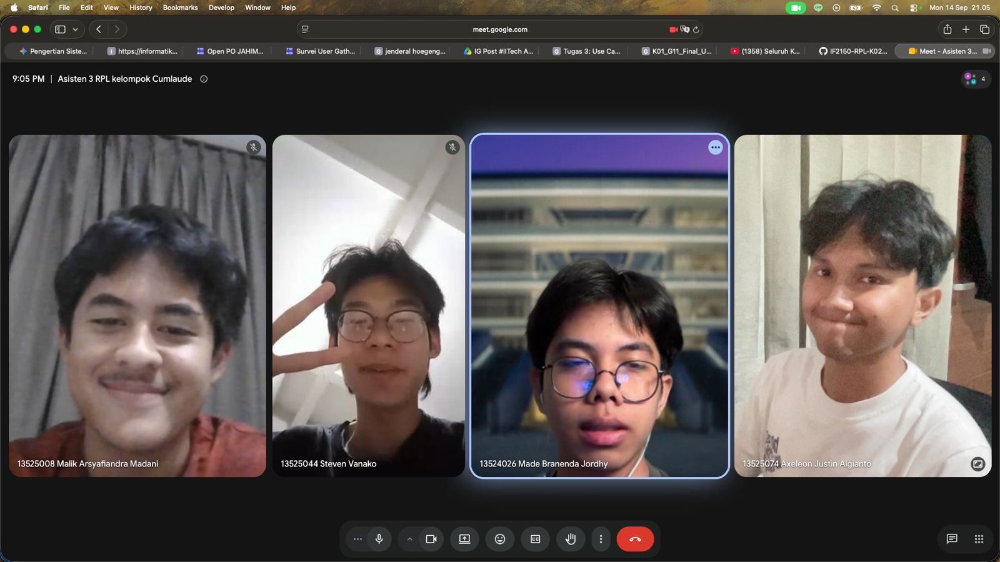

# Form Asistensi

## Tugas Besar IF2150 - Rekayasa Perangkat Lunak

| Informasi | Keterangan |
| --- | --- |
| **Hari** | Senin |
| **Tanggal** | 14/09/2026 |
| **Kelas** | K02 |
| **Nomor Kelompok** | G09  |
| **Nama Kelompok** | Cumlaude  |
| **Nama Perangkat Lunak** | SEHATI (Sistem Elektronik Pelayanan Kesehatan Terintegrasi)  |
| **Dokumen** | K02_G09_UC.md (Tugas 3 - Use Case & Scenario Use Case)  |

### Anggota Kelompok

| NIM | Nama |
| --- | --- |
| 13525008 | Malik Arsyafiandra Madani |
| 13525044 | Steven Vanako |
| 13525071 | Muhammad Adnan Kurniawan |
| 13525074 | Axeleon Justin Algianto |
| 13525110 | Fachry Azriel Fajdwani |

### Catatan

| Catatan |
| --- |
| 1. Penyelarasan use case dengan goal yang ingin dituju |
| 2. Optimalisasi KF yang dikaitkan pada setiap use case dengan perampingan use case yang ditetapkan |
| 3. Penggunaan use case (include & exclude) yang lebih optimal sesuai dengan fungsinya |
| 4. Pemeriksaan kembali skenario use case dan use casenya serta pembuatan use case skenario yang lebih optimal dan d |

## Dokumentasi

  

  <i>Gambar 1. Dokumentasi kegiatan asistensi.</i>

