<h1>
IF2150 REKAYASA PERANGKAT LUNAK
 
TUGAS 4
 
CLASS DIAGRAM
</h1>
 

## SEHATI - Sistem Elektronik Pelayanan Kesehatan Terintegrasi

### Untuk: Made Branenda Jordhy

Dipersiapkan oleh:

| Informasi | Keterangan |
| --- | --- |
| Kelas | K02 |
| Kelompok | G09 |

| NIM | Nama |
| --- | --- |
| 13525008 | Malik Arsyafiandra Madani |
| 13525044 | Steven Vanako |
| 13525071 | Muhammad Adnan Kurniawan |
| 13525074 | Axeleon Justin Algianto |
| 13525110 | Fachry Azriel Fajdwani |

---

## Daftar Perubahan

| Revisi | Deskripsi |
| :--- | :--- |
| A | Penyusunan awal dokumen: Bab 1 sampai Bab 3 menyalin deskripsi perangkat lunak, KF01 s.d. KF24, serta 12 use case beserta skenarionya dari dokumen *Use Case & Scenario Use Case*; Bab 4 memodelkan 33 kelas ke dalam 12 diagram kelas per use case dan satu diagram kelas keseluruhan; Bab 5 menelusuri tiap kelas ke use case dan kebutuhan fungsionalnya |
| B | Penyesuaian hasil asistensi 22 September 2026: Bab 4 disusun ulang memakai kerangka Entity-Control-Boundary sehingga tiap diagram kelas per use case memuat sedikitnya satu boundary, satu control, dan satu entity; jumlah kelas berubah dari 33 menjadi 55; atribut diringkas seperlunya; Bab 5 mengikuti daftar kelas yang baru |
| C |  |

 
 

# BAB 1: Deskripsi Perangkat Lunak

SEHATI (Sistem Elektronik Pelayanan Kesehatan Terintegrasi) adalah aplikasi desktop yang menangani pelayanan rawat jalan puskesmas dari ujung ke ujung. Satu aplikasi menampung pendaftaran pasien, skrining tanda vital, pemeriksaan dokter, peresepan elektronik, penyerahan obat, sampai rekapitulasi laporan, lalu dipakai bersama oleh seluruh petugas pada satu fasilitas kesehatan.

Yang membedakan SEHATI dari SIMPUS kebanyakan adalah kemampuannya membandingkan hasil pengukuran seorang pasien antar-waktu. Sistem mengenali pola yang mengarah ke penyakit tidak menular (hipertensi, obesitas, indikasi diabetes), lalu menyusun pasien tersebut menjadi daftar pantau yang ditindaklanjuti petugas. Basis data lokal menopang seluruh fungsi tanpa memerlukan internet (*offline-first*), sedangkan pengiriman data ke SATUSEHAT menyusul ketika koneksi tersedia sehingga kewajiban regulasi tetap terpenuhi.

Cakupan sistem menyusuri perjalanan pasien melewati tiga titik layanan puskesmas. Petugas di loket menelusuri data pasien, mendaftarkan pasien baru, lalu membuka kunjungan beserta nomor antrean poli. Di ruang periksa, perawat mencatat keluhan awal dan tanda vital, dan sistem menimbang hasilnya terhadap ambang klinis serta riwayat pengukuran pasien; dokter kemudian membaca rekam medis beserta penanda risiko pada satu layar, menegakkan diagnosis, menyusun resep elektronik yang stoknya tervalidasi saat itu juga, dan menjadwalkan kunjungan ulang. Petugas apotek melayani antrean resep lalu menandai penyerahan obat, dan penandaan itu memicu sistem memotong stok, menutup kunjungan, serta mengantrekan datanya sebagai bundel HL7 FHIR. Di luar jam pelayanan, sistem menopang pengelolaan akun dan data master, pencatatan obat masuk beserta peringatan persediaan, penindaklanjutan pasien pada daftar pantau, penyusunan laporan periodik, sinkronisasi ke SATUSEHAT, dan pencadangan basis data terjadwal.

---

# BAB 2: Kebutuhan Fungsional

## 2.1 Kebutuhan Fungsional

Tabel berikut menyalin seluruh Kebutuhan Fungsional dari Subbab 2.4 dokumen *Requirement Gathering* (M2). Kolom ID Kebutuhan merujuk ID pada tabel Pemetaan Kebutuhan di dokumen yang sama, sehingga tiap KF tetap tertelusur sampai ke kebutuhan asalnya. Seluruh rumusan memakai pola EARS.

Tabel 2.1. Daftar Kebutuhan Fungsional

| ID KF | ID Kebutuhan | Penjelasan |
| :--- | :--- | :--- |
| KF01 | R01 | **Ketika** petugas mengetikkan NIK, nama, atau nomor rekam medis pada kolom pencarian di layar pendaftaran, baik utuh maupun sebagian (parsial), perangkat lunak harus menampilkan daftar pasien yang cocok saat itu juga |
| KF02 | R02, R03 | Perangkat lunak harus menyediakan formulir pendaftaran pasien baru (NIK, nama lengkap, tanggal lahir, jenis kelamin, alamat, nomor telepon) serta penyuntingan data pasien lama dari layar profil.   **Ketika** pendaftaran pasien baru tersimpan, perangkat lunak harus menerbitkan tepat satu nomor rekam medis yang unik bagi pasien tersebut.   **Jika** NIK yang masuk bukan 16 digit numerik atau sudah terpakai pasien lain, **maka** perangkat lunak harus menolak penyimpanan dan menampilkan pesan kesalahan pada kolom NIK |
| KF03 | R04 | **Ketika** petugas membuka kunjungan baru dengan memilih poli tujuan, perangkat lunak harus menerbitkan nomor antrean yang berurutan per poli per hari.   **Ketika** hari pelayanan berganti, perangkat lunak harus memulai ulang urutan nomor antrean setiap poli dari awal |
| KF04 | R05 | Perangkat lunak harus menampilkan daftar antrean skrining berisi pasien yang menunggu, terurut menurut nomor antrean.   **Ketika** petugas menekan tombol "Panggil Berikutnya", perangkat lunak harus mengubah status pasien pada urutan terdepan menjadi "sedang dilayani" |
| KF05 | R06 | Perangkat lunak harus menyediakan formulir skrining dengan kolom teks bebas untuk keluhan awal dan kolom numerik untuk tekanan darah sistolik/diastolik (mmHg), berat badan (kg), tinggi badan (cm), suhu (°C), dan nadi (bpm).   **Apabila** hasil pemeriksaan gula darah sewaktu tersedia, perangkat lunak harus menerima nilainya (mg/dL) sebagai isian opsional pada formulir yang sama |
| KF06 | R07 | **Ketika** petugas menyimpan formulir skrining, perangkat lunak harus memeriksa setiap nilai tanda vital terhadap rentang fisiologis yang wajar.   **Jika** terdapat nilai di luar rentang tersebut, **maka** perangkat lunak harus menolak penyimpanan dan menampilkan peringatan pada kolom yang bersangkutan |
| KF07 | R08 | **Ketika** nilai tanda vital tersimpan, perangkat lunak harus membandingkannya terhadap ambang klinis pada data master dan terhadap riwayat pengukuran pasien pada kunjungan-kunjungan sebelumnya.   **Jika** ambang klinis terlampaui atau tiga kunjungan berturut-turut atau lebih menunjukkan nilai di atas ambang yang dapat dikonfigurasi pada data master, **maka** perangkat lunak harus menandai kunjungan sebagai "berisiko" beserta label jenis risikonya (hipertensi, obesitas, indikasi diabetes) dan menampilkan peringatan visual berupa ikon dan warna |
| KF08 | R10 | **Ketika** petugas membuka riwayat pengukuran seorang pasien, perangkat lunak harus menampilkan grafik garis (*line chart*) tren tanda vital (tekanan darah, berat badan, gula darah) dari kunjungan-kunjungan sebelumnya dengan waktu pada sumbu-x |
| KF09 | R11 | **Ketika** petugas membuka ringkasan rekam medis seorang pasien, perangkat lunak harus menampilkan data diri, daftar diagnosis lampau, riwayat obat, dan penanda risiko aktif pada satu tampilan tanpa berpindah layar |
| KF10 | R12, R13 | Perangkat lunak harus menyediakan formulir pemeriksaan dengan kolom anamnesis (teks bebas), diagnosis, dan tindakan, yang hanya terbuka bagi pengguna berstatus dokter.   **Ketika** dokter mengisi kolom diagnosis, perangkat lunak harus menyediakan pencarian kode ICD-10 dan menyimpan diagnosis sebagai kode standar tersebut |
| KF11 | R14, R15 | **Ketika** dokter menyusun resep elektronik, perangkat lunak harus menyediakan pencarian obat dari data master beserta isian dosis, jumlah, dan aturan pakai, sekaligus menampilkan indikator ketersediaan stok setiap obat yang terpilih.   **Jika** stok obat yang diresepkan kurang, **maka** perangkat lunak harus menampilkan peringatan dan meminta dokter memperbaiki resep sebelum resep diteruskan ke antrean apotek |
| KF12 | R16 | **Ketika** dokter menjadwalkan kunjungan ulang, perangkat lunak harus menyimpan tanggal atau rentang waktu yang ditetapkan dan menautkan jadwal tersebut ke daftar pantau pasien |
| KF13 | R17 | Perangkat lunak harus menampilkan antrean resep pada layar apotek, terurut menurut waktu masuk, beserta nama pasien, daftar obat, dosis, dan jumlahnya.   **Ketika** petugas menekan tombol "Obat Diserahkan" pada sebuah resep, perangkat lunak harus mengubah status resep tersebut menjadi selesai dilayani |
| KF14 | R18 | **Ketika** sebuah resep ditandai selesai dilayani dan petugas mengonfirmasi penyerahan, perangkat lunak harus memotong stok setiap obat sebanyak jumlah yang diserahkan, menutup kunjungan yang bersangkutan, dan menyusun data kunjungan tersebut menjadi bundel HL7 FHIR pada antrean sinkronisasi |
| KF15 | R19 | Perangkat lunak harus menyediakan antarmuka manajemen pengguna (menambah akun, menyunting peran, menonaktifkan akun) serta manajemen data master (daftar obat, daftar poli, ambang nilai risiko) |
| KF16 | R20 | **Selama** seorang pengguna masuk ke aplikasi, perangkat lunak harus membatasi menu dan fitur yang terbuka baginya menurut peran akun tersebut.   **Ketika** terjadi perubahan data, perangkat lunak harus mencatatnya pada jejak audit yang memuat identitas pengguna, waktu, dan deskripsi perubahan |
| KF17 | R21 | **Ketika** petugas menyimpan formulir penerimaan obat (nama obat, nomor bets, jumlah, tanggal kedaluwarsa), perangkat lunak harus menambahkan jumlah tersebut ke stok obat yang bersangkutan.   **Jika** stok suatu obat berada di bawah ambang minimum atau suatu bets berjarak 90 hari atau kurang dari tanggal kedaluwarsanya, **maka** perangkat lunak harus menampilkan peringatan persediaan pada dasbor apotek |
| KF18 | R22 | Perangkat lunak harus menampilkan daftar pantau berisi pasien yang pernah ditandai berisiko dan pasien yang dijadwalkan kunjungan ulang, dengan penyaring jenis risiko, rentang tanggal, dan status tindak lanjut.   **Ketika** petugas mencatat tindak lanjut, perangkat lunak harus menyimpan jenis kontak, hasil upaya, dan status kedatangan pasien pada entri daftar pantau tersebut |
| KF19 | R23 | **Ketika** pengguna memilih rentang tanggal pelaporan, perangkat lunak harus menghitung rekapitulasi kunjungan dan diagnosis terbanyak tanpa perintah tambahan, lalu menghasilkan berkas laporan dalam format yang dapat dicetak dan diolah secara tabuler (PDF atau Spreadsheet) |
| KF20 | R24 | **Ketika** pengguna menjalankan sinkronisasi dan koneksi internet tersedia, perangkat lunak harus mengirim bundel HL7 FHIR pada antrean ke platform SATUSEHAT dan menampilkan status pengiriman setiap bundel.   **Jika** koneksi internet putus, **maka** perangkat lunak harus menyediakan opsi "Ekspor Bundel" yang menyimpan antrean sinkronisasi sebagai berkas untuk diunggah dari lokasi lain yang berjaringan |
| KF21 | R26 | Perangkat lunak harus menjalankan pencadangan basis data sesuai jadwal ke media penyimpanan terpisah dan menampilkan informasi pencadangan terakhir pada dasbor administrasi.   **Jika** pencadangan gagal, **maka** perangkat lunak harus menampilkan peringatan kepada pengguna sampai pencadangan berikutnya berhasil |
| KF22 | R28 | Perangkat lunak harus menyimpan seluruh data pelayanan pada basis data lokal di dalam lingkungan fasilitas dan menampilkan indikator status koneksi pada bilah aplikasi.   **Selama** koneksi internet terputus, perangkat lunak harus tetap menjalankan seluruh fungsi pendaftaran, skrining, pemeriksaan, peresepan, dan penyerahan obat secara penuh |
| KF23 | R29 | **Ketika** beberapa petugas pada satu jaringan lokal mengubah data yang sama bersamaan, perangkat lunak harus menjaga perubahan bersamaan pada nomor antrean dan pemotongan stok obat agar tidak saling menimpa dan tidak menghilangkan data |
| KF24 | R30 | Perangkat lunak harus menyediakan pintasan papan ketik pada layar pendaftaran, skrining, pemeriksaan, dan apotek untuk bernavigasi, menyimpan formulir, dan memanggil pasien.   **Ketika** pintasan tersebut ditekan, perangkat lunak harus menjalankan tindakan terkait sehingga seluruh alur pelayanan dapat tuntas tanpa tetikus |

---

# BAB 3: Model Use Case

Bab ini menyalin model use case dari dokumen *Use Case & Scenario Use Case* (M3). Skenario pada Subbab 3.4 menjadi dasar penentuan kelas, atribut, metode, dan relasi pada BAB 4.

SEHATI mencakup fungsi administratif dan klinis pelayanan rawat jalan puskesmas, mulai dari pendaftaran di loket, skrining tanda vital oleh perawat, pemeriksaan dan pencatatan rekam medis oleh dokter, sampai peresepan elektronik dan penyerahan obat di apotek. Di luar jam pelayanan, cakupannya meluas ke pengelolaan akun pengguna, data master, persediaan obat, daftar pantau pasien, laporan periodik, dan pencadangan basis data. SEHATI berhubungan dengan satu sistem luar, yaitu platform SATUSEHAT, lewat pengiriman bundel HL7 FHIR satu arah.

## 3.1 Identifikasi Aktor

Aktor pada model ini mengikuti tiga peran manusia yang ditetapkan sejak Milestone 1. Pasien tidak menjadi aktor karena menerima manfaat sistem tanpa menyentuhnya, sedangkan SATUSEHAT berkedudukan sebagai sistem eksternal, bukan aktor.

| Aktor | Deskripsi |
| :--- | :--- |
| Petugas Administrasi | Berjaga di loket pendaftaran sekaligus memegang administrasi sistem. Mengurus data pasien, membuka kunjungan poli, menyusun laporan periodik, menjalankan sinkronisasi ke SATUSEHAT, menata data master, dan mengatur hak akses pengguna. |
| Tenaga Klinis | Bertugas di ruang periksa poli, mencakup perawat dan dokter. Memanggil pasien dari antrean skrining, mencatat keluhan awal dan tanda vital, membaca rekam medis, menegakkan diagnosis berkode ICD-10, menyusun resep, dan memegang daftar pantau pasien berisiko. Kewenangan menegakkan diagnosis dan meresepkan obat hanya dimiliki pengguna berstatus dokter. |
| Petugas Farmasi | Bertugas di instalasi farmasi puskesmas. Melayani antrean resep yang diteruskan dari ruang periksa, mengonfirmasi penyerahan obat kepada pasien, dan mengurus persediaan obat fasilitas. |

## 3.2 Identifikasi Use Case

Dua belas use case berikut merangkum seluruh kebutuhan fungsional KF01 sampai KF24 dari Bab 2 menjadi unit interaksi yang utuh.

| ID UC | Nama Use Case | Deskripsi Singkat | Aktor Terlibat | ID KF Terkait |
| :--- | :--- | :--- | :--- | :--- |
| UC01 | Masuk ke Aplikasi | Pengguna mengautentikasi diri, lalu sistem membuka menu sesuai peran akunnya. | Petugas Administrasi, Tenaga Klinis, Petugas Farmasi | KF16 |
| UC02 | Mengelola Data Pasien | Petugas menelusuri data pasien secara parsial, lalu mendaftarkan pasien baru atau memutakhirkan data lama tanpa mengubah nomor rekam medisnya. | Petugas Administrasi | KF01, KF02 |
| UC03 | Mengelola Kunjungan Pasien | Petugas membuka kunjungan bagi pasien ke poli tujuan dan sistem menerbitkan nomor antreannya. | Petugas Administrasi | KF01, KF03, KF23 |
| UC04 | Melakukan Skrining Awal | Perawat memanggil pasien dari antrean, mencatat keluhan awal dan tanda vital, lalu sistem menimbang hasilnya terhadap ambang risiko. | Tenaga Klinis | KF04, KF05, KF06, KF07, KF24 |
| UC05 | Melakukan Pemeriksaan Medis | Dokter membaca rekam medis dan tren pengukuran pasien pada satu layar, memeriksa pasien, lalu menegakkan diagnosis berkode ICD-10. | Tenaga Klinis | KF08, KF09, KF10, KF12, KF22, KF24 |
| UC06 | Menyusun Resep Elektronik | Dokter meresepkan obat dari data master puskesmas dengan indikator ketersediaan stok saat itu juga. | Tenaga Klinis | KF11 |
| UC07 | Melayani Resep Obat | Petugas Farmasi melayani antrean resep dan mengonfirmasi penyerahan obat, yang memicu pemotongan stok serta penutupan kunjungan. | Petugas Farmasi | KF13, KF14, KF23 |
| UC08 | Mengelola Persediaan Obat | Petugas Farmasi mencatat obat masuk ke persediaan, dan sistem memunculkan peringatan stok menipis maupun bets mendekati kedaluwarsa. | Petugas Farmasi | KF17 |
| UC09 | Mengelola Daftar Pantau Pasien | Tenaga Klinis menelusuri pasien penyakit tidak menular yang terjadwal, menghubungi mereka, lalu mencatat hasil tindak lanjutnya. | Tenaga Klinis | KF12, KF18 |
| UC10 | Menyusun Laporan Periodik | Petugas Administrasi menghasilkan rekapitulasi kunjungan dan diagnosis per periode, lalu mengekspornya sebagai berkas laporan. | Petugas Administrasi | KF19 |
| UC11 | Melakukan Sinkronisasi SATUSEHAT | Petugas Administrasi mengirim antrean bundel HL7 FHIR ke SATUSEHAT ketika daring, atau mengekspornya sebagai berkas ketika luring. | Petugas Administrasi | KF20, KF22 |
| UC12 | Mengelola Konfigurasi & Basis Data Sistem | Petugas Administrasi mengurus akun staf, data master obat, poli, dan ambang nilai risiko, serta memantau pencadangan basis data lokal. | Petugas Administrasi | KF15, KF21 |

Model ini memakai dua relasi antar use case berikut.

| Relasi | Penjelasan |
| :--- | :--- |
| UC03 **«include»** UC02 | Petugas tidak dapat membuka kunjungan tanpa lebih dulu menemukan atau mendaftarkan pasiennya, sehingga UC03 selalu menjalankan UC02. |
| UC06 **«extend»** UC05 | Dokter menyusun resep hanya ketika hasil pemeriksaan menuntut terapi obat, sehingga UC06 memperluas UC05 sebagai cabang opsional. |

## 3.3 Use Case Diagram

 

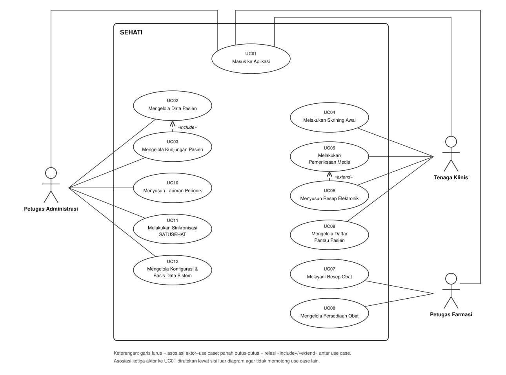

<i>Gambar 1. Use Case Diagram SEHATI.</i>

 

## 3.4 Skenario Use Case

Skenario berikut menyalin Subbab 3.5 dokumen *Use Case & Scenario Use Case*. Kolom Reaksi Perangkat Lunak menjadi sumber metode kelas pada BAB 4.

### 3.4.1 Skenario UC01

**Nama Use Case:** Masuk ke Aplikasi

**Skenario Normal**

| No | Aksi Aktor | Reaksi Perangkat Lunak |
| :--- | :--- | :--- |
| 1 | Pengguna membuka aplikasi SEHATI | Sistem menampilkan layar autentikasi berisi kolom nama pengguna dan kata sandi |
| 2 | Pengguna mengisi nama pengguna dan kata sandi yang benar, lalu menekan tombol "Masuk" | Sistem memeriksa kredensial, membuka sesi pengguna, mencatat peristiwa masuk ke jejak audit, lalu menampilkan dasbor kerja yang menunya terbatas pada peran akun tersebut |

 

**Skenario Alternatif 1: Kredensial Tidak Cocok**

| No | Aksi Aktor | Reaksi Perangkat Lunak |
| :--- | :--- | :--- |
| 1 | Pengguna mengisi nama pengguna atau kata sandi yang salah, lalu menekan tombol "Masuk" | Sistem menolak autentikasi, menampilkan pesan "Nama pengguna atau kata sandi salah", mengosongkan kolom kata sandi, dan mencatat percobaan gagal ke jejak audit |
| 2 | Pengguna mengisi ulang kredensial yang benar | Sistem kembali ke langkah 2 skenario normal |

 

**Skenario Alternatif 2: Akun Berstatus Nonaktif**

| No | Aksi Aktor | Reaksi Perangkat Lunak |
| :--- | :--- | :--- |
| 1 | Pengguna mencoba masuk memakai akun yang sudah dinonaktifkan administrator | Sistem menolak permintaan masuk, memberi tahu bahwa akun tersebut nonaktif, dan meminta pengguna menghubungi Petugas Administrasi |

 

**Skenario Alternatif 3: Pengguna Membuka Modul di Luar Hak Aksesnya**

| No | Aksi Aktor | Reaksi Perangkat Lunak |
| :--- | :--- | :--- |
| 1 | Pengguna mencoba membuka fungsi atau layar di luar wewenangnya, misalnya perawat membuka formulir penegakan diagnosis dokter | Sistem menyembunyikan menu tersebut dari dasbor dan menolak perintah akses langsung disertai keterangan bahwa peran akun itu tidak berwenang |

### 3.4.2 Skenario UC02

**Nama Use Case:** Mengelola Data Pasien

**Skenario Normal (Pendaftaran Pasien Baru)**

| No | Aksi Aktor | Reaksi Perangkat Lunak |
| :--- | :--- | :--- |
| 1 | Petugas Administrasi membuka modul pendaftaran pasien | Sistem menampilkan kolom pencarian pasien dan tombol "Daftarkan Pasien Baru" |
| 2 | Petugas mengetikkan NIK, nama lengkap, atau nomor rekam medis secara parsial untuk memastikan pasien belum terdaftar | Sistem menelusuri basis data lokal saat itu juga lalu menampilkan keterangan "Data pasien tidak ditemukan" |
| 3 | Petugas menekan tombol "Daftarkan Pasien Baru" | Sistem membuka formulir pendaftaran berisi kolom NIK (16 digit), nama lengkap, tanggal lahir, jenis kelamin, alamat domisili, dan nomor telepon |
| 4 | Petugas melengkapi data diri pasien lalu menekan tombol "Simpan" atau pintasan papan ketik simpan | Sistem memeriksa kelengkapan isian serta keunikan NIK, menerbitkan tepat satu nomor rekam medis baru, menyimpan data pasien ke basis data lokal, mencatat transaksi ke jejak audit, dan menampilkan notifikasi pendaftaran berhasil |

 

**Skenario Alternatif 1: Memutakhirkan Data Pasien Lama**

| No | Aksi Aktor | Reaksi Perangkat Lunak |
| :--- | :--- | :--- |
| 1 | Petugas mengetikkan kata kunci pencarian pada langkah 2 skenario normal | Sistem menampilkan daftar pasien yang cocok beserta NIK, nama, tanggal lahir, dan nomor rekam medisnya |
| 2 | Petugas memilih salah satu pasien dari hasil pencarian lalu menekan tombol "Sunting Data" | Sistem membuka formulir data pasien yang sudah terisi data lama |
| 3 | Petugas mengubah data yang berubah, misalnya alamat atau nomor telepon, lalu menekan tombol "Simpan" | Sistem memeriksa perubahan, memutakhirkan profil pasien pada basis data lokal tanpa menyentuh nomor rekam medis yang sudah terbit, mencatat jejak audit, dan menampilkan konfirmasi pembaruan |

 

**Skenario Alternatif 2: NIK Tidak Valid atau Sudah Dipakai Pasien Lain**

| No | Aksi Aktor | Reaksi Perangkat Lunak |
| :--- | :--- | :--- |
| 1 | Petugas mengisi NIK yang bukan 16 digit numerik atau NIK yang sudah dimiliki pasien lain, lalu menekan "Simpan" | Sistem menolak penyimpanan, menandai kolom NIK dengan penanda merah, dan menampilkan pesan kesalahan yang menyebut sebabnya (NIK tidak valid atau NIK sudah terdaftar) |
| 2 | Petugas mengoreksi isian NIK | Sistem kembali ke langkah 4 skenario normal |

### 3.4.3 Skenario UC03

**Nama Use Case:** Mengelola Kunjungan Pasien

**Skenario Normal**

| No | Aksi Aktor | Reaksi Perangkat Lunak |
| :--- | :--- | :--- |
| 1 | Petugas Administrasi memilih pasien dari hasil pencarian data pasien (UC02) lalu menekan tombol "Buat Kunjungan" | Sistem menampilkan layar pembuatan kunjungan berisi ringkasan identitas pasien dan pilihan poli tujuan rawat jalan |
| 2 | Petugas memilih poli tujuan lalu menekan tombol "Terbitkan Antrean" | Sistem membuat entri kunjungan hari berjalan, menerbitkan nomor antrean berurutan per poli untuk hari tersebut, menautkan kunjungan ke rekam medis pasien, mencatat jejak audit, lalu menampilkan tiket antrean poli |

 

**Skenario Alternatif 1: Pasien Masih Punya Kunjungan Aktif Hari Itu**

| No | Aksi Aktor | Reaksi Perangkat Lunak |
| :--- | :--- | :--- |
| 1 | Petugas menekan tombol "Buat Kunjungan" untuk pasien yang masih tercatat punya kunjungan aktif hari itu | Sistem menolak pembuatan kunjungan ganda dan menampilkan kunjungan aktif pasien tersebut beserta nomor antrean dan poli yang sedang berjalan |

 

**Skenario Alternatif 2: Dua Petugas Membuka Kunjungan pada Poli yang Sama secara Bersamaan**

| No | Aksi Aktor | Reaksi Perangkat Lunak |
| :--- | :--- | :--- |
| 1 | Dua petugas pada komputer berbeda dalam satu jaringan lokal menerbitkan antrean untuk poli yang sama pada detik yang sama | Sistem menjalankan isolasi transaksi basis data sehingga kedua kunjungan memperoleh nomor antrean yang tetap berurutan dan unik, tanpa nomor ganda maupun data yang tertimpa |

 

**Skenario Alternatif 3: Hari Pelayanan Berganti**

| No | Aksi Aktor | Reaksi Perangkat Lunak |
| :--- | :--- | :--- |
| 1 | Petugas menerbitkan antrean pertama pada hari pelayanan yang baru | Sistem memulai ulang urutan nomor antrean setiap poli dari angka satu |

### 3.4.4 Skenario UC04

**Nama Use Case:** Melakukan Skrining Awal

**Skenario Normal**

| No | Aksi Aktor | Reaksi Perangkat Lunak |
| :--- | :--- | :--- |
| 1 | Perawat membuka modul antrean skrining | Sistem menampilkan daftar pasien yang menunggu skrining, terurut menurut nomor antrean dan poli tujuan |
| 2 | Perawat menekan tombol "Panggil Berikutnya" atau pintasan papan ketik pemanggil | Sistem mengubah status pasien terdepan menjadi "sedang diskrining", memutakhirkan tampilan monitor antrean, dan membuka formulir skrining |
| 3 | Perawat mengisi keluhan awal serta hasil pengukuran tekanan darah sistolik/diastolik (mmHg), berat badan (kg), tinggi badan (cm), suhu tubuh (°C), nadi (bpm), dan gula darah sewaktu (mg/dL) bila tersedia, memakai pintasan navigasi papan ketik | Sistem menerima setiap isian dan memindahkan fokus antar-kolom tanpa menuntut pengguna berpindah ke tetikus |
| 4 | Perawat menekan pintasan papan ketik simpan | Sistem memeriksa rentang fisiologis seluruh nilai, membandingkan hasil pengukuran terhadap ambang klinis pada data master serta riwayat kunjungan pasien, menyimpan data skrining, mengubah status menjadi "siap diperiksa dokter", lalu meneruskan pasien ke antrean poli |

 

**Skenario Alternatif 1: Pasien Tidak Hadir saat Dipanggil**

| No | Aksi Aktor | Reaksi Perangkat Lunak |
| :--- | :--- | :--- |
| 1 | Pasien yang dipanggil tidak kunjung hadir, lalu perawat menekan tombol "Lewati" | Sistem menandai status pasien menjadi "tidak hadir", memindahkan nomor antreannya ke urutan terbawah, dan menampilkan data pasien berikutnya |

 

**Skenario Alternatif 2: Nilai Pengukuran di Luar Rentang Fisiologis Wajar**

| No | Aksi Aktor | Reaksi Perangkat Lunak |
| :--- | :--- | :--- |
| 1 | Perawat menyimpan formulir skrining yang memuat nilai tidak masuk akal, misalnya suhu tubuh 72 °C atau sistolik 400 mmHg akibat salah ketik | Sistem menolak penyimpanan, menandai kolom bermasalah dengan penanda merah, dan menampilkan pesan kesalahan rentang fisiologis |
| 2 | Perawat mengoreksi nilai pengukuran | Sistem kembali ke langkah 4 skenario normal |

 

**Skenario Alternatif 3: Hasil Pengukuran Melampaui Ambang Risiko**

| No | Aksi Aktor | Reaksi Perangkat Lunak |
| :--- | :--- | :--- |
| 1 | Perawat menyimpan hasil skrining yang nilainya melampaui ambang klinis pada data master, atau yang menunjukkan tiga kunjungan berturut-turut atau lebih di atas ambang | Sistem menandai kunjungan dengan label risiko yang sesuai (hipertensi, obesitas, atau indikasi diabetes), menampilkan peringatan berupa ikon dan warna merah pada berkas kunjungan, memasukkan pasien ke daftar pantau, lalu meneruskannya ke antrean poli |

### 3.4.5 Skenario UC05

**Nama Use Case:** Melakukan Pemeriksaan Medis

**Skenario Normal**

| No | Aksi Aktor | Reaksi Perangkat Lunak |
| :--- | :--- | :--- |
| 1 | Dokter memilih pasien dari daftar antrean ruang periksa | Sistem menampilkan ringkasan rekam medis pasien pada satu layar tanpa berpindah tampilan, memuat data diri, hasil skrining hari itu, daftar diagnosis lampau, riwayat obat, dan penanda risiko aktif |
| 2 | Dokter menekan tab "Lihat Tren Tanda Vital" | Sistem menampilkan grafik garis tekanan darah, berat badan, dan gula darah antar-kunjungan dengan waktu pada sumbu-x |
| 3 | Dokter melakukan anamnesis dan pemeriksaan fisik, lalu mengetikkan kata kunci diagnosis pada kolom diagnosis | Sistem menampilkan padanan kode dan deskripsi ICD-10 selagi dokter mengetik |
| 4 | Dokter memilih kode ICD-10 yang tepat, mengisi tindakan, dan menetapkan tanggal kontrol ulang bagi pasien yang perlu dipantau | Sistem menyimpan diagnosis sebagai kode standar, menautkan rencana kontrol ke daftar pantau pasien, dan menyiapkan ringkasan pemeriksaan |
| 5 | Dokter memeriksa kembali seluruh isian, memicu UC06 bila pasien memerlukan terapi obat, lalu menekan pintasan papan ketik simpan | Sistem mengunci rekam medis kunjungan hari itu, mencatat transaksi ke jejak audit, dan memutakhirkan status kunjungan pasien |

 

**Skenario Alternatif 1: Pengguna yang Membuka Layar Bukan Berstatus Dokter**

| No | Aksi Aktor | Reaksi Perangkat Lunak |
| :--- | :--- | :--- |
| 1 | Tenaga klinis yang bukan dokter, misalnya perawat, membuka rekam medis pasien di ruang periksa | Sistem menampilkan rekam medis dalam mode baca saja serta mengunci kolom diagnosis ICD-10 dan tindakan, disertai keterangan batas wewenang peran |

 

**Skenario Alternatif 2: Kode Diagnosis ICD-10 Tidak Ditemukan**

| No | Aksi Aktor | Reaksi Perangkat Lunak |
| :--- | :--- | :--- |
| 1 | Dokter mengetikkan kata kunci diagnosis yang tidak cocok dengan kode mana pun pada data master ICD-10 | Sistem menampilkan pesan "Kode diagnosis ICD-10 tidak ditemukan" dan meminta dokter memakai istilah lain atau kode bab yang bersangkutan |
| 2 | Dokter mengetikkan istilah pencarian yang tepat | Sistem kembali ke langkah 4 skenario normal |

 

**Skenario Alternatif 3: Pemeriksaan Berlangsung saat Koneksi Internet Terputus**

| No | Aksi Aktor | Reaksi Perangkat Lunak |
| :--- | :--- | :--- |
| 1 | Dokter memeriksa pasien ketika koneksi internet puskesmas padam | Sistem tetap menjalankan penelusuran rekam medis, penampilan grafik tren, dan penyimpanan diagnosis lewat basis data lokal, serta menampilkan indikator "Luring" pada bilah status aplikasi |

 

**Skenario Alternatif 4: Pasien Baru Pertama Kali Berkunjung**

| No | Aksi Aktor | Reaksi Perangkat Lunak |
| :--- | :--- | :--- |
| 1 | Dokter membuka rekam medis pasien yang baru pertama kali datang lalu menekan "Lihat Tren Tanda Vital" | Sistem menampilkan nilai pengukuran hari itu dalam bentuk tabel, disertai keterangan bahwa grafik tren baru terbentuk setelah pasien berkunjung minimal dua kali |

### 3.4.6 Skenario UC06

**Nama Use Case:** Menyusun Resep Elektronik

**Skenario Normal**

| No | Aksi Aktor | Reaksi Perangkat Lunak |
| :--- | :--- | :--- |
| 1 | Dokter menekan tombol "Tambah Resep Elektronik" pada panel pemeriksaan (UC05) | Sistem membuka formulir peresepan yang tersambung ke data master obat beserta stok apotek |
| 2 | Dokter mencari nama obat, memilih sediaannya, lalu mengisi jumlah, dosis, dan aturan pakai | Sistem memeriksa ketersediaan stok saat itu juga dan menampilkan indikator hijau "Tersedia" |
| 3 | Dokter menekan tombol "Kirim ke Apotek" | Sistem memeriksa kecukupan stok seluruh item resep, mengunci rincian obat pada berkas kunjungan berjalan, lalu meneruskan resep ke antrean apotek |

 

**Skenario Alternatif 1: Jumlah Obat yang Diresepkan Melampaui Stok**

| No | Aksi Aktor | Reaksi Perangkat Lunak |
| :--- | :--- | :--- |
| 1 | Dokter memilih obat yang jumlah kebutuhannya melampaui sisa stok di apotek | Sistem menahan penerusan resep, menampilkan indikator merah "Stok Kurang", dan memunculkan peringatan berisi sisa stok yang tersedia |
| 2 | Dokter mengganti obat dengan padanan yang stoknya memadai atau menyesuaikan jumlahnya | Sistem kembali ke langkah 3 skenario normal |

### 3.4.7 Skenario UC07

**Nama Use Case:** Melayani Resep Obat

**Skenario Normal**

| No | Aksi Aktor | Reaksi Perangkat Lunak |
| :--- | :--- | :--- |
| 1 | Petugas Farmasi membuka modul antrean resep apotek | Sistem menampilkan antrean resep terurut menurut waktu masuk, lengkap dengan nama pasien, nomor antrean, poli asal, serta nama obat, dosis, dan jumlahnya |
| 2 | Petugas memilih satu resep untuk disiapkan | Sistem menampilkan rincian resep beserta nomor bets sediaan obat yang tersedia |
| 3 | Petugas menyiapkan obat, memanggil pasien, menjelaskan aturan pakai, lalu menekan tombol "Obat Diserahkan" dan mengonfirmasi penyerahan | Sistem mengubah status resep menjadi "selesai dilayani", memotong stok setiap obat sebanyak jumlah yang diserahkan, menutup kunjungan pasien, lalu menyusun data kunjungan menjadi bundel HL7 FHIR pada antrean sinkronisasi |

 

**Skenario Alternatif 1: Sediaan Obat Bermasalah saat Disiapkan**

| No | Aksi Aktor | Reaksi Perangkat Lunak |
| :--- | :--- | :--- |
| 1 | Petugas Farmasi mendapati kerusakan fisik obat atau kendala sediaan lain saat penyiapan, lalu menekan tombol "Kembalikan ke Dokter" | Sistem membuka kolom catatan yang wajib diisi alasan pengembaliannya |
| 2 | Petugas mengisi alasan pengembalian lalu menekan tombol "Konfirmasi" | Sistem mengembalikan resep ke layar dokter pemeriksa, mengeluarkannya dari antrean aktif apotek, dan menahan penutupan kunjungan sampai dokter menerbitkan resep revisi |

 

**Skenario Alternatif 2: Dua Petugas Mengonfirmasi Penyerahan secara Bersamaan**

| No | Aksi Aktor | Reaksi Perangkat Lunak |
| :--- | :--- | :--- |
| 1 | Dua petugas farmasi pada loket berbeda menekan tombol "Obat Diserahkan" untuk resep yang sama pada saat yang hampir sama | Sistem memproses konfirmasi pertama secara atomik dan menolak konfirmasi kedua dengan pesan bahwa resep sudah selesai dilayani, sehingga stok terpotong tepat satu kali |

### 3.4.8 Skenario UC08

**Nama Use Case:** Mengelola Persediaan Obat

**Skenario Normal**

| No | Aksi Aktor | Reaksi Perangkat Lunak |
| :--- | :--- | :--- |
| 1 | Petugas Farmasi membuka modul persediaan obat lalu memilih formulir "Penerimaan Obat Masuk" | Sistem menampilkan formulir berisi pilihan nama obat dari data master, nomor bets, jumlah yang masuk, dan tanggal kedaluwarsa |
| 2 | Petugas mengisi data faktur penerimaan obat dari gudang farmasi atau distributor lalu menekan tombol "Simpan" | Sistem memeriksa kelengkapan data, menambahkan jumlah tersebut ke stok obat yang bersangkutan, mencatat nomor bets dan tanggal kedaluwarsa ke kartu inventaris, mencatat jejak audit, lalu memutakhirkan saldo persediaan pada dasbor apotek |

 

**Skenario Alternatif 1: Stok Menipis atau Bets Mendekati Kedaluwarsa**

| No | Aksi Aktor | Reaksi Perangkat Lunak |
| :--- | :--- | :--- |
| 1 | Petugas Farmasi membuka dasbor apotek ketika ada obat yang saldonya di bawah ambang minimum atau bets yang berjarak 90 hari atau kurang dari tanggal kedaluwarsanya | Sistem menampilkan peringatan persediaan yang merinci obat mana yang menipis dan bets mana yang mendekati kedaluwarsa |

 

**Skenario Alternatif 2: Jumlah atau Tanggal Kedaluwarsa Tidak Valid**

| No | Aksi Aktor | Reaksi Perangkat Lunak |
| :--- | :--- | :--- |
| 1 | Petugas mengisi jumlah obat nol atau kurang, atau menetapkan tanggal kedaluwarsa yang sudah lewat, lalu menekan tombol "Simpan" | Sistem menolak pencatatan dan menampilkan pesan kesalahan pada kolom yang tidak memenuhi syarat |
| 2 | Petugas memperbaiki isian penerimaan obat | Sistem kembali ke langkah 2 skenario normal |

### 3.4.9 Skenario UC09

**Nama Use Case:** Mengelola Daftar Pantau Pasien

**Skenario Normal**

| No | Aksi Aktor | Reaksi Perangkat Lunak |
| :--- | :--- | :--- |
| 1 | Tenaga Klinis membuka modul "Daftar Pantau Pasien" | Sistem menampilkan pasien yang pernah ditandai berisiko penyakit tidak menular beserta pasien yang dijadwalkan kunjungan ulang, dilengkapi penyaring jenis risiko, rentang tanggal, dan status tindak lanjut |
| 2 | Petugas menyaring daftar menurut jenis risiko dan rentang tanggal untuk menentukan sasaran pemantauan hari itu | Sistem memutakhirkan tabel sesuai kriteria penyaring, menampilkan identitas pasien, nomor kontak, riwayat risiko, dan tanggal rencana kontrol |
| 3 | Petugas menghubungi pasien lewat telepon, pesan, atau kader lapangan, lalu menekan tombol "Catat Tindak Lanjut" pada entri pasien tersebut | Sistem membuka formulir tindak lanjut berisi pilihan jenis kontak, catatan hasil upaya, dan rencana kedatangan pasien |
| 4 | Petugas melengkapi formulir lalu menekan tombol "Simpan" | Sistem menyimpan catatan tindak lanjut ke rekam medis pasien, mengubah status pada daftar pantau menjadi "selesai ditindaklanjuti", dan mencatat jejak audit |

 

**Skenario Alternatif 1: Pasien Belum Dapat Dihubungi**

| No | Aksi Aktor | Reaksi Perangkat Lunak |
| :--- | :--- | :--- |
| 1 | Petugas mencatat hasil upaya dengan status "tidak terhubung" atau "nomor tidak aktif" pada formulir tindak lanjut | Sistem menyimpan riwayat upaya tersebut, mengubah status entri menjadi "perlu dihubungi ulang", dan mempertahankan pasien pada prioritas daftar pantau |

 

**Skenario Alternatif 2: Penyaringan Tidak Menemukan Pasien**

| No | Aksi Aktor | Reaksi Perangkat Lunak |
| :--- | :--- | :--- |
| 1 | Petugas menyaring daftar pantau dengan kriteria yang tidak memuat pasien mana pun | Sistem menampilkan tabel kosong disertai keterangan "Tidak ada pasien yang cocok dengan kriteria saringan" |

### 3.4.10 Skenario UC10

**Nama Use Case:** Menyusun Laporan Periodik

**Skenario Normal**

| No | Aksi Aktor | Reaksi Perangkat Lunak |
| :--- | :--- | :--- |
| 1 | Petugas Administrasi membuka modul "Laporan Periodik" | Sistem menampilkan parameter laporan berupa pilihan rentang tanggal dan penyaring poli layanan |
| 2 | Petugas menetapkan rentang tanggal lalu menekan tombol "Tampilkan Rekapitulasi" | Sistem menghimpun data dari basis data lokal tanpa perintah tambahan, lalu menghitung jumlah kunjungan per poli, sebaran status pelayanan, dan sepuluh diagnosis ICD-10 terbanyak |
| 3 | Petugas menekan tombol "Ekspor Laporan" lalu memilih format berkas (PDF atau Spreadsheet) | Sistem menyusun rekapitulasi menjadi dokumen sesuai format pilihan, menyimpannya pada direktori yang ditentukan pengguna, dan menampilkan notifikasi berkas berhasil dibuat |

 

**Skenario Alternatif 1: Tidak Ada Pelayanan pada Rentang Waktu Terpilih**

| No | Aksi Aktor | Reaksi Perangkat Lunak |
| :--- | :--- | :--- |
| 1 | Petugas memilih rentang tanggal yang tidak memuat catatan pelayanan sama sekali | Sistem menampilkan tabel rekapitulasi bernilai nol disertai keterangan "Tidak ada data pelayanan pada rentang tanggal terpilih" dan mengunci tombol ekspor |

 

**Skenario Alternatif 2: Rentang Tanggal Tidak Valid**

| No | Aksi Aktor | Reaksi Perangkat Lunak |
| :--- | :--- | :--- |
| 1 | Petugas mengisi tanggal akhir yang lebih awal daripada tanggal mulai | Sistem menolak penghitungan dan meminta pengguna memperbaiki urutan tanggalnya |

### 3.4.11 Skenario UC11

**Nama Use Case:** Melakukan Sinkronisasi SATUSEHAT

**Skenario Normal**

| No | Aksi Aktor | Reaksi Perangkat Lunak |
| :--- | :--- | :--- |
| 1 | Petugas Administrasi membuka modul "Sinkronisasi SATUSEHAT" | Sistem menampilkan jumlah bundel HL7 FHIR yang tertunda pada antrean, riwayat pengiriman terakhir, dan indikator status koneksi internet |
| 2 | Petugas menekan tombol "Sinkronkan Sekarang" saat koneksi internet tersedia | Sistem mengirim bundel HL7 FHIR pada antrean ke layanan SATUSEHAT secara tunda tanpa menghentikan pekerjaan lain |
| 3 | Layanan SATUSEHAT membalas dengan kode penerimaan | Sistem menandai bundel tersebut sebagai berhasil terkirim, mencatat log integrasi, dan mengosongkan antrean yang sudah terkirim |

 

**Skenario Alternatif 1: Sinkronisasi Dijalankan saat Jaringan Terputus**

| No | Aksi Aktor | Reaksi Perangkat Lunak |
| :--- | :--- | :--- |
| 1 | Petugas menekan tombol "Sinkronkan Sekarang" saat indikator jaringan menunjukkan kondisi luring | Sistem menahan pengiriman, mempertahankan seluruh bundel pada antrean lokal, dan membuka pilihan tombol "Ekspor Bundel" |
| 2 | Petugas menekan tombol "Ekspor Bundel" lalu memilih media penyimpanan eksternal | Sistem menyimpan antrean bundel sebagai satu berkas arsip terenkripsi ke media tersebut agar dapat diunggah dari perangkat lain yang berjaringan |

 

**Skenario Alternatif 2: SATUSEHAT Menolak Sebagian Bundel**

| No | Aksi Aktor | Reaksi Perangkat Lunak |
| :--- | :--- | :--- |
| 1 | Petugas menjalankan sinkronisasi, lalu server SATUSEHAT menolak sebagian bundel karena format metadata atau data praktisi tidak sesuai | Sistem menandai bundel yang lolos sebagai terkirim, menahan bundel yang ditolak pada antrean lokal dengan status "Gagal Kirim", menampilkan rincian alasan penolakan, dan mencatatnya pada log integrasi |

### 3.4.12 Skenario UC12

**Nama Use Case:** Mengelola Konfigurasi & Basis Data Sistem

**Skenario Normal (Manajemen Akun dan Data Master)**

| No | Aksi Aktor | Reaksi Perangkat Lunak |
| :--- | :--- | :--- |
| 1 | Petugas Administrasi membuka menu "Pengaturan Sistem" | Sistem menampilkan tab Akun Pengguna, Data Master (obat, poli, ambang nilai risiko), dan Pemeliharaan Basis Data |
| 2 | Petugas membuka tab Akun Pengguna lalu menekan tombol "Tambah Pengguna Baru" | Sistem menampilkan formulir berisi nama lengkap, nama pengguna, kata sandi, dan pilihan peran akses |
| 3 | Petugas melengkapi data akun, memilih peran yang sesuai, lalu menekan tombol "Simpan" | Sistem menyimpan kata sandi dalam bentuk *hash*, menambahkan akun ke basis data lokal, mencatat jejak audit, dan memutakhirkan daftar akun |
| 4 | Petugas berpindah ke tab Data Master untuk menyesuaikan ambang nilai risiko, misalnya batas sistolik hipertensi, lalu menekan tombol "Simpan Pengaturan" | Sistem memutakhirkan parameter tersebut pada basis data lokal, mencatat perubahan ke jejak audit, dan memberlakukan ambang baru untuk skrining kunjungan berikutnya |

 

**Skenario Alternatif 1: Memantau dan Menjalankan Pencadangan Basis Data**

| No | Aksi Aktor | Reaksi Perangkat Lunak |
| :--- | :--- | :--- |
| 1 | Petugas membuka tab Pemeliharaan Basis Data untuk memeriksa status pencadangan | Sistem menampilkan pencadangan terakhir beserta tanggal, ukuran berkas, status keberhasilan, dan lokasi media penyimpanannya |
| 2 | Petugas menekan tombol "Cadangkan Basis Data Sekarang" | Sistem menyalin basis data lokal ke media penyimpanan terpisah dalam bentuk terenkripsi, memeriksa keutuhan arsipnya, lalu memutakhirkan catatan waktu pencadangan terakhir |

 

**Skenario Alternatif 2: Nama Pengguna Sudah Dipakai**

| No | Aksi Aktor | Reaksi Perangkat Lunak |
| :--- | :--- | :--- |
| 1 | Petugas menyimpan akun baru dengan nama pengguna yang sudah dipakai staf lain | Sistem menolak pendaftaran akun, menandai kolom nama pengguna, dan meminta petugas memakai nama yang belum terdaftar |
| 2 | Petugas mengisi nama pengguna yang belum terdaftar | Sistem kembali ke langkah 3 skenario normal |

 

**Skenario Alternatif 3: Menonaktifkan Akun Pengguna Lama**

| No | Aksi Aktor | Reaksi Perangkat Lunak |
| :--- | :--- | :--- |
| 1 | Petugas memilih akun staf yang sudah berhenti bertugas lalu menekan tombol "Nonaktifkan Akun" | Sistem mengubah status akun menjadi nonaktif, memutus sesi aktif pengguna tersebut, menolak percobaan masuk berikutnya dari akun itu, dan mencatat jejak audit |

 

**Skenario Alternatif 4: Pencadangan Terjadwal Gagal**

| No | Aksi Aktor | Reaksi Perangkat Lunak |
| :--- | :--- | :--- |
| 1 | Jadwal pencadangan otomatis gagal berjalan, misalnya karena media penyimpanan penuh atau terlepas | Sistem menampilkan peringatan kegagalan pencadangan pada dasbor dan mempertahankannya sampai pencadangan berikutnya berhasil |
| 2 | Petugas menyambungkan media penyimpanan yang memadai lalu menekan tombol "Cadangkan Basis Data Sekarang" | Sistem kembali ke langkah 2 skenario alternatif 1 |

---

# BAB 4: Diagram Kelas

Struktur kelas berikut menurunkan skenario use case pada Subbab 3.4 memakai kerangka **Entity-Control-Boundary (ECB)** sesuai arahan asistensi 22 September 2026. Tiga stereotip itu membagi tanggung jawab sebagai berikut.

| Stereotip | Peran | Pola penamaan |
| :--- | :--- | :--- |
| Boundary | Antarmuka sisi klien yang disentuh aktor, termasuk antarmuka ke sistem luar | `<Nama>Form`, `<Nama>Gateway` |
| Control | Alur kerja dan aturan bisnis satu use case | `<Nama>Manager` |
| Entity | Data yang tersimpan di basis data lokal | `<Nama>Entity` |

Tiap diagram pada Subbab 4.2 memuat sedikitnya satu boundary, satu control, dan satu entity. Beberapa use case memakai lebih dari satu boundary ketika aktor berpindah layar, atau lebih dari satu control ketika satu use case menjalankan dua aturan yang berbeda sifatnya. Boundary tidak pernah menyentuh entity secara langsung; seluruh lalu lintasnya lewat control.

Mengikuti arahan asistensi, diagram hanya memuat nama kelas dan relasinya. Atribut dan metode masuk ke tabel di bawah tiap diagram, dan kami membatasinya pada yang menopang skenario Subbab 3.4.

## 4.1 Identifikasi Kelas

Lima puluh lima kelas berikut merealisasikan dua belas use case pada Subbab 3.3: 16 boundary, 13 control, dan 26 entity. Satu kelas dapat melayani lebih dari satu use case. BAB 5 menelusuri tiap kelas kembali ke kebutuhan fungsional yang menuntutnya.

Tabel 4.1. Identifikasi Kelas

| ID Kelas | Nama Kelas | Stereotip | Deskripsi Kelas | ID Use Case |
| :--- | :--- | :--- | :--- | :--- |
| C01 | LoginForm | Boundary | Layar autentikasi tempat pengguna memasukkan nama pengguna dan kata sandi. | UC01 |
| C02 | PasienForm | Boundary | Layar pencarian dan formulir data pasien di loket pendaftaran. | UC02 |
| C03 | KunjunganForm | Boundary | Layar pembuatan kunjungan dan penerbitan tiket antrean poli. | UC03 |
| C04 | AntreanSkriningForm | Boundary | Layar daftar antrean skrining beserta tombol pemanggilan pasien. | UC04 |
| C05 | SkriningForm | Boundary | Formulir pengisian keluhan awal dan tanda vital pasien. | UC04 |
| C06 | RekamMedisForm | Boundary | Layar ringkasan rekam medis dan grafik tren tanda vital pasien. | UC05 |
| C07 | PemeriksaanForm | Boundary | Formulir anamnesis, diagnosis ICD-10, tindakan, dan jadwal kontrol. | UC05 |
| C08 | ResepForm | Boundary | Formulir peresepan elektronik beserta indikator stok tiap obat. | UC06 |
| C09 | AntreanResepForm | Boundary | Layar antrean resep apotek terurut menurut waktu masuk. | UC07 |
| C10 | PenyerahanObatForm | Boundary | Layar rincian resep dan konfirmasi penyerahan obat kepada pasien. | UC07 |
| C11 | PersediaanForm | Boundary | Layar penerimaan obat masuk dan dasbor peringatan persediaan apotek. | UC08 |
| C12 | DaftarPantauForm | Boundary | Layar daftar pantau pasien berisiko beserta penyaring dan pencatatan tindak lanjut. | UC09 |
| C13 | LaporanForm | Boundary | Layar pemilihan periode dan pratinjau rekapitulasi laporan. | UC10 |
| C14 | SinkronisasiForm | Boundary | Layar status antrean bundel beserta tombol sinkronisasi dan ekspor. | UC11 |
| C15 | SATUSEHATGateway | Boundary | Antarmuka sistem ke layanan SATUSEHAT untuk mengirim bundel HL7 FHIR. | UC11 |
| C16 | KonfigurasiForm | Boundary | Layar manajemen akun, data master, dan pemantauan pencadangan. | UC12 |
| C17 | AutentikasiManager | Control | Memeriksa kredensial, membuka sesi, dan menerapkan batas akses menurut peran akun. | UC01 |
| C18 | PasienManager | Control | Mengatur pencarian, pendaftaran, dan pemutakhiran data pasien. | UC02 |
| C19 | KunjunganManager | Control | Membuka kunjungan, menerbitkan nomor antrean, dan menjaga penomoran tetap unik. | UC03 |
| C20 | SkriningManager | Control | Memanggil pasien dari antrean dan menyimpan hasil skrining yang lolos validasi rentang. | UC04 |
| C21 | RisikoManager | Control | Membandingkan tanda vital terhadap ambang dan riwayat, lalu menerbitkan penanda risiko. | UC04, UC09 |
| C22 | PemeriksaanManager | Control | Menyusun ringkasan rekam medis, menyimpan diagnosis ICD-10, dan menjadwalkan kontrol. | UC05 |
| C23 | ResepManager | Control | Menyusun resep, memvalidasi stok, dan meneruskan resep ke antrean apotek. | UC06 |
| C24 | ApotekManager | Control | Melayani antrean resep, memotong stok, menutup kunjungan, dan menyiapkan bundel FHIR. | UC07 |
| C25 | PersediaanManager | Control | Mencatat obat masuk dan menerbitkan peringatan stok menipis maupun bets mendekati kedaluwarsa. | UC08 |
| C26 | PantauManager | Control | Menyaring daftar pantau dan menyimpan hasil tindak lanjut pasien. | UC09 |
| C27 | LaporanManager | Control | Menghitung rekapitulasi kunjungan dan diagnosis, lalu mengekspor berkas laporan. | UC10 |
| C28 | SinkronisasiManager | Control | Mengelola antrean bundel HL7 FHIR, pengiriman daring, dan ekspor luring. | UC11 |
| C29 | KonfigurasiManager | Control | Mengurus akun pengguna, data master, dan penjadwalan pencadangan basis data. | UC12 |
| C30 | PenggunaEntity | Entity | Data akun staf puskesmas beserta peran dan status aktifnya. | UC01, UC12 |
| C31 | SesiEntity | Entity | Data sesi kerja pengguna sejak berhasil masuk sampai keluar. | UC01 |
| C32 | AuditEntity | Entity | Catatan perubahan data beserta pelaku dan waktunya. | UC01, UC02, UC03, UC05, UC08, UC12 |
| C33 | PasienEntity | Entity | Data diri pasien beserta nomor rekam medisnya. | UC02, UC03, UC09 |
| C34 | RekamMedisEntity | Entity | Riwayat klinis pasien berisi diagnosis lampau, riwayat obat, dan penanda risiko aktif. | UC02, UC05, UC09 |
| C35 | KunjunganEntity | Entity | Satu kedatangan pasien ke poli beserta nomor antrean dan statusnya. | UC03, UC04, UC05, UC07, UC10, UC11 |
| C36 | PoliEntity | Entity | Data master poli rawat jalan beserta urutan antrean hariannya. | UC03, UC10, UC12 |
| C37 | AntreanEntity | Entity | Daftar urut layanan pada satu titik pelayanan (skrining, poli, atau apotek). | UC03, UC04, UC06, UC07 |
| C38 | SkriningEntity | Entity | Hasil skrining satu kunjungan beserta keluhan awal pasien. | UC04 |
| C39 | TandaVitalEntity | Entity | Nilai pengukuran fisik pasien pada satu skrining. | UC04, UC05 |
| C40 | AmbangRisikoEntity | Entity | Data master ambang klinis penanda risiko penyakit tidak menular. | UC04, UC12 |
| C41 | PenandaRisikoEntity | Entity | Tanda risiko yang melekat pada kunjungan beserta jenisnya. | UC04, UC09 |
| C42 | PemeriksaanEntity | Entity | Anamnesis, tindakan, dan hasil pemeriksaan dokter pada satu kunjungan. | UC05, UC06 |
| C43 | DiagnosisEntity | Entity | Diagnosis kunjungan dalam bentuk kode standar ICD-10. | UC05, UC10 |
| C44 | KodeICD10Entity | Entity | Data master kode diagnosis ICD-10. | UC05 |
| C45 | JadwalKontrolEntity | Entity | Rencana kunjungan ulang pasien. | UC05, UC09 |
| C46 | ResepEntity | Entity | Resep elektronik satu kunjungan beserta status pelayanannya di apotek. | UC06, UC07 |
| C47 | ItemResepEntity | Entity | Rincian satu obat pada sebuah resep. | UC06, UC07 |
| C48 | ObatEntity | Entity | Data master obat beserta saldo stok apotek dan ambang minimumnya. | UC06, UC07, UC08, UC12 |
| C49 | BetsObatEntity | Entity | Satu bets sediaan obat beserta jumlah dan tanggal kedaluwarsanya. | UC07, UC08 |
| C50 | PenerimaanObatEntity | Entity | Catatan obat masuk dari gudang farmasi atau distributor. | UC08 |
| C51 | DaftarPantauEntity | Entity | Entri pasien berisiko atau terjadwal kontrol beserta status tindak lanjutnya. | UC04, UC09 |
| C52 | TindakLanjutEntity | Entity | Catatan satu upaya menghubungi pasien pada daftar pantau. | UC09 |
| C53 | LaporanEntity | Entity | Hasil rekapitulasi periodik beserta rentang tanggal dan format berkasnya. | UC10 |
| C54 | BundelFHIREntity | Entity | Bundel HL7 FHIR satu kunjungan beserta status pengirimannya. | UC07, UC11 |
| C55 | PencadanganEntity | Entity | Catatan pencadangan basis data lokal terjadwal. | UC12 |

## 4.2 Diagram Kelas per Use Case

### 4.2.1 Use Case UC01

**Nama Use Case:** *Masuk ke Aplikasi*

Komposisi ECB: 1 boundary, 1 control, 3 entity.

#### Identifikasi Kelas

| ID Kelas | Nama Kelas | Stereotip | Deskripsi Kelas |
| :--- | :--- | :--- | :--- |
| C01 | LoginForm | Boundary | Layar autentikasi tempat pengguna memasukkan nama pengguna dan kata sandi. |
| C17 | AutentikasiManager | Control | Memeriksa kredensial, membuka sesi, dan menerapkan batas akses menurut peran akun. |
| C30 | PenggunaEntity | Entity | Data akun staf puskesmas beserta peran dan status aktifnya. |
| C31 | SesiEntity | Entity | Data sesi kerja pengguna sejak berhasil masuk sampai keluar. |
| C32 | AuditEntity | Entity | Catatan perubahan data beserta pelaku dan waktunya. |

#### Diagram Kelas

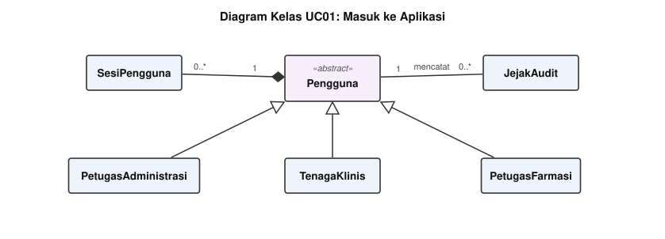

<i>Gambar 2. Diagram Kelas Use Case UC01 (Masuk ke Aplikasi).</i>

`LoginForm` meneruskan kredensial ke `AutentikasiManager`, dan manager itu membaca `PenggunaEntity` lalu menulis `SesiEntity` dan `AuditEntity`. `PenggunaEntity` memegang `SesiEntity` dalam relasi **komposisi** karena sesi ikut hilang bersama akun pemiliknya.

#### Atribut dan Metode

| ID Kelas | Nama Kelas | Stereotip | Atribut | Metode/Operasi |
| :--- | :--- | :--- | :--- | :--- |
| C01 | LoginForm | Boundary | namaPengguna, kataSandi | tampilkan(), kirimKredensial(), tampilkanPesanGagal() |
| C17 | AutentikasiManager | Control | percobaanGagal | autentikasi(), bukaSesi(), periksaHakAkses() |
| C30 | PenggunaEntity | Entity | idPengguna, namaPengguna, kataSandiHash, peran, status | simpan(), nonaktifkan() |
| C31 | SesiEntity | Entity | idSesi, waktuMulai, statusAktif | buka(), tutup() |
| C32 | AuditEntity | Entity | idAudit, idPengguna, waktu, deskripsi | simpan() |

### 4.2.2 Use Case UC02

**Nama Use Case:** *Mengelola Data Pasien*

Komposisi ECB: 1 boundary, 1 control, 3 entity.

#### Identifikasi Kelas

| ID Kelas | Nama Kelas | Stereotip | Deskripsi Kelas |
| :--- | :--- | :--- | :--- |
| C02 | PasienForm | Boundary | Layar pencarian dan formulir data pasien di loket pendaftaran. |
| C18 | PasienManager | Control | Mengatur pencarian, pendaftaran, dan pemutakhiran data pasien. |
| C32 | AuditEntity | Entity | Catatan perubahan data beserta pelaku dan waktunya. |
| C33 | PasienEntity | Entity | Data diri pasien beserta nomor rekam medisnya. |
| C34 | RekamMedisEntity | Entity | Riwayat klinis pasien berisi diagnosis lampau, riwayat obat, dan penanda risiko aktif. |

#### Diagram Kelas

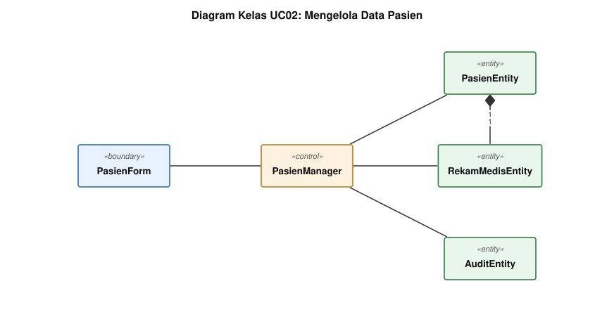

<i>Gambar 3. Diagram Kelas Use Case UC02 (Mengelola Data Pasien).</i>

`PasienManager` memegang validasi NIK dan penerbitan nomor rekam medis, sehingga `PasienForm` tidak menyentuh basis data secara langsung. `PasienEntity` memegang `RekamMedisEntity` lewat **komposisi** satu-ke-satu.

#### Atribut dan Metode

| ID Kelas | Nama Kelas | Stereotip | Atribut | Metode/Operasi |
| :--- | :--- | :--- | :--- | :--- |
| C02 | PasienForm | Boundary | kataKunci, dataFormulir | tampilkanHasilCari(), kirimDataPasien(), tampilkanPesanValidasi() |
| C18 | PasienManager | Control | - | cariPasien(), daftarkanPasien(), perbaruiPasien(), validasiNIK() |
| C32 | AuditEntity | Entity | idAudit, idPengguna, waktu, deskripsi | simpan() |
| C33 | PasienEntity | Entity | idPasien, nik, nomorRekamMedis, nama, tanggalLahir | simpan(), perbarui() |
| C34 | RekamMedisEntity | Entity | idRekamMedis, daftarDiagnosis, riwayatObat | tambahEntri() |

### 4.2.3 Use Case UC03

**Nama Use Case:** *Mengelola Kunjungan Pasien*

Komposisi ECB: 1 boundary, 1 control, 5 entity.

#### Identifikasi Kelas

| ID Kelas | Nama Kelas | Stereotip | Deskripsi Kelas |
| :--- | :--- | :--- | :--- |
| C03 | KunjunganForm | Boundary | Layar pembuatan kunjungan dan penerbitan tiket antrean poli. |
| C19 | KunjunganManager | Control | Membuka kunjungan, menerbitkan nomor antrean, dan menjaga penomoran tetap unik. |
| C32 | AuditEntity | Entity | Catatan perubahan data beserta pelaku dan waktunya. |
| C33 | PasienEntity | Entity | Data diri pasien beserta nomor rekam medisnya. |
| C35 | KunjunganEntity | Entity | Satu kedatangan pasien ke poli beserta nomor antrean dan statusnya. |
| C36 | PoliEntity | Entity | Data master poli rawat jalan beserta urutan antrean hariannya. |
| C37 | AntreanEntity | Entity | Daftar urut layanan pada satu titik pelayanan (skrining, poli, atau apotek). |

#### Diagram Kelas

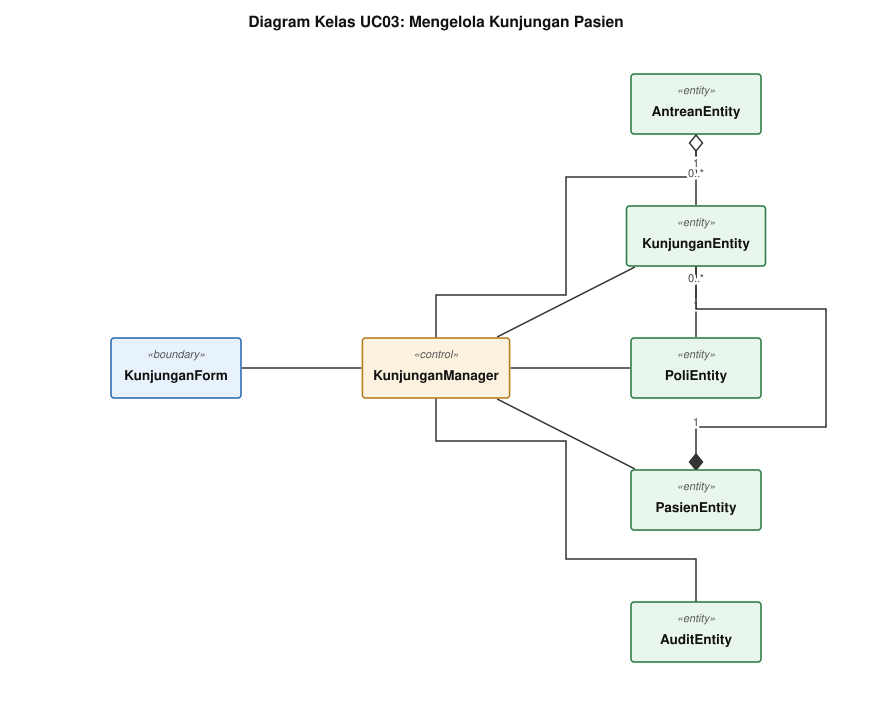

<i>Gambar 4. Diagram Kelas Use Case UC03 (Mengelola Kunjungan Pasien).</i>

`KunjunganManager` menerbitkan nomor antrean lewat `PoliEntity` dan menolak kunjungan ganda, dua aturan yang tidak boleh tersebar ke layar. `AntreanEntity` menghimpun kunjungan lewat **agregasi** karena kunjungan tetap ada setelah keluar dari antrean.

#### Atribut dan Metode

| ID Kelas | Nama Kelas | Stereotip | Atribut | Metode/Operasi |
| :--- | :--- | :--- | :--- | :--- |
| C03 | KunjunganForm | Boundary | poliTerpilih | tampilkanPilihanPoli(), kirimPermintaanKunjungan(), tampilkanTiketAntrean() |
| C19 | KunjunganManager | Control | - | bukaKunjungan(), terbitkanNomorAntrean(), cegahKunjunganGanda() |
| C32 | AuditEntity | Entity | idAudit, idPengguna, waktu, deskripsi | simpan() |
| C33 | PasienEntity | Entity | idPasien, nik, nomorRekamMedis, nama, tanggalLahir | simpan(), perbarui() |
| C35 | KunjunganEntity | Entity | idKunjungan, tanggal, nomorAntrean, status | simpan(), perbaruiStatus() |
| C36 | PoliEntity | Entity | idPoli, namaPoli, urutanTerakhir | ambilNomorBerikutnya() |
| C37 | AntreanEntity | Entity | idAntrean, jenis, daftarEntri | ambilTerdepan(), pindahkanKeBelakang() |

### 4.2.4 Use Case UC04

**Nama Use Case:** *Melakukan Skrining Awal*

Komposisi ECB: 2 boundary, 2 control, 7 entity.

#### Identifikasi Kelas

| ID Kelas | Nama Kelas | Stereotip | Deskripsi Kelas |
| :--- | :--- | :--- | :--- |
| C04 | AntreanSkriningForm | Boundary | Layar daftar antrean skrining beserta tombol pemanggilan pasien. |
| C05 | SkriningForm | Boundary | Formulir pengisian keluhan awal dan tanda vital pasien. |
| C20 | SkriningManager | Control | Memanggil pasien dari antrean dan menyimpan hasil skrining yang lolos validasi rentang. |
| C21 | RisikoManager | Control | Membandingkan tanda vital terhadap ambang dan riwayat, lalu menerbitkan penanda risiko. |
| C35 | KunjunganEntity | Entity | Satu kedatangan pasien ke poli beserta nomor antrean dan statusnya. |
| C37 | AntreanEntity | Entity | Daftar urut layanan pada satu titik pelayanan (skrining, poli, atau apotek). |
| C38 | SkriningEntity | Entity | Hasil skrining satu kunjungan beserta keluhan awal pasien. |
| C39 | TandaVitalEntity | Entity | Nilai pengukuran fisik pasien pada satu skrining. |
| C40 | AmbangRisikoEntity | Entity | Data master ambang klinis penanda risiko penyakit tidak menular. |
| C41 | PenandaRisikoEntity | Entity | Tanda risiko yang melekat pada kunjungan beserta jenisnya. |
| C51 | DaftarPantauEntity | Entity | Entri pasien berisiko atau terjadwal kontrol beserta status tindak lanjutnya. |

#### Diagram Kelas

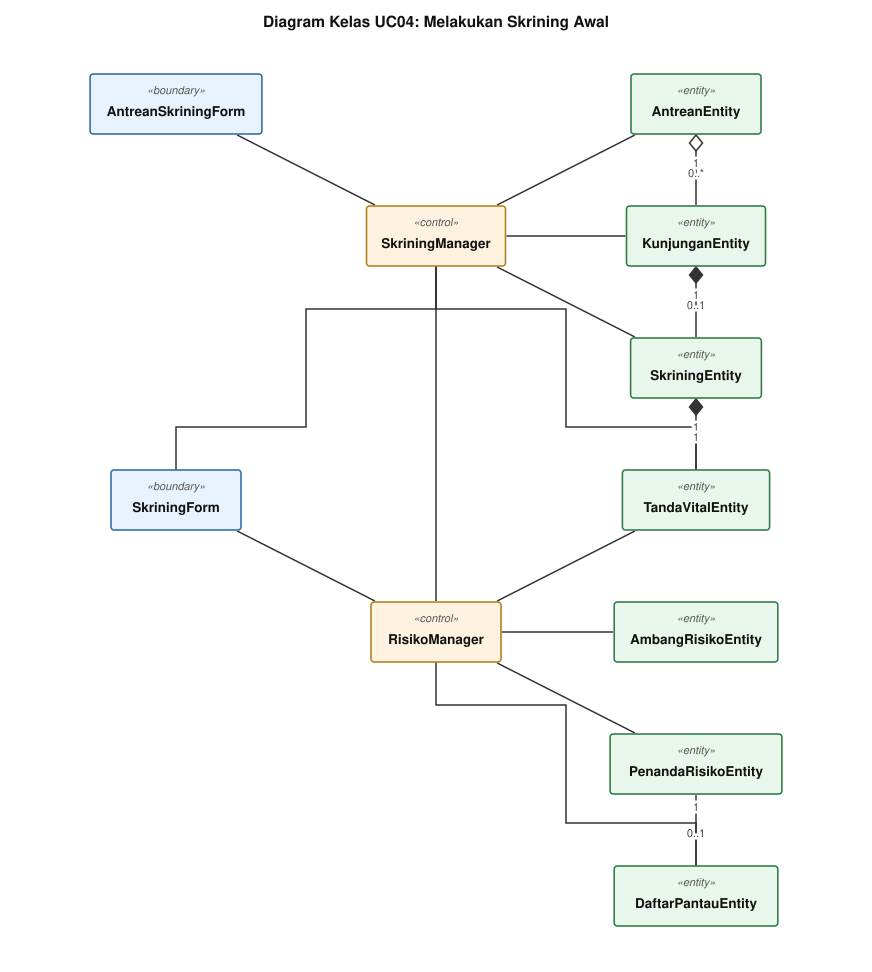

<i>Gambar 5. Diagram Kelas Use Case UC04 (Melakukan Skrining Awal).</i>

Dua boundary melayani dua layar berbeda: `AntreanSkriningForm` untuk pemanggilan pasien dan `SkriningForm` untuk pengisian tanda vital. Perbandingan nilai terhadap ambang dan riwayat kami pisahkan ke `RisikoManager` supaya `SkriningManager` cukup mengurus validasi rentang dan penyimpanan.

#### Atribut dan Metode

| ID Kelas | Nama Kelas | Stereotip | Atribut | Metode/Operasi |
| :--- | :--- | :--- | :--- | :--- |
| C04 | AntreanSkriningForm | Boundary | daftarTampil | tampilkanAntrean(), kirimPanggilan(), kirimLewati() |
| C05 | SkriningForm | Boundary | isianKeluhan, isianUkuran | tampilkanFormulir(), kirimHasilSkrining(), tampilkanPeringatanRentang() |
| C20 | SkriningManager | Control | - | panggilPasien(), validasiRentang(), simpanSkrining() |
| C21 | RisikoManager | Control | - | evaluasiRisiko(), terbitkanPenanda(), masukkanKeDaftarPantau() |
| C35 | KunjunganEntity | Entity | idKunjungan, tanggal, nomorAntrean, status | simpan(), perbaruiStatus() |
| C37 | AntreanEntity | Entity | idAntrean, jenis, daftarEntri | ambilTerdepan(), pindahkanKeBelakang() |
| C38 | SkriningEntity | Entity | idSkrining, keluhanAwal, waktu | simpan() |
| C39 | TandaVitalEntity | Entity | sistolik, diastolik, beratBadan, tinggiBadan, gulaDarah | hitungIMT() |
| C40 | AmbangRisikoEntity | Entity | idAmbang, jenisRisiko, nilaiBatas | simpan() |
| C41 | PenandaRisikoEntity | Entity | idPenanda, jenisRisiko, tanggal, status | simpan(), cabut() |
| C51 | DaftarPantauEntity | Entity | idEntri, jenisRisiko, statusTindakLanjut | simpan(), perbaruiStatus() |

### 4.2.5 Use Case UC05

**Nama Use Case:** *Melakukan Pemeriksaan Medis*

Komposisi ECB: 2 boundary, 1 control, 8 entity.

#### Identifikasi Kelas

| ID Kelas | Nama Kelas | Stereotip | Deskripsi Kelas |
| :--- | :--- | :--- | :--- |
| C06 | RekamMedisForm | Boundary | Layar ringkasan rekam medis dan grafik tren tanda vital pasien. |
| C07 | PemeriksaanForm | Boundary | Formulir anamnesis, diagnosis ICD-10, tindakan, dan jadwal kontrol. |
| C22 | PemeriksaanManager | Control | Menyusun ringkasan rekam medis, menyimpan diagnosis ICD-10, dan menjadwalkan kontrol. |
| C32 | AuditEntity | Entity | Catatan perubahan data beserta pelaku dan waktunya. |
| C34 | RekamMedisEntity | Entity | Riwayat klinis pasien berisi diagnosis lampau, riwayat obat, dan penanda risiko aktif. |
| C35 | KunjunganEntity | Entity | Satu kedatangan pasien ke poli beserta nomor antrean dan statusnya. |
| C39 | TandaVitalEntity | Entity | Nilai pengukuran fisik pasien pada satu skrining. |
| C42 | PemeriksaanEntity | Entity | Anamnesis, tindakan, dan hasil pemeriksaan dokter pada satu kunjungan. |
| C43 | DiagnosisEntity | Entity | Diagnosis kunjungan dalam bentuk kode standar ICD-10. |
| C44 | KodeICD10Entity | Entity | Data master kode diagnosis ICD-10. |
| C45 | JadwalKontrolEntity | Entity | Rencana kunjungan ulang pasien. |

#### Diagram Kelas

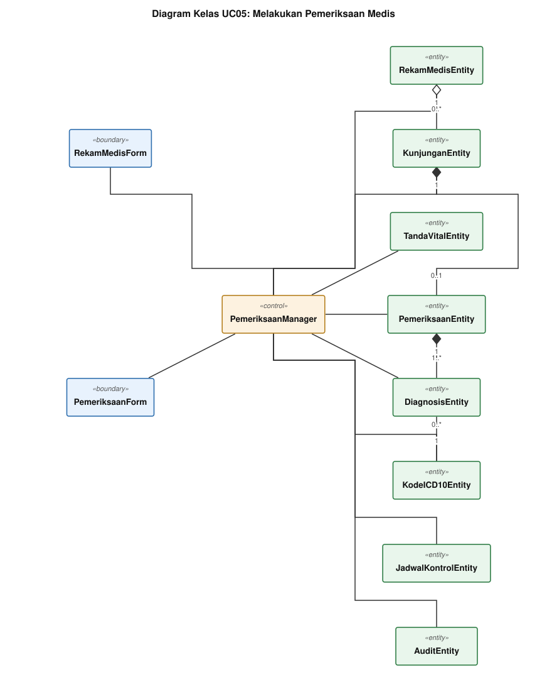

<i>Gambar 6. Diagram Kelas Use Case UC05 (Melakukan Pemeriksaan Medis).</i>

`RekamMedisForm` menampilkan ringkasan dan grafik tren, sedangkan `PemeriksaanForm` menerima anamnesis dan diagnosis. `PemeriksaanManager` menyusun seri tren dari `TandaVitalEntity` kunjungan lampau, sehingga boundary cukup menggambar hasilnya.

#### Atribut dan Metode

| ID Kelas | Nama Kelas | Stereotip | Atribut | Metode/Operasi |
| :--- | :--- | :--- | :--- | :--- |
| C06 | RekamMedisForm | Boundary | idPasienTampil, seriTren | tampilkanRingkasan(), tampilkanGrafikTren() |
| C07 | PemeriksaanForm | Boundary | isianAnamnesis, kataKunciDiagnosis | tampilkanFormulir(), kirimHasilPemeriksaan(), tampilkanSaranKode() |
| C22 | PemeriksaanManager | Control | - | susunRingkasan(), susunTren(), simpanPemeriksaan(), jadwalkanKontrol() |
| C32 | AuditEntity | Entity | idAudit, idPengguna, waktu, deskripsi | simpan() |
| C34 | RekamMedisEntity | Entity | idRekamMedis, daftarDiagnosis, riwayatObat | tambahEntri() |
| C35 | KunjunganEntity | Entity | idKunjungan, tanggal, nomorAntrean, status | simpan(), perbaruiStatus() |
| C39 | TandaVitalEntity | Entity | sistolik, diastolik, beratBadan, tinggiBadan, gulaDarah | hitungIMT() |
| C42 | PemeriksaanEntity | Entity | idPemeriksaan, anamnesis, tindakan, terkunci | simpan(), kunci() |
| C43 | DiagnosisEntity | Entity | idDiagnosis, kodeICD10, deskripsi | simpan() |
| C44 | KodeICD10Entity | Entity | kode, deskripsi, bab | cari() |
| C45 | JadwalKontrolEntity | Entity | idJadwal, tanggalRencana, status | simpan() |

### 4.2.6 Use Case UC06

**Nama Use Case:** *Menyusun Resep Elektronik*

Komposisi ECB: 1 boundary, 1 control, 5 entity.

#### Identifikasi Kelas

| ID Kelas | Nama Kelas | Stereotip | Deskripsi Kelas |
| :--- | :--- | :--- | :--- |
| C08 | ResepForm | Boundary | Formulir peresepan elektronik beserta indikator stok tiap obat. |
| C23 | ResepManager | Control | Menyusun resep, memvalidasi stok, dan meneruskan resep ke antrean apotek. |
| C37 | AntreanEntity | Entity | Daftar urut layanan pada satu titik pelayanan (skrining, poli, atau apotek). |
| C42 | PemeriksaanEntity | Entity | Anamnesis, tindakan, dan hasil pemeriksaan dokter pada satu kunjungan. |
| C46 | ResepEntity | Entity | Resep elektronik satu kunjungan beserta status pelayanannya di apotek. |
| C47 | ItemResepEntity | Entity | Rincian satu obat pada sebuah resep. |
| C48 | ObatEntity | Entity | Data master obat beserta saldo stok apotek dan ambang minimumnya. |

#### Diagram Kelas

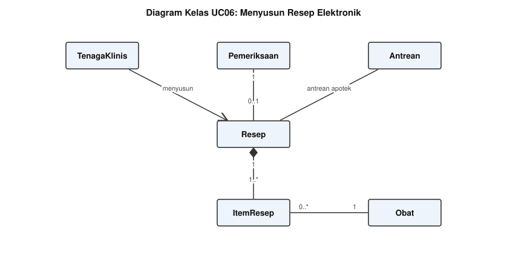

<i>Gambar 7. Diagram Kelas Use Case UC06 (Menyusun Resep Elektronik).</i>

`ResepManager` memeriksa kecukupan stok sebelum resep masuk antrean apotek, jadi `ResepForm` hanya menampilkan indikator hijau atau merah yang dikirim manager. `ResepEntity` memegang `ItemResepEntity` lewat **komposisi** karena rincian item tidak bermakna di luar resepnya.

#### Atribut dan Metode

| ID Kelas | Nama Kelas | Stereotip | Atribut | Metode/Operasi |
| :--- | :--- | :--- | :--- | :--- |
| C08 | ResepForm | Boundary | isianItem, indikatorStok | tampilkanFormulir(), kirimResep(), tampilkanPeringatanStok() |
| C23 | ResepManager | Control | - | tambahItem(), validasiStok(), kirimKeApotek() |
| C37 | AntreanEntity | Entity | idAntrean, jenis, daftarEntri | ambilTerdepan(), pindahkanKeBelakang() |
| C42 | PemeriksaanEntity | Entity | idPemeriksaan, anamnesis, tindakan, terkunci | simpan(), kunci() |
| C46 | ResepEntity | Entity | idResep, waktuMasuk, status | simpan(), perbaruiStatus() |
| C47 | ItemResepEntity | Entity | idItem, dosis, jumlah, aturanPakai | simpan() |
| C48 | ObatEntity | Entity | idObat, namaObat, sediaan, stok, ambangMinimum | kurangiStok(), tambahStok() |

### 4.2.7 Use Case UC07

**Nama Use Case:** *Melayani Resep Obat*

Komposisi ECB: 2 boundary, 1 control, 7 entity.

#### Identifikasi Kelas

| ID Kelas | Nama Kelas | Stereotip | Deskripsi Kelas |
| :--- | :--- | :--- | :--- |
| C09 | AntreanResepForm | Boundary | Layar antrean resep apotek terurut menurut waktu masuk. |
| C10 | PenyerahanObatForm | Boundary | Layar rincian resep dan konfirmasi penyerahan obat kepada pasien. |
| C24 | ApotekManager | Control | Melayani antrean resep, memotong stok, menutup kunjungan, dan menyiapkan bundel FHIR. |
| C35 | KunjunganEntity | Entity | Satu kedatangan pasien ke poli beserta nomor antrean dan statusnya. |
| C37 | AntreanEntity | Entity | Daftar urut layanan pada satu titik pelayanan (skrining, poli, atau apotek). |
| C46 | ResepEntity | Entity | Resep elektronik satu kunjungan beserta status pelayanannya di apotek. |
| C47 | ItemResepEntity | Entity | Rincian satu obat pada sebuah resep. |
| C48 | ObatEntity | Entity | Data master obat beserta saldo stok apotek dan ambang minimumnya. |
| C49 | BetsObatEntity | Entity | Satu bets sediaan obat beserta jumlah dan tanggal kedaluwarsanya. |
| C54 | BundelFHIREntity | Entity | Bundel HL7 FHIR satu kunjungan beserta status pengirimannya. |

#### Diagram Kelas

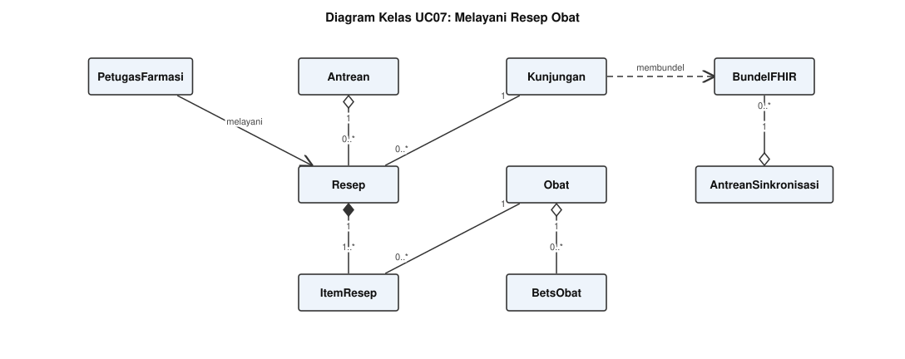

<i>Gambar 8. Diagram Kelas Use Case UC07 (Melayani Resep Obat).</i>

Satu konfirmasi penyerahan di `PenyerahanObatForm` memicu empat langkah di `ApotekManager`: potong stok, tandai resep selesai, tutup kunjungan, lalu susun bundel. Menaruhnya di satu control membuat keempatnya berjalan atomik saat dua petugas menekan tombol bersamaan.

#### Atribut dan Metode

| ID Kelas | Nama Kelas | Stereotip | Atribut | Metode/Operasi |
| :--- | :--- | :--- | :--- | :--- |
| C09 | AntreanResepForm | Boundary | daftarTampil | tampilkanAntrean(), pilihResep() |
| C10 | PenyerahanObatForm | Boundary | rincianTampil | tampilkanRincian(), kirimKonfirmasi(), kirimPengembalian() |
| C24 | ApotekManager | Control | - | layaniResep(), potongStok(), tutupKunjungan(), susunBundel() |
| C35 | KunjunganEntity | Entity | idKunjungan, tanggal, nomorAntrean, status | simpan(), perbaruiStatus() |
| C37 | AntreanEntity | Entity | idAntrean, jenis, daftarEntri | ambilTerdepan(), pindahkanKeBelakang() |
| C46 | ResepEntity | Entity | idResep, waktuMasuk, status | simpan(), perbaruiStatus() |
| C47 | ItemResepEntity | Entity | idItem, dosis, jumlah, aturanPakai | simpan() |
| C48 | ObatEntity | Entity | idObat, namaObat, sediaan, stok, ambangMinimum | kurangiStok(), tambahStok() |
| C49 | BetsObatEntity | Entity | nomorBets, jumlah, tanggalKedaluwarsa | kurangi() |
| C54 | BundelFHIREntity | Entity | idBundel, isiBundel, status | simpan(), tandaiTerkirim() |

### 4.2.8 Use Case UC08

**Nama Use Case:** *Mengelola Persediaan Obat*

Komposisi ECB: 1 boundary, 1 control, 4 entity.

#### Identifikasi Kelas

| ID Kelas | Nama Kelas | Stereotip | Deskripsi Kelas |
| :--- | :--- | :--- | :--- |
| C11 | PersediaanForm | Boundary | Layar penerimaan obat masuk dan dasbor peringatan persediaan apotek. |
| C25 | PersediaanManager | Control | Mencatat obat masuk dan menerbitkan peringatan stok menipis maupun bets mendekati kedaluwarsa. |
| C32 | AuditEntity | Entity | Catatan perubahan data beserta pelaku dan waktunya. |
| C48 | ObatEntity | Entity | Data master obat beserta saldo stok apotek dan ambang minimumnya. |
| C49 | BetsObatEntity | Entity | Satu bets sediaan obat beserta jumlah dan tanggal kedaluwarsanya. |
| C50 | PenerimaanObatEntity | Entity | Catatan obat masuk dari gudang farmasi atau distributor. |

#### Diagram Kelas

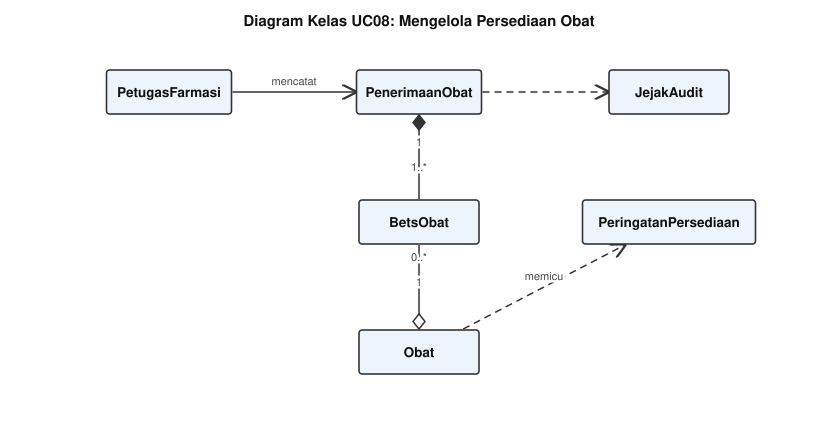

<i>Gambar 9. Diagram Kelas Use Case UC08 (Mengelola Persediaan Obat).</i>

Peringatan stok menipis dan bets mendekati kedaluwarsa terbit dari `PersediaanManager`, bukan dari entity, karena ambangnya menyangkut kebijakan apotek. `PersediaanForm` menampilkan daftar peringatan yang sudah jadi.

#### Atribut dan Metode

| ID Kelas | Nama Kelas | Stereotip | Atribut | Metode/Operasi |
| :--- | :--- | :--- | :--- | :--- |
| C11 | PersediaanForm | Boundary | isianPenerimaan, daftarPeringatan | tampilkanFormulir(), kirimPenerimaan(), tampilkanPeringatan() |
| C25 | PersediaanManager | Control | - | catatPenerimaan(), tambahStok(), terbitkanPeringatan() |
| C32 | AuditEntity | Entity | idAudit, idPengguna, waktu, deskripsi | simpan() |
| C48 | ObatEntity | Entity | idObat, namaObat, sediaan, stok, ambangMinimum | kurangiStok(), tambahStok() |
| C49 | BetsObatEntity | Entity | nomorBets, jumlah, tanggalKedaluwarsa | kurangi() |
| C50 | PenerimaanObatEntity | Entity | idPenerimaan, nomorFaktur, tanggalTerima | simpan() |

### 4.2.9 Use Case UC09

**Nama Use Case:** *Mengelola Daftar Pantau Pasien*

Komposisi ECB: 1 boundary, 2 control, 6 entity.

#### Identifikasi Kelas

| ID Kelas | Nama Kelas | Stereotip | Deskripsi Kelas |
| :--- | :--- | :--- | :--- |
| C12 | DaftarPantauForm | Boundary | Layar daftar pantau pasien berisiko beserta penyaring dan pencatatan tindak lanjut. |
| C21 | RisikoManager | Control | Membandingkan tanda vital terhadap ambang dan riwayat, lalu menerbitkan penanda risiko. |
| C26 | PantauManager | Control | Menyaring daftar pantau dan menyimpan hasil tindak lanjut pasien. |
| C33 | PasienEntity | Entity | Data diri pasien beserta nomor rekam medisnya. |
| C34 | RekamMedisEntity | Entity | Riwayat klinis pasien berisi diagnosis lampau, riwayat obat, dan penanda risiko aktif. |
| C41 | PenandaRisikoEntity | Entity | Tanda risiko yang melekat pada kunjungan beserta jenisnya. |
| C45 | JadwalKontrolEntity | Entity | Rencana kunjungan ulang pasien. |
| C51 | DaftarPantauEntity | Entity | Entri pasien berisiko atau terjadwal kontrol beserta status tindak lanjutnya. |
| C52 | TindakLanjutEntity | Entity | Catatan satu upaya menghubungi pasien pada daftar pantau. |

#### Diagram Kelas

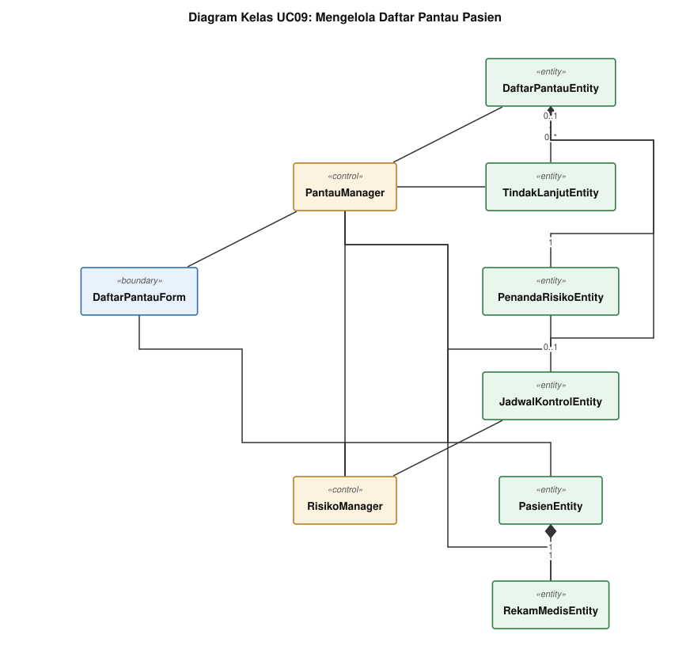

<i>Gambar 10. Diagram Kelas Use Case UC09 (Mengelola Daftar Pantau Pasien).</i>

`RisikoManager` muncul lagi di sini karena pasien masuk daftar pantau lewat dua jalan: penanda risiko dari skrining dan jadwal kontrol dari dokter. `PantauManager` mengurus penyaringan dan pencatatan tindak lanjutnya.

#### Atribut dan Metode

| ID Kelas | Nama Kelas | Stereotip | Atribut | Metode/Operasi |
| :--- | :--- | :--- | :--- | :--- |
| C12 | DaftarPantauForm | Boundary | penyaring, daftarTampil | tampilkanDaftar(), kirimPenyaring(), kirimTindakLanjut() |
| C21 | RisikoManager | Control | - | evaluasiRisiko(), terbitkanPenanda(), masukkanKeDaftarPantau() |
| C26 | PantauManager | Control | - | saringDaftar(), catatTindakLanjut(), perbaruiStatus() |
| C33 | PasienEntity | Entity | idPasien, nik, nomorRekamMedis, nama, tanggalLahir | simpan(), perbarui() |
| C34 | RekamMedisEntity | Entity | idRekamMedis, daftarDiagnosis, riwayatObat | tambahEntri() |
| C41 | PenandaRisikoEntity | Entity | idPenanda, jenisRisiko, tanggal, status | simpan(), cabut() |
| C45 | JadwalKontrolEntity | Entity | idJadwal, tanggalRencana, status | simpan() |
| C51 | DaftarPantauEntity | Entity | idEntri, jenisRisiko, statusTindakLanjut | simpan(), perbaruiStatus() |
| C52 | TindakLanjutEntity | Entity | idTindakLanjut, jenisKontak, hasilUpaya, statusKedatangan | simpan() |

### 4.2.10 Use Case UC10

**Nama Use Case:** *Menyusun Laporan Periodik*

Komposisi ECB: 1 boundary, 1 control, 4 entity.

#### Identifikasi Kelas

| ID Kelas | Nama Kelas | Stereotip | Deskripsi Kelas |
| :--- | :--- | :--- | :--- |
| C13 | LaporanForm | Boundary | Layar pemilihan periode dan pratinjau rekapitulasi laporan. |
| C27 | LaporanManager | Control | Menghitung rekapitulasi kunjungan dan diagnosis, lalu mengekspor berkas laporan. |
| C35 | KunjunganEntity | Entity | Satu kedatangan pasien ke poli beserta nomor antrean dan statusnya. |
| C36 | PoliEntity | Entity | Data master poli rawat jalan beserta urutan antrean hariannya. |
| C43 | DiagnosisEntity | Entity | Diagnosis kunjungan dalam bentuk kode standar ICD-10. |
| C53 | LaporanEntity | Entity | Hasil rekapitulasi periodik beserta rentang tanggal dan format berkasnya. |

#### Diagram Kelas

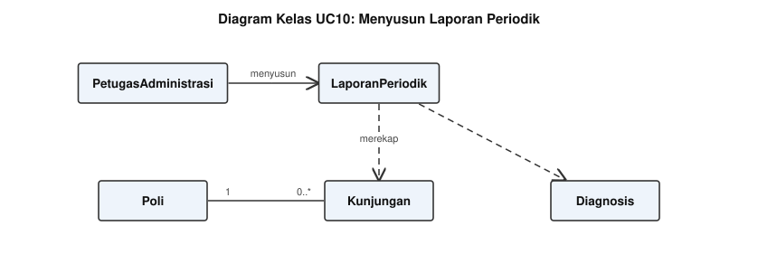

<i>Gambar 11. Diagram Kelas Use Case UC10 (Menyusun Laporan Periodik).</i>

`LaporanManager` membaca kunjungan dan diagnosis pada rentang tanggal terpilih, lalu menyimpan hasilnya sebagai `LaporanEntity` supaya rekapitulasi yang sama tidak dihitung ulang saat diekspor.

#### Atribut dan Metode

| ID Kelas | Nama Kelas | Stereotip | Atribut | Metode/Operasi |
| :--- | :--- | :--- | :--- | :--- |
| C13 | LaporanForm | Boundary | tanggalMulai, tanggalAkhir | tampilkanRekapitulasi(), kirimPermintaanEkspor() |
| C27 | LaporanManager | Control | - | hitungRekapitulasi(), ekspor() |
| C35 | KunjunganEntity | Entity | idKunjungan, tanggal, nomorAntrean, status | simpan(), perbaruiStatus() |
| C36 | PoliEntity | Entity | idPoli, namaPoli, urutanTerakhir | ambilNomorBerikutnya() |
| C43 | DiagnosisEntity | Entity | idDiagnosis, kodeICD10, deskripsi | simpan() |
| C53 | LaporanEntity | Entity | idLaporan, tanggalMulai, tanggalAkhir, format | simpan() |

### 4.2.11 Use Case UC11

**Nama Use Case:** *Melakukan Sinkronisasi SATUSEHAT*

Komposisi ECB: 2 boundary, 1 control, 2 entity.

#### Identifikasi Kelas

| ID Kelas | Nama Kelas | Stereotip | Deskripsi Kelas |
| :--- | :--- | :--- | :--- |
| C14 | SinkronisasiForm | Boundary | Layar status antrean bundel beserta tombol sinkronisasi dan ekspor. |
| C15 | SATUSEHATGateway | Boundary | Antarmuka sistem ke layanan SATUSEHAT untuk mengirim bundel HL7 FHIR. |
| C28 | SinkronisasiManager | Control | Mengelola antrean bundel HL7 FHIR, pengiriman daring, dan ekspor luring. |
| C35 | KunjunganEntity | Entity | Satu kedatangan pasien ke poli beserta nomor antrean dan statusnya. |
| C54 | BundelFHIREntity | Entity | Bundel HL7 FHIR satu kunjungan beserta status pengirimannya. |

#### Diagram Kelas

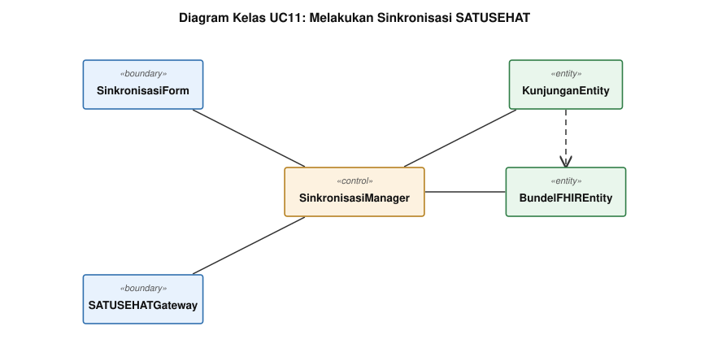

<i>Gambar 12. Diagram Kelas Use Case UC11 (Melakukan Sinkronisasi SATUSEHAT).</i>

`SATUSEHATGateway` berkedudukan sebagai boundary ke sistem luar, sejajar dengan boundary ke pengguna. `SinkronisasiManager` memutuskan mengirim atau mengekspor berkas menurut hasil `periksaKoneksi()`.

#### Atribut dan Metode

| ID Kelas | Nama Kelas | Stereotip | Atribut | Metode/Operasi |
| :--- | :--- | :--- | :--- | :--- |
| C14 | SinkronisasiForm | Boundary | daftarStatus | tampilkanStatus(), kirimPermintaanSinkron(), kirimPermintaanEkspor() |
| C15 | SATUSEHATGateway | Boundary | alamatLayanan, token | periksaKoneksi(), kirimBundel() |
| C28 | SinkronisasiManager | Control | jumlahTertunda | antrekanBundel(), kirimSemua(), eksporBundel() |
| C35 | KunjunganEntity | Entity | idKunjungan, tanggal, nomorAntrean, status | simpan(), perbaruiStatus() |
| C54 | BundelFHIREntity | Entity | idBundel, isiBundel, status | simpan(), tandaiTerkirim() |

### 4.2.12 Use Case UC12

**Nama Use Case:** *Mengelola Konfigurasi & Basis Data Sistem*

Komposisi ECB: 1 boundary, 1 control, 6 entity.

#### Identifikasi Kelas

| ID Kelas | Nama Kelas | Stereotip | Deskripsi Kelas |
| :--- | :--- | :--- | :--- |
| C16 | KonfigurasiForm | Boundary | Layar manajemen akun, data master, dan pemantauan pencadangan. |
| C29 | KonfigurasiManager | Control | Mengurus akun pengguna, data master, dan penjadwalan pencadangan basis data. |
| C30 | PenggunaEntity | Entity | Data akun staf puskesmas beserta peran dan status aktifnya. |
| C32 | AuditEntity | Entity | Catatan perubahan data beserta pelaku dan waktunya. |
| C36 | PoliEntity | Entity | Data master poli rawat jalan beserta urutan antrean hariannya. |
| C40 | AmbangRisikoEntity | Entity | Data master ambang klinis penanda risiko penyakit tidak menular. |
| C48 | ObatEntity | Entity | Data master obat beserta saldo stok apotek dan ambang minimumnya. |
| C55 | PencadanganEntity | Entity | Catatan pencadangan basis data lokal terjadwal. |

#### Diagram Kelas

<i>Gambar 13. Diagram Kelas Use Case UC12 (Mengelola Konfigurasi & Basis Data Sistem).</i>

Satu `KonfigurasiManager` melayani empat jenis data master dan penjadwalan pencadangan. Tiap perubahan yang lewat manager ini menulis `AuditEntity`, memenuhi KF16 tanpa menambah control baru.

#### Atribut dan Metode

| ID Kelas | Nama Kelas | Stereotip | Atribut | Metode/Operasi |
| :--- | :--- | :--- | :--- | :--- |
| C16 | KonfigurasiForm | Boundary | tabAktif, isianData | tampilkanData(), kirimPerubahan(), tampilkanStatusPencadangan() |
| C29 | KonfigurasiManager | Control | - | simpanAkun(), simpanDataMaster(), jalankanPencadangan() |
| C30 | PenggunaEntity | Entity | idPengguna, namaPengguna, kataSandiHash, peran, status | simpan(), nonaktifkan() |
| C32 | AuditEntity | Entity | idAudit, idPengguna, waktu, deskripsi | simpan() |
| C36 | PoliEntity | Entity | idPoli, namaPoli, urutanTerakhir | ambilNomorBerikutnya() |
| C40 | AmbangRisikoEntity | Entity | idAmbang, jenisRisiko, nilaiBatas | simpan() |
| C48 | ObatEntity | Entity | idObat, namaObat, sediaan, stok, ambangMinimum | kurangiStok(), tambahStok() |
| C55 | PencadanganEntity | Entity | idPencadangan, waktu, status, lokasiMedia | simpan() |

## 4.3 Diagram Kelas Keseluruhan

Diagram berikut menyatukan seluruh kelas dari dua belas diagram pada Subbab 4.2 tanpa duplikasi. Susunannya berlapis menurut stereotip: boundary di dua baris teratas, control di tengah, entity di bawah. Lapisan itu memperlihatkan aturan ECB secara langsung, yaitu tidak ada garis yang melompat dari boundary ke entity.

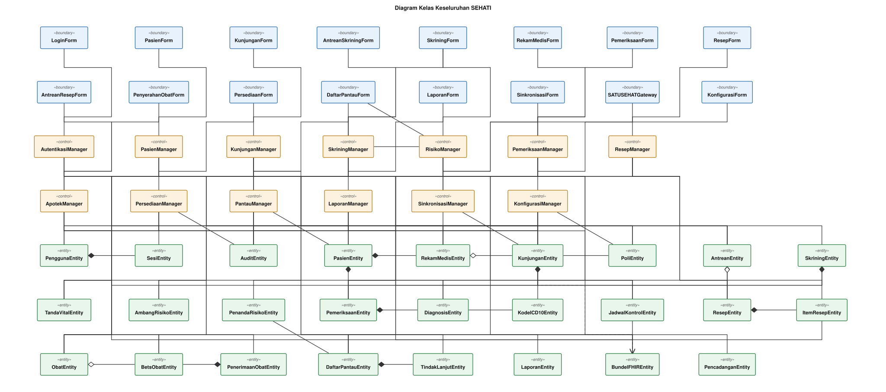

<i>Gambar 14. Diagram Kelas Keseluruhan SEHATI.</i>

Beberapa entity muncul pada banyak use case. `KunjunganEntity` menyambungkan pendaftaran, skrining, pemeriksaan, peresepan, pelaporan, dan sinkronisasi. `ObatEntity` dipakai `ResepManager`, `ApotekManager`, `PersediaanManager`, dan `KonfigurasiManager`. `AuditEntity` menerima tulisan dari hampir seluruh control sebagai pemenuhan KF16.

Tabel 4.2. Atribut dan Metode Seluruh Kelas

| ID Kelas | Nama Kelas | Stereotip | Atribut | Metode/Operasi |
| :--- | :--- | :--- | :--- | :--- |
| C01 | LoginForm | Boundary | namaPengguna, kataSandi | tampilkan(), kirimKredensial(), tampilkanPesanGagal() |
| C02 | PasienForm | Boundary | kataKunci, dataFormulir | tampilkanHasilCari(), kirimDataPasien(), tampilkanPesanValidasi() |
| C03 | KunjunganForm | Boundary | poliTerpilih | tampilkanPilihanPoli(), kirimPermintaanKunjungan(), tampilkanTiketAntrean() |
| C04 | AntreanSkriningForm | Boundary | daftarTampil | tampilkanAntrean(), kirimPanggilan(), kirimLewati() |
| C05 | SkriningForm | Boundary | isianKeluhan, isianUkuran | tampilkanFormulir(), kirimHasilSkrining(), tampilkanPeringatanRentang() |
| C06 | RekamMedisForm | Boundary | idPasienTampil, seriTren | tampilkanRingkasan(), tampilkanGrafikTren() |
| C07 | PemeriksaanForm | Boundary | isianAnamnesis, kataKunciDiagnosis | tampilkanFormulir(), kirimHasilPemeriksaan(), tampilkanSaranKode() |
| C08 | ResepForm | Boundary | isianItem, indikatorStok | tampilkanFormulir(), kirimResep(), tampilkanPeringatanStok() |
| C09 | AntreanResepForm | Boundary | daftarTampil | tampilkanAntrean(), pilihResep() |
| C10 | PenyerahanObatForm | Boundary | rincianTampil | tampilkanRincian(), kirimKonfirmasi(), kirimPengembalian() |
| C11 | PersediaanForm | Boundary | isianPenerimaan, daftarPeringatan | tampilkanFormulir(), kirimPenerimaan(), tampilkanPeringatan() |
| C12 | DaftarPantauForm | Boundary | penyaring, daftarTampil | tampilkanDaftar(), kirimPenyaring(), kirimTindakLanjut() |
| C13 | LaporanForm | Boundary | tanggalMulai, tanggalAkhir | tampilkanRekapitulasi(), kirimPermintaanEkspor() |
| C14 | SinkronisasiForm | Boundary | daftarStatus | tampilkanStatus(), kirimPermintaanSinkron(), kirimPermintaanEkspor() |
| C15 | SATUSEHATGateway | Boundary | alamatLayanan, token | periksaKoneksi(), kirimBundel() |
| C16 | KonfigurasiForm | Boundary | tabAktif, isianData | tampilkanData(), kirimPerubahan(), tampilkanStatusPencadangan() |
| C17 | AutentikasiManager | Control | percobaanGagal | autentikasi(), bukaSesi(), periksaHakAkses() |
| C18 | PasienManager | Control | - | cariPasien(), daftarkanPasien(), perbaruiPasien(), validasiNIK() |
| C19 | KunjunganManager | Control | - | bukaKunjungan(), terbitkanNomorAntrean(), cegahKunjunganGanda() |
| C20 | SkriningManager | Control | - | panggilPasien(), validasiRentang(), simpanSkrining() |
| C21 | RisikoManager | Control | - | evaluasiRisiko(), terbitkanPenanda(), masukkanKeDaftarPantau() |
| C22 | PemeriksaanManager | Control | - | susunRingkasan(), susunTren(), simpanPemeriksaan(), jadwalkanKontrol() |
| C23 | ResepManager | Control | - | tambahItem(), validasiStok(), kirimKeApotek() |
| C24 | ApotekManager | Control | - | layaniResep(), potongStok(), tutupKunjungan(), susunBundel() |
| C25 | PersediaanManager | Control | - | catatPenerimaan(), tambahStok(), terbitkanPeringatan() |
| C26 | PantauManager | Control | - | saringDaftar(), catatTindakLanjut(), perbaruiStatus() |
| C27 | LaporanManager | Control | - | hitungRekapitulasi(), ekspor() |
| C28 | SinkronisasiManager | Control | jumlahTertunda | antrekanBundel(), kirimSemua(), eksporBundel() |
| C29 | KonfigurasiManager | Control | - | simpanAkun(), simpanDataMaster(), jalankanPencadangan() |
| C30 | PenggunaEntity | Entity | idPengguna, namaPengguna, kataSandiHash, peran, status | simpan(), nonaktifkan() |
| C31 | SesiEntity | Entity | idSesi, waktuMulai, statusAktif | buka(), tutup() |
| C32 | AuditEntity | Entity | idAudit, idPengguna, waktu, deskripsi | simpan() |
| C33 | PasienEntity | Entity | idPasien, nik, nomorRekamMedis, nama, tanggalLahir | simpan(), perbarui() |
| C34 | RekamMedisEntity | Entity | idRekamMedis, daftarDiagnosis, riwayatObat | tambahEntri() |
| C35 | KunjunganEntity | Entity | idKunjungan, tanggal, nomorAntrean, status | simpan(), perbaruiStatus() |
| C36 | PoliEntity | Entity | idPoli, namaPoli, urutanTerakhir | ambilNomorBerikutnya() |
| C37 | AntreanEntity | Entity | idAntrean, jenis, daftarEntri | ambilTerdepan(), pindahkanKeBelakang() |
| C38 | SkriningEntity | Entity | idSkrining, keluhanAwal, waktu | simpan() |
| C39 | TandaVitalEntity | Entity | sistolik, diastolik, beratBadan, tinggiBadan, gulaDarah | hitungIMT() |
| C40 | AmbangRisikoEntity | Entity | idAmbang, jenisRisiko, nilaiBatas | simpan() |
| C41 | PenandaRisikoEntity | Entity | idPenanda, jenisRisiko, tanggal, status | simpan(), cabut() |
| C42 | PemeriksaanEntity | Entity | idPemeriksaan, anamnesis, tindakan, terkunci | simpan(), kunci() |
| C43 | DiagnosisEntity | Entity | idDiagnosis, kodeICD10, deskripsi | simpan() |
| C44 | KodeICD10Entity | Entity | kode, deskripsi, bab | cari() |
| C45 | JadwalKontrolEntity | Entity | idJadwal, tanggalRencana, status | simpan() |
| C46 | ResepEntity | Entity | idResep, waktuMasuk, status | simpan(), perbaruiStatus() |
| C47 | ItemResepEntity | Entity | idItem, dosis, jumlah, aturanPakai | simpan() |
| C48 | ObatEntity | Entity | idObat, namaObat, sediaan, stok, ambangMinimum | kurangiStok(), tambahStok() |
| C49 | BetsObatEntity | Entity | nomorBets, jumlah, tanggalKedaluwarsa | kurangi() |
| C50 | PenerimaanObatEntity | Entity | idPenerimaan, nomorFaktur, tanggalTerima | simpan() |
| C51 | DaftarPantauEntity | Entity | idEntri, jenisRisiko, statusTindakLanjut | simpan(), perbaruiStatus() |
| C52 | TindakLanjutEntity | Entity | idTindakLanjut, jenisKontak, hasilUpaya, statusKedatangan | simpan() |
| C53 | LaporanEntity | Entity | idLaporan, tanggalMulai, tanggalAkhir, format | simpan() |
| C54 | BundelFHIREntity | Entity | idBundel, isiBundel, status | simpan(), tandaiTerkirim() |
| C55 | PencadanganEntity | Entity | idPencadangan, waktu, status, lokasiMedia | simpan() |

---

# BAB 5: Traceability

Tabel berikut mencocokkan tiap kelas pada BAB 4 dengan use case pada Subbab 3.3 dan kebutuhan fungsional pada BAB 2. Tiap kelas tertelusur ke sedikitnya satu KF, dan KF01 sampai KF24 seluruhnya tercakup oleh sedikitnya satu kelas.

Tabel 5.1. Traceability Kelas, Use Case, dan Kebutuhan Fungsional

| ID Kelas | Nama Kelas | ID Use Case | ID KF |
| :--- | :--- | :--- | :--- |
| C01 | LoginForm | UC01 | KF16 |
| C02 | PasienForm | UC02 | KF01, KF02 |
| C03 | KunjunganForm | UC03 | KF01, KF03, KF23 |
| C04 | AntreanSkriningForm | UC04 | KF04, KF05, KF06, KF07, KF24 |
| C05 | SkriningForm | UC04 | KF04, KF05, KF06, KF07, KF24 |
| C06 | RekamMedisForm | UC05 | KF08, KF09, KF10, KF12, KF22, KF24 |
| C07 | PemeriksaanForm | UC05 | KF08, KF09, KF10, KF12, KF22, KF24 |
| C08 | ResepForm | UC06 | KF11 |
| C09 | AntreanResepForm | UC07 | KF13, KF14, KF23 |
| C10 | PenyerahanObatForm | UC07 | KF13, KF14, KF23 |
| C11 | PersediaanForm | UC08 | KF17 |
| C12 | DaftarPantauForm | UC09 | KF12, KF18 |
| C13 | LaporanForm | UC10 | KF19 |
| C14 | SinkronisasiForm | UC11 | KF20, KF22 |
| C15 | SATUSEHATGateway | UC11 | KF20, KF22 |
| C16 | KonfigurasiForm | UC12 | KF15, KF21 |
| C17 | AutentikasiManager | UC01 | KF16 |
| C18 | PasienManager | UC02 | KF01, KF02 |
| C19 | KunjunganManager | UC03 | KF01, KF03, KF23 |
| C20 | SkriningManager | UC04 | KF04, KF05, KF06, KF07, KF24 |
| C21 | RisikoManager | UC04, UC09 | KF07, KF12, KF18 |
| C22 | PemeriksaanManager | UC05 | KF08, KF09, KF10, KF12, KF22, KF24 |
| C23 | ResepManager | UC06 | KF11 |
| C24 | ApotekManager | UC07 | KF13, KF14, KF23 |
| C25 | PersediaanManager | UC08 | KF17 |
| C26 | PantauManager | UC09 | KF12, KF18 |
| C27 | LaporanManager | UC10 | KF19 |
| C28 | SinkronisasiManager | UC11 | KF20, KF22 |
| C29 | KonfigurasiManager | UC12 | KF15, KF21 |
| C30 | PenggunaEntity | UC01, UC12 | KF15, KF16 |
| C31 | SesiEntity | UC01 | KF16 |
| C32 | AuditEntity | UC01, UC02, UC03, UC05, UC08, UC12 | KF16 |
| C33 | PasienEntity | UC02, UC03, UC09 | KF01, KF02, KF18 |
| C34 | RekamMedisEntity | UC02, UC05, UC09 | KF02, KF09, KF18 |
| C35 | KunjunganEntity | UC03, UC04, UC05, UC07, UC10, UC11 | KF03, KF07, KF14, KF19, KF20, KF22, KF23 |
| C36 | PoliEntity | UC03, UC10, UC12 | KF03, KF15, KF19 |
| C37 | AntreanEntity | UC03, UC04, UC06, UC07 | KF03, KF04, KF13, KF23 |
| C38 | SkriningEntity | UC04 | KF04, KF05, KF06, KF07, KF24 |
| C39 | TandaVitalEntity | UC04, UC05 | KF05, KF06, KF07, KF08 |
| C40 | AmbangRisikoEntity | UC04, UC12 | KF04, KF05, KF06, KF07, KF15, KF21, KF24 |
| C41 | PenandaRisikoEntity | UC04, UC09 | KF07, KF18 |
| C42 | PemeriksaanEntity | UC05, UC06 | KF09, KF10, KF11, KF24 |
| C43 | DiagnosisEntity | UC05, UC10 | KF10, KF19 |
| C44 | KodeICD10Entity | UC05 | KF08, KF09, KF10, KF12, KF22, KF24 |
| C45 | JadwalKontrolEntity | UC05, UC09 | KF12, KF18 |
| C46 | ResepEntity | UC06, UC07 | KF11, KF13, KF14 |
| C47 | ItemResepEntity | UC06, UC07 | KF11, KF13, KF14 |
| C48 | ObatEntity | UC06, UC07, UC08, UC12 | KF11, KF14, KF15, KF17 |
| C49 | BetsObatEntity | UC07, UC08 | KF14, KF17 |
| C50 | PenerimaanObatEntity | UC08 | KF17 |
| C51 | DaftarPantauEntity | UC04, UC09 | KF07, KF12, KF18 |
| C52 | TindakLanjutEntity | UC09 | KF12, KF18 |
| C53 | LaporanEntity | UC10 | KF19 |
| C54 | BundelFHIREntity | UC07, UC11 | KF14, KF20 |
| C55 | PencadanganEntity | UC12 | KF15, KF21 |

KF22 (operasi luring), KF23 (perubahan data bersamaan), dan KF24 (pintasan papan ketik) bersifat lintas-kelas. Ketiganya kami bebankan pada kelas yang memegang titik kritisnya: `KunjunganEntity` untuk penomoran antrean yang bersamaan, `AntreanEntity` untuk konfirmasi penyerahan yang bersamaan, `SATUSEHATGateway` untuk deteksi koneksi putus, serta `SkriningForm` dan `PemeriksaanForm` untuk pintasan papan ketik di layar pelayanan.
---

# Referensi

- Notasi UML: [https://www.omg.org/spec/UML/](https://www.omg.org/spec/UML/)
- Kerangka Entity-Control-Boundary: Jacobson, I. dkk., *Object-Oriented Software Engineering: A Use Case Driven Approach*
- Perkakas diagram: [https://www.drawio.com/](https://www.drawio.com/), [https://staruml.io/](https://staruml.io/)
- Dokumen *Requirement Gathering* SEHATI (M2) dan *Use Case & Scenario Use Case* SEHATI (M3)
