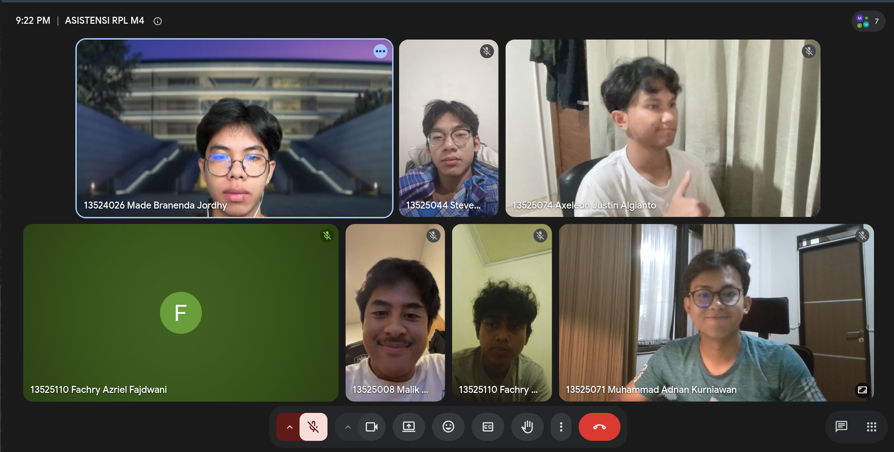

# Form Asistensi

## Tugas Besar IF2150 - Rekayasa Perangkat Lunak

| Informasi | Keterangan |
| --- | --- |
| **Hari** | Selasa |
| **Tanggal** | 22/09/2026 |
| **Kelas** | K02 |
| **Nomor Kelompok** | G09  |
| **Nama Kelompok** | Cumlaude  |
| **Nama Perangkat Lunak** | SEHATI (Sistem Elektronik Pelayanan Kesehatan Terintegrasi)  |
| **Dokumen** | K02_G09_CD.md (Tugas 4 - Class Diagram)  |

### Anggota Kelompok

| NIM | Nama |
| --- | --- |
| 13525008 | Malik Arsyafiandra Madani |
| 13525044 | Steven Vanako |
| 13525071 | Muhammad Adnan Kurniawan |
| 13525074 | Axeleon Justin Algianto |
| 13525110 | Fachry Azriel Fajdwani |

### Catatan

| Catatan |
| --- |
| 1. Pakai kerangka Entity-Control-Boundary (ECB) saat menyusun diagram kelas tiap use case |
| 2. Boundary mewakili sisi front end yang disentuh pengguna (client side) |
| 3. Control mewakili manager yang memegang alur kerja use case |
| 4. Entity mewakili data yang tersimpan |
| 5. Tiap diagram kelas per use case sekurang-kurangnya memuat satu boundary, satu control, dan satu entity, dan boleh lebih dari satu sesuai kebutuhan use case tersebut |
| 6. Penentuan atribut cukup seadanya, tidak perlu terlalu lengkap |

## Dokumentasi

  

  <i>Gambar 1. Dokumentasi kegiatan asistensi.</i>

