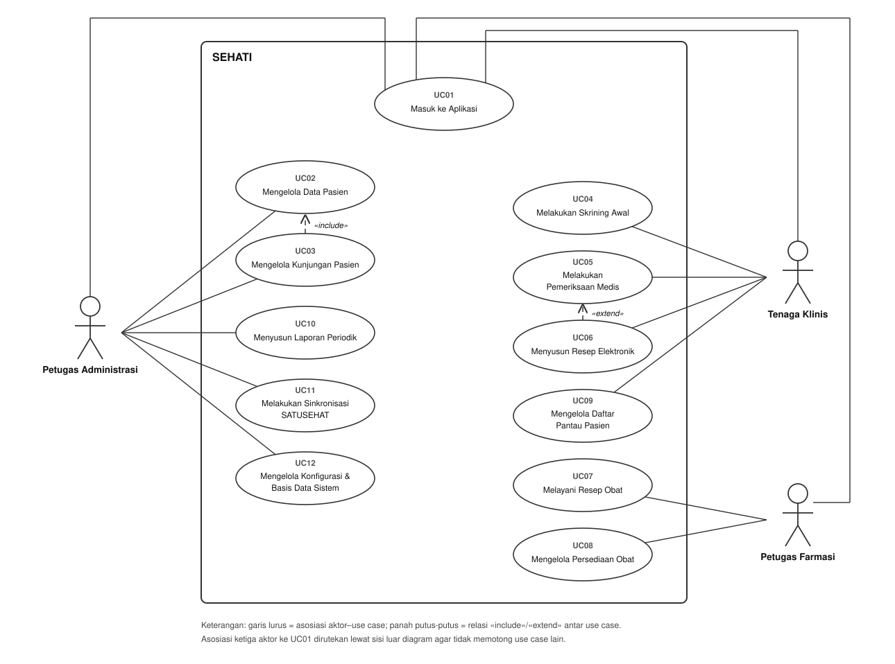

<h1>
IF2150 REKAYASA PERANGKAT LUNAK
 
TUGAS 5
 
SPESIFIKASI KEBUTUHAN PERANGKAT LUNAK (SKPL)
</h1>
 

## SEHATI - Sistem Elektronik Pelayanan Kesehatan Terintegrasi

### Untuk: Made Branenda Jordhy

Dipersiapkan oleh:
| Informasi | Keterangan |
| --- | --- |
| Kelas | K02 |
| Kelompok | G09  |

| NIM | Nama |
|---|---|
| 13525008 | Malik Arsyafiandra Madani |
| 13525044 | Steven Vanako |
| 13525071 | Muhammad Adnan Kurniawan |
| 13525074 | Axeleon Justin Algianto |
| 13525110 | Fachry Azriel Fajdwani |
---

## Daftar Perubahan

| Revisi | Deskripsi |
| :--- | :--- |
| A | Pembuatan awal dokumen Spesifikasi Kebutuhan Perangkat Lunak (SKPL) untuk SEHATI. |

 

# BAB 1: Pendahuluan

## 1.1 Tujuan Penulisan Dokumen
Dokumen Spesifikasi Kebutuhan Perangkat Lunak (SKPL) ini disusun sebagai acuan utama dalam pengembangan aplikasi SEHATI (Sistem Elektronik Pelayanan Kesehatan Terintegrasi). Tujuan dokumen ini adalah mendefinisikan dengan jelas dan spesifik seluruh kebutuhan perangkat lunak, baik fungsional maupun non-fungsional, serta batasan-batasan sistem. Dokumen ini akan digunakan oleh pengembang (*developer*) sebagai panduan implementasi, penguji (*tester*) sebagai basis pengujian kualitas, serta pemangku kepentingan (*stakeholder*) seperti pihak puskesmas untuk validasi fungsionalitas sistem akhir.

## 1.2 Lingkup Masalah
SEHATI merupakan aplikasi *desktop* pengelolaan pelayanan rawat jalan puskesmas yang menyatukan seluruh rantai pelayanan mulai dari pendaftaran, skrining, pemeriksaan, hingga farmasi. Aplikasi ini dikembangkan untuk mengatasi permasalahan fragmentasi rekam medis dan rendahnya deteksi dini pada fasilitas kesehatan dengan menerapkan pemantauan risiko kesehatan longitudinal pasien secara aktif, sembari memastikan sistem tetap berjalan penuh di lingkungan dengan keterbatasan koneksi internet (*offline-first*) dan mampu menyinkronkan data ke platform nasional SATUSEHAT.

## 1.3 Definisi, Istilah, dan Singkatan

Tabel 1.3. Definisi Istilah dan Singkatan

| Singkatan, Akronim, atau Istilah | Penjelasan |
| :--- | :--- |
| P/L | Perangkat Lunak. |
| SKPL | Spesifikasi Kebutuhan Perangkat Lunak. |
| KF | Kebutuhan Fungsional. |
| KNF | Kebutuhan Non-Fungsional. |
| UC | Use Case. |
| EARS | *Easy Approach to Requirements Syntax*, pola penulisan kebutuhan agar konsisten dan mudah diuji. |
| RME | Rekam Medis Elektronik. |
| PTM | Penyakit Tidak Menular (seperti hipertensi, obesitas, diabetes). |
| SATUSEHAT | Platform integrasi data kesehatan nasional milik Kemenkes RI. |
| HL7 FHIR | *Health Level Seven Fast Healthcare Interoperability Resources*, standar pertukaran data kesehatan yang dipakai oleh SATUSEHAT. |

## 1.4 Aturan Penomoran

Tabel 1.4. Aturan Penomoran

| Hal/Bagian | Penomoran | Keterangan |
| :--- | :--- | :--- |
| Kebutuhan Fungsional | KFXX | XX adalah dua digit angka berurutan |
| Kebutuhan Non-Fungsional | KNFXX | XX adalah dua digit angka berurutan |
| Aktor | AXX | XX adalah dua digit angka berurutan |
| Use Case | UCXX | XX adalah dua digit angka berurutan |
| Kelas | CXX | XX adalah dua digit angka berurutan |

## 1.5 Referensi
1. Dokumen *Topic Brainstorming* Kelompok K02 G09.
2. Dokumen *Requirement Gathering* Kelompok K02 G09.
3. Dokumen *Use Case & Scenario Use Case* Kelompok K02 G09.
4. Dokumen *Class Diagram* Kelompok K02 G09.

## 1.6 Deskripsi Umum Dokumen (Ikhtisar)
Dokumen SKPL ini disusun ke dalam beberapa bab dengan sistematika sebagai berikut:
- **BAB 1: Pendahuluan**, menguraikan tujuan dokumen, lingkup masalah, definisi istilah, aturan penomoran, referensi, dan deskripsi umum dokumen.
- **BAB 2: Deskripsi Perangkat Lunak**, menjelaskan deskripsi umum sistem, pengguna dan kebutuhan, batasan, serta lingkungan operasi perangkat lunak.
- **BAB 3: Deskripsi Kebutuhan Perangkat Lunak**, merincikan Kebutuhan Fungsional (KF) dan Kebutuhan Non-Fungsional (KNF).
- **BAB 4: Pemodelan Use Case**, memaparkan identifikasi aktor, daftar *use case*, diagram *use case*, serta skenario dari masing-masing *use case*.
- **BAB 5: Pemodelan Kelas**, menjabarkan identifikasi kelas, diagram kelas per *use case*, serta diagram kelas secara keseluruhan.
- **BAB 6: Traceability**, berisi matriks penelusuran yang menghubungkan antara Kelas, *Use Case*, dan Kebutuhan Fungsional.

---

# BAB 2: Deskripsi Perangkat Lunak

## 2.1 Deskripsi Umum Sistem
SEHATI menangani pelayanan rawat jalan dari ujung ke ujung melalui beberapa tahap layanan: 
1. **Pendaftaran di loket**: Petugas menelusuri data pasien, mendaftar, lalu membuka kunjungan antrean.
2. **Skrining**: Perawat mengukur tanda vital, lalu sistem menandai risiko kondisi pasien otomatis.
3. **Pemeriksaan**: Dokter mencatat anamnesis, diagnosis, tindakan, dan menyusun resep elektronik.
4. **Farmasi**: Petugas menyiapkan resep lalu menyerahkan obat pada pasien dengan pemotongan stok secara otomatis.
Di luar pelayanan, terdapat alur pendukung seperti penyusunan laporan, pengurusan stok, tindak lanjut daftar pantau pasien berisiko, serta sinkronisasi data rekam medis ke SATUSEHAT.

<i>Gambar 1. Activity Diagram Alur Pelayanan Rawat Jalan SEHATI</i>

## 2.2 Deskripsi Umum Perangkat Lunak
SEHATI merupakan aplikasi *desktop offline-first* yang mengelola secara penuh pendaftaran, pemeriksaan, peresepan elektronik, hingga pengelolaan obat di puskesmas. Aplikasi dirancang untuk menutupi kesenjangan tidak adanya pemantauan riwayat kondisi antar-waktu dengan melacak pasien berisiko. SEHATI berinteraksi dengan API dari **SATUSEHAT** Kementerian Kesehatan; sistem bekerja mencatat rekam medis pada basis data lokal dan mengirimkan kumpulan data (bundel HL7 FHIR) secara *asynchronous* ketika koneksi internet puskesmas tersedia.

## 2.3 Pengguna dan Kebutuhan Pengguna Perangkat Lunak

| Pengguna | Kebutuhan |
| :--- | :--- |
| **Petugas Administrasi** | Membutuhkan fitur manajemen data pasien yang cepat, pendaftaran kunjungan, manajemen *master data*, pembuatan laporan otomatis, dan fasilitas kontrol sinkronisasi data ke SATUSEHAT. |
| **Tenaga Klinis** | Membutuhkan tampilan riwayat pasien yang utuh dan komprehensif pada satu layar, fasilitas peringatan dini atau penanda batas normal (*skrining*), penulisan resep dengan validasi stok obat langsung, serta fitur pemantauan pasien berisiko. |
| **Petugas Farmasi** | Membutuhkan antrean resep yang terbaca jelas dari ruang periksa, validasi status penyerahan obat, pengurusan persediaan dan inventarisasi stok (*restock*), serta peringatan obat kedaluwarsa. |

## 2.4 Batasan Perangkat Lunak
1. Aplikasi harus berjalan sebagai aplikasi desktop (tanpa mewajibkan akses web bagi operasional lokal) untuk menjamin pelayanan tidak terhenti akibat ketiadaan koneksi (*offline-first*).
2. Format struktur data pengiriman rekam medis harus mengikuti standar HL7 FHIR yang ditentukan oleh regulasi SATUSEHAT Kementerian Kesehatan.
3. Penanda risiko hanya berfungsi sebagai instrumen pengingat atau deteksi dini, dan **tidak** mengambil alih kewenangan klinis tenaga kesehatan.
4. Akses basis data dibatasi oleh fitur otorisasi per *role* pengguna demi menjaga kerahasiaan rekam medis.

## 2.5 Lingkungan Operasi Perangkat Lunak

| Komponen | Spesifikasi |
| :--- | :--- |
| **Aplikasi / Client** | Aplikasi Desktop berbasis GUI (menggunakan JavaFX/Electron atau *framework desktop* sejenis). |
| **DBMS** | Basis Data Relasional yang beroperasi secara lokal (misal: PostgreSQL / MySQL). |
| **Sistem Operasi** | *Cross-platform* pada lingkungan desktop seperti Windows 10/11 atau distribusi Linux modern. |
| **Lainnya** | Komponen utilitas penjadwalan *backup* otomatis dan komponen *worker* sinkronisasi HTTP/REST API terpisah. |

---

# BAB 3: Deskripsi Kebutuhan Perangkat Lunak

## 3.1 Kebutuhan Fungsional (KF)
Tabel berikut menyalin seluruh Kebutuhan Fungsional versi final dari Subbab 2.1 dokumen *Class Diagram*. Kolom ID Kebutuhan merujuk ID pada tabel Pemetaan Kebutuhan (Subbab 2.3) dokumen *Requirement Gathering*, dan seluruh rumusan memakai pola EARS. Kebutuhan R09, R25, dan R27 tidak diturunkan menjadi KF/KNF karena berupa aturan bisnis dan kepatuhan hukum yang dipenuhi lewat batasan perancangan (Subbab 2.4).

Tabel 3.1. Kebutuhan Fungsional

| ID KF | ID Kebutuhan | Penjelasan |
| :--- | :--- | :--- |
| KF01 | R01 | **Ketika** petugas mengetikkan NIK, nama, atau nomor rekam medis pada kolom pencarian di layar pendaftaran, baik utuh maupun sebagian (parsial), perangkat lunak harus menampilkan daftar pasien yang cocok saat itu juga |
| KF02 | R02, R03 | Perangkat lunak harus menyediakan formulir pendaftaran pasien baru (NIK, nama lengkap, tanggal lahir, jenis kelamin, alamat, nomor telepon) serta penyuntingan data pasien lama dari layar profil.   **Ketika** pendaftaran pasien baru tersimpan, perangkat lunak harus menerbitkan tepat satu nomor rekam medis yang unik bagi pasien tersebut.   **Jika** NIK yang masuk bukan 16 digit numerik atau sudah terpakai pasien lain, **maka** perangkat lunak harus menolak penyimpanan dan menampilkan pesan kesalahan pada kolom NIK |
| KF03 | R04 | **Ketika** petugas membuka kunjungan baru dengan memilih poli tujuan, perangkat lunak harus menerbitkan nomor antrean yang berurutan per poli per hari.   **Ketika** hari pelayanan berganti, perangkat lunak harus memulai ulang urutan nomor antrean setiap poli dari awal |
| KF04 | R05 | Perangkat lunak harus menampilkan daftar antrean skrining berisi pasien yang menunggu, terurut menurut nomor antrean.   **Ketika** petugas menekan tombol "Panggil Berikutnya", perangkat lunak harus mengubah status pasien pada urutan terdepan menjadi "sedang dilayani" |
| KF05 | R06 | Perangkat lunak harus menyediakan formulir skrining dengan kolom teks bebas untuk keluhan awal dan kolom numerik untuk tekanan darah sistolik/diastolik (mmHg), berat badan (kg), tinggi badan (cm), suhu (°C), dan nadi (bpm).   **Apabila** hasil pemeriksaan gula darah sewaktu tersedia, perangkat lunak harus menerima nilainya (mg/dL) sebagai isian opsional pada formulir yang sama |
| KF06 | R07 | **Ketika** petugas menyimpan formulir skrining, perangkat lunak harus memeriksa setiap nilai tanda vital terhadap rentang fisiologis yang wajar.   **Jika** terdapat nilai di luar rentang tersebut, **maka** perangkat lunak harus menolak penyimpanan dan menampilkan peringatan pada kolom yang bersangkutan |
| KF07 | R08 | **Ketika** nilai tanda vital tersimpan, perangkat lunak harus membandingkannya terhadap ambang klinis pada data master dan terhadap riwayat pengukuran pasien pada kunjungan-kunjungan sebelumnya.   **Jika** ambang klinis terlampaui atau tiga kunjungan berturut-turut atau lebih menunjukkan nilai di atas ambang yang dapat dikonfigurasi pada data master, **maka** perangkat lunak harus menandai kunjungan sebagai "berisiko" beserta label jenis risikonya (hipertensi, obesitas, indikasi diabetes) dan menampilkan peringatan visual berupa ikon dan warna |
| KF08 | R10 | **Ketika** petugas membuka riwayat pengukuran seorang pasien, perangkat lunak harus menampilkan grafik garis (*line chart*) tren tanda vital (tekanan darah, berat badan, gula darah) dari kunjungan-kunjungan sebelumnya dengan waktu pada sumbu-x |
| KF09 | R11 | **Ketika** petugas membuka ringkasan rekam medis seorang pasien, perangkat lunak harus menampilkan data diri, daftar diagnosis lampau, riwayat obat, dan penanda risiko aktif pada satu tampilan tanpa berpindah layar |
| KF10 | R12, R13 | Perangkat lunak harus menyediakan formulir pemeriksaan dengan kolom anamnesis (teks bebas), diagnosis, dan tindakan, yang hanya terbuka bagi pengguna berstatus dokter.   **Ketika** dokter mengisi kolom diagnosis, perangkat lunak harus menyediakan pencarian kode ICD-10 dan menyimpan diagnosis sebagai kode standar tersebut |
| KF11 | R14, R15 | **Ketika** dokter menyusun resep elektronik, perangkat lunak harus menyediakan pencarian obat dari data master beserta isian dosis, jumlah, dan aturan pakai, sekaligus menampilkan indikator ketersediaan stok setiap obat yang terpilih.   **Jika** stok obat yang diresepkan kurang, **maka** perangkat lunak harus menampilkan peringatan dan meminta dokter memperbaiki resep sebelum resep diteruskan ke antrean apotek |
| KF12 | R16 | **Ketika** dokter menjadwalkan kunjungan ulang, perangkat lunak harus menyimpan tanggal atau rentang waktu yang ditetapkan dan menautkan jadwal tersebut ke daftar pantau pasien |
| KF13 | R17 | Perangkat lunak harus menampilkan antrean resep pada layar apotek, terurut menurut waktu masuk, beserta nama pasien, daftar obat, dosis, dan jumlahnya.   **Ketika** petugas menekan tombol "Obat Diserahkan" pada sebuah resep, perangkat lunak harus mengubah status resep tersebut menjadi selesai dilayani |
| KF14 | R18 | **Ketika** sebuah resep ditandai selesai dilayani dan petugas mengonfirmasi penyerahan, perangkat lunak harus memotong stok setiap obat sebanyak jumlah yang diserahkan, menutup kunjungan yang bersangkutan, dan menyusun data kunjungan tersebut menjadi bundel HL7 FHIR pada antrean sinkronisasi |
| KF15 | R19 | Perangkat lunak harus menyediakan antarmuka manajemen pengguna (menambah akun, menyunting peran, menonaktifkan akun) serta manajemen data master (daftar obat, daftar poli, ambang nilai risiko) |
| KF16 | R20 | **Selama** seorang pengguna masuk ke aplikasi, perangkat lunak harus membatasi menu dan fitur yang terbuka baginya menurut peran akun tersebut.   **Ketika** terjadi perubahan data, perangkat lunak harus mencatatnya pada jejak audit yang memuat identitas pengguna, waktu, dan deskripsi perubahan |
| KF17 | R21 | **Ketika** petugas menyimpan formulir penerimaan obat (nama obat, nomor bets, jumlah, tanggal kedaluwarsa), perangkat lunak harus menambahkan jumlah tersebut ke stok obat yang bersangkutan.   **Jika** stok suatu obat berada di bawah ambang minimum atau suatu bets berjarak 90 hari atau kurang dari tanggal kedaluwarsanya, **maka** perangkat lunak harus menampilkan peringatan persediaan pada dasbor apotek |
| KF18 | R22 | Perangkat lunak harus menampilkan daftar pantau berisi pasien yang pernah ditandai berisiko dan pasien yang dijadwalkan kunjungan ulang, dengan penyaring jenis risiko, rentang tanggal, dan status tindak lanjut.   **Ketika** petugas mencatat tindak lanjut, perangkat lunak harus menyimpan jenis kontak, hasil upaya, dan status kedatangan pasien pada entri daftar pantau tersebut |
| KF19 | R23 | **Ketika** pengguna memilih rentang tanggal pelaporan, perangkat lunak harus menghitung rekapitulasi kunjungan dan diagnosis terbanyak tanpa perintah tambahan, lalu menghasilkan berkas laporan dalam format yang dapat dicetak dan diolah secara tabuler (PDF atau Spreadsheet) |
| KF20 | R24 | **Ketika** pengguna menjalankan sinkronisasi dan koneksi internet tersedia, perangkat lunak harus mengirim bundel HL7 FHIR pada antrean ke platform SATUSEHAT dan menampilkan status pengiriman setiap bundel.   **Jika** koneksi internet putus, **maka** perangkat lunak harus menyediakan opsi "Ekspor Bundel" yang menyimpan antrean sinkronisasi sebagai berkas untuk diunggah dari lokasi lain yang berjaringan |
| KF21 | R26 | Perangkat lunak harus menjalankan pencadangan basis data sesuai jadwal ke media penyimpanan terpisah dan menampilkan informasi pencadangan terakhir pada dasbor administrasi.   **Jika** pencadangan gagal, **maka** perangkat lunak harus menampilkan peringatan kepada pengguna sampai pencadangan berikutnya berhasil |
| KF22 | R28 | Perangkat lunak harus menyimpan seluruh data pelayanan pada basis data lokal di dalam lingkungan fasilitas dan menampilkan indikator status koneksi pada bilah aplikasi.   **Selama** koneksi internet terputus, perangkat lunak harus tetap menjalankan seluruh fungsi pendaftaran, skrining, pemeriksaan, peresepan, dan penyerahan obat secara penuh |
| KF23 | R29 | **Ketika** beberapa petugas pada satu jaringan lokal mengubah data yang sama bersamaan, perangkat lunak harus menjaga perubahan bersamaan pada nomor antrean dan pemotongan stok obat agar tidak saling menimpa dan tidak menghilangkan data |
| KF24 | R30 | Perangkat lunak harus menyediakan pintasan papan ketik pada layar pendaftaran, skrining, pemeriksaan, dan apotek untuk bernavigasi, menyimpan formulir, dan memanggil pasien.   **Ketika** pintasan tersebut ditekan, perangkat lunak harus menjalankan tindakan terkait sehingga seluruh alur pelayanan dapat tuntas tanpa tetikus |

## 3.2 Kebutuhan Non-Fungsional (KNF)
Tabel berikut menyalin Kebutuhan Non-Fungsional dari Subbab 2.5 dokumen *Requirement Gathering*. Penomoran ID Kebutuhan tidak berubah karena penomoran KF pada Subbab 3.1 tetap sama.

Tabel 3.2. Kebutuhan Non-Fungsional

| ID KNF | ID Kebutuhan | Parameter | Deskripsi Kebutuhan |
| :--- | :--- | :--- | :--- |
| KNF01 | R01 | Response Time | **Ketika** pengguna memasukkan sedikitnya 3 karakter kata kunci pencarian pasien, perangkat lunak harus menampilkan hasilnya dalam waktu kurang dari 2 detik pada kondisi operasi normal, termasuk saat basis data telah berisi 50.000 rekam medis |
| KNF02 | R07 | Reliability | Perangkat lunak harus menjalankan validasi tanda vital pada setiap penyimpanan formulir skrining tanpa jalan pintas dan tanpa opsi menonaktifkannya, sehingga data yang tersimpan selalu berada dalam rentang fisiologis yang wajar |
| KNF03 | R18 | Reliability | **Jika** penyusunan bundel HL7 FHIR gagal di tengah proses, **maka** perangkat lunak harus membatalkan seluruh bundel tersebut secara atomik sehingga tidak ada bundel parsial yang masuk ke antrean sinkronisasi |
| KNF04 | R20 | Security | **Ketika** pengguna membuka aplikasi, perangkat lunak harus mewajibkan autentikasi (masuk dengan akun) sebelum fungsi apa pun terbuka.   Perangkat lunak harus menyimpan kata sandi dalam bentuk *hash* (minimal bcrypt) dan tidak pernah dalam bentuk teks polos. **Jika** pengguna diam tanpa aktivitas selama 15 menit, **maka** perangkat lunak harus mengakhiri sesi dan mewajibkan autentikasi ulang |
| KNF05 | R20 | Security | **Selama** pengguna terautentikasi, perangkat lunak harus memberlakukan otorisasi berbasis peran (*role-based access control*) pada setiap akses data.   **Ketika** data pasien berubah, perangkat lunak harus merekam perubahan tersebut pada jejak audit yang tidak dapat dihapus pengguna biasa |
| KNF06 | R26 | Reliability | **Ketika** pencadangan otomatis berjalan, perangkat lunak harus menghasilkan salinan yang konsisten (*point-in-time snapshot*) tanpa mengganggu ketersediaan sistem bagi pengguna |
| KNF07 | R24 | Portability | Perangkat lunak harus menyusun bundel sinkronisasi menurut standar HL7 FHIR R4 sehingga platform SATUSEHAT menerimanya tanpa konversi tambahan |
| KNF08 | R08 | Ergonomy | **Ketika** ambang risiko terlampaui, perangkat lunak harus menampilkan peringatan dengan penanda visual yang jelas (warna merah dan ikon peringatan) tanpa langkah tambahan dari pengguna |
| KNF09 | R28 | Availability | **Selama** jam pelayanan, perangkat lunak harus menyediakan seluruh fungsi pelayanan rawat jalan secara penuh (100%) tanpa koneksi internet; jaringan yang putus hanya boleh menunda sinkronisasi ke SATUSEHAT, bukan menghentikan pelayanan |
| KNF10 | R28 | Portability | Perangkat lunak harus terpasang dan berjalan pada Windows dan Linux 64-bit dengan RAM 4 GB serta ruang penyimpanan kosong 2 GB, tanpa pengadaan perangkat keras baru |
| KNF11 | R29 | Reliability | **Ketika** sedikitnya 5 perangkat mengakses sistem bersamaan dalam satu jaringan lokal, perangkat lunak harus memproses seluruh transaksi tanpa kehilangan data (*lost update*) pada nomor antrean maupun stok obat |
| KNF12 | R30 | Ergonomy | Perangkat lunak harus memungkinkan pengisian satu formulir skrining tuntas sepenuhnya lewat papan ketik tanpa berpindah ke tetikus, dan menampilkan seluruh pintasan papan ketik pada layar bantuan aplikasi |
| KNF13 | R28 | Reliability | **Jika** aplikasi berhenti mendadak, **maka** perangkat lunak harus menjaga data yang telah tersimpan sebelumnya tetap utuh dan konsisten saat aplikasi dimulai kembali |

---

# BAB 4: Pemodelan Use Case

## 4.1 Identifikasi Aktor
Aktor mengikuti tiga peran manusia yang ditetapkan sejak Milestone 1 dan tercantum pada Subbab 3.1 dokumen *Class Diagram*. Pasien tidak menjadi aktor karena menerima manfaat sistem tanpa menyentuhnya, sedangkan SATUSEHAT berkedudukan sebagai sistem eksternal, bukan aktor.

| ID Aktor | Aktor | Deskripsi |
| :--- | :--- | :--- |
| A01 | Petugas Administrasi | Berjaga di loket pendaftaran sekaligus memegang administrasi sistem. Mengurus data pasien, membuka kunjungan poli, menyusun laporan periodik, menjalankan sinkronisasi ke SATUSEHAT, menata data master, dan mengatur hak akses pengguna. |
| A02 | Tenaga Klinis | Bertugas di ruang periksa poli, mencakup perawat dan dokter. Memanggil pasien dari antrean skrining, mencatat keluhan awal dan tanda vital, membaca rekam medis, menegakkan diagnosis berkode ICD-10, menyusun resep, dan memegang daftar pantau pasien berisiko. Kewenangan menegakkan diagnosis dan meresepkan obat hanya dimiliki pengguna berstatus dokter. |
| A03 | Petugas Farmasi | Bertugas di instalasi farmasi puskesmas. Melayani antrean resep yang diteruskan dari ruang periksa, mengonfirmasi penyerahan obat kepada pasien, dan mengurus persediaan obat fasilitas. |

## 4.2 Identifikasi Use Case
Dua belas *use case* berikut menyalin Subbab 3.2 dokumen *Class Diagram* dan merangkum seluruh kebutuhan fungsional KF01 sampai KF24 pada Subbab 3.1.

| ID UC | Nama Use Case | Deskripsi Singkat | Aktor | ID KF |
| :--- | :--- | :--- | :--- | :--- |
| UC01 | Masuk ke Aplikasi | Pengguna mengautentikasi diri, lalu sistem membuka menu sesuai peran akunnya. | Petugas Administrasi, Tenaga Klinis, Petugas Farmasi | KF16 |
| UC02 | Mengelola Data Pasien | Petugas menelusuri data pasien secara parsial, lalu mendaftarkan pasien baru atau memutakhirkan data lama tanpa mengubah nomor rekam medisnya. | Petugas Administrasi | KF01, KF02 |
| UC03 | Mengelola Kunjungan Pasien | Petugas membuka kunjungan bagi pasien ke poli tujuan dan sistem menerbitkan nomor antreannya. | Petugas Administrasi | KF01, KF03, KF23 |
| UC04 | Melakukan Skrining Awal | Perawat memanggil pasien dari antrean, mencatat keluhan awal dan tanda vital, lalu sistem menimbang hasilnya terhadap ambang risiko. | Tenaga Klinis | KF04, KF05, KF06, KF07, KF24 |
| UC05 | Melakukan Pemeriksaan Medis | Dokter membaca rekam medis dan tren pengukuran pasien pada satu layar, memeriksa pasien, lalu menegakkan diagnosis berkode ICD-10. | Tenaga Klinis | KF08, KF09, KF10, KF12, KF22, KF24 |
| UC06 | Menyusun Resep Elektronik | Dokter meresepkan obat dari data master puskesmas dengan indikator ketersediaan stok saat itu juga. | Tenaga Klinis | KF11 |
| UC07 | Melayani Resep Obat | Petugas Farmasi melayani antrean resep dan mengonfirmasi penyerahan obat, yang memicu pemotongan stok serta penutupan kunjungan. | Petugas Farmasi | KF13, KF14, KF23 |
| UC08 | Mengelola Persediaan Obat | Petugas Farmasi mencatat obat masuk ke persediaan, dan sistem memunculkan peringatan stok menipis maupun bets mendekati kedaluwarsa. | Petugas Farmasi | KF17 |
| UC09 | Mengelola Daftar Pantau Pasien | Tenaga Klinis menelusuri pasien penyakit tidak menular yang terjadwal, menghubungi mereka, lalu mencatat hasil tindak lanjutnya. | Tenaga Klinis | KF12, KF18 |
| UC10 | Menyusun Laporan Periodik | Petugas Administrasi menghasilkan rekapitulasi kunjungan dan diagnosis per periode, lalu mengekspornya sebagai berkas laporan. | Petugas Administrasi | KF19 |
| UC11 | Melakukan Sinkronisasi SATUSEHAT | Petugas Administrasi mengirim antrean bundel HL7 FHIR ke SATUSEHAT ketika daring, atau mengekspornya sebagai berkas ketika luring. | Petugas Administrasi | KF20, KF22 |
| UC12 | Mengelola Konfigurasi & Basis Data Sistem | Petugas Administrasi mengurus akun staf, data master obat, poli, dan ambang nilai risiko, serta memantau pencadangan basis data lokal. | Petugas Administrasi | KF15, KF21 |

Model ini memakai dua relasi antar-*use case* berikut.

| Relasi | Penjelasan |
| :--- | :--- |
| UC03 **«include»** UC02 | Petugas tidak dapat membuka kunjungan tanpa lebih dulu menemukan atau mendaftarkan pasiennya, sehingga UC03 selalu menjalankan UC02. |
| UC06 **«extend»** UC05 | Dokter menyusun resep hanya ketika hasil pemeriksaan menuntut terapi obat, sehingga UC06 memperluas UC05 sebagai cabang opsional. |

## 4.3 Use Case Diagram

<i>Gambar 2. Use Case Diagram SEHATI</i>

## 4.4 Skenario Use Case
Skenario berikut menyalin Subbab 3.4 dokumen *Class Diagram* (sama dengan Subbab 3.5 dokumen *Use Case & Scenario Use Case*). Setiap *use case* hanya melibatkan satu aktor manusia, sehingga tabel skenario cukup memakai kolom Aksi Aktor dan Reaksi Perangkat Lunak. Interaksi dengan SATUSEHAT sebagai sistem eksternal dituliskan pada kolom Reaksi Perangkat Lunak.

### 4.4.1 Skenario UC01

**Nama Use Case:** Masuk ke Aplikasi

**Skenario Normal**

| No | Aksi Aktor | Reaksi Perangkat Lunak |
| :--- | :--- | :--- |
| 1 | Pengguna membuka aplikasi SEHATI | Sistem menampilkan layar autentikasi berisi kolom nama pengguna dan kata sandi |
| 2 | Pengguna mengisi nama pengguna dan kata sandi yang benar, lalu menekan tombol "Masuk" | Sistem memeriksa kredensial, membuka sesi pengguna, mencatat peristiwa masuk ke jejak audit, lalu menampilkan dasbor kerja yang menunya terbatas pada peran akun tersebut |

 

**Skenario Alternatif 1: Kredensial Tidak Cocok**

| No | Aksi Aktor | Reaksi Perangkat Lunak |
| :--- | :--- | :--- |
| 1 | Pengguna mengisi nama pengguna atau kata sandi yang salah, lalu menekan tombol "Masuk" | Sistem menolak autentikasi, menampilkan pesan "Nama pengguna atau kata sandi salah", mengosongkan kolom kata sandi, dan mencatat percobaan gagal ke jejak audit |
| 2 | Pengguna mengisi ulang kredensial yang benar | Sistem kembali ke langkah 2 skenario normal |

 

**Skenario Alternatif 2: Akun Berstatus Nonaktif**

| No | Aksi Aktor | Reaksi Perangkat Lunak |
| :--- | :--- | :--- |
| 1 | Pengguna mencoba masuk memakai akun yang sudah dinonaktifkan administrator | Sistem menolak permintaan masuk, memberi tahu bahwa akun tersebut nonaktif, dan meminta pengguna menghubungi Petugas Administrasi |

 

**Skenario Alternatif 3: Pengguna Membuka Modul di Luar Hak Aksesnya**

| No | Aksi Aktor | Reaksi Perangkat Lunak |
| :--- | :--- | :--- |
| 1 | Pengguna mencoba membuka fungsi atau layar di luar wewenangnya, misalnya perawat membuka formulir penegakan diagnosis dokter | Sistem menyembunyikan menu tersebut dari dasbor dan menolak perintah akses langsung disertai keterangan bahwa peran akun itu tidak berwenang |

### 4.4.2 Skenario UC02

**Nama Use Case:** Mengelola Data Pasien

**Skenario Normal (Pendaftaran Pasien Baru)**

| No | Aksi Aktor | Reaksi Perangkat Lunak |
| :--- | :--- | :--- |
| 1 | Petugas Administrasi membuka modul pendaftaran pasien | Sistem menampilkan kolom pencarian pasien dan tombol "Daftarkan Pasien Baru" |
| 2 | Petugas mengetikkan NIK, nama lengkap, atau nomor rekam medis secara parsial untuk memastikan pasien belum terdaftar | Sistem menelusuri basis data lokal saat itu juga lalu menampilkan keterangan "Data pasien tidak ditemukan" |
| 3 | Petugas menekan tombol "Daftarkan Pasien Baru" | Sistem membuka formulir pendaftaran berisi kolom NIK (16 digit), nama lengkap, tanggal lahir, jenis kelamin, alamat domisili, dan nomor telepon |
| 4 | Petugas melengkapi data diri pasien lalu menekan tombol "Simpan" atau pintasan papan ketik simpan | Sistem memeriksa kelengkapan isian serta keunikan NIK, menerbitkan tepat satu nomor rekam medis baru, menyimpan data pasien ke basis data lokal, mencatat transaksi ke jejak audit, dan menampilkan notifikasi pendaftaran berhasil |

 

**Skenario Alternatif 1: Memutakhirkan Data Pasien Lama**

| No | Aksi Aktor | Reaksi Perangkat Lunak |
| :--- | :--- | :--- |
| 1 | Petugas mengetikkan kata kunci pencarian pada langkah 2 skenario normal | Sistem menampilkan daftar pasien yang cocok beserta NIK, nama, tanggal lahir, dan nomor rekam medisnya |
| 2 | Petugas memilih salah satu pasien dari hasil pencarian lalu menekan tombol "Sunting Data" | Sistem membuka formulir data pasien yang sudah terisi data lama |
| 3 | Petugas mengubah data yang berubah, misalnya alamat atau nomor telepon, lalu menekan tombol "Simpan" | Sistem memeriksa perubahan, memutakhirkan profil pasien pada basis data lokal tanpa menyentuh nomor rekam medis yang sudah terbit, mencatat jejak audit, dan menampilkan konfirmasi pembaruan |

 

**Skenario Alternatif 2: NIK Tidak Valid atau Sudah Dipakai Pasien Lain**

| No | Aksi Aktor | Reaksi Perangkat Lunak |
| :--- | :--- | :--- |
| 1 | Petugas mengisi NIK yang bukan 16 digit numerik atau NIK yang sudah dimiliki pasien lain, lalu menekan "Simpan" | Sistem menolak penyimpanan, menandai kolom NIK dengan penanda merah, dan menampilkan pesan kesalahan yang menyebut sebabnya (NIK tidak valid atau NIK sudah terdaftar) |
| 2 | Petugas mengoreksi isian NIK | Sistem kembali ke langkah 4 skenario normal |

### 4.4.3 Skenario UC03

**Nama Use Case:** Mengelola Kunjungan Pasien

**Skenario Normal**

| No | Aksi Aktor | Reaksi Perangkat Lunak |
| :--- | :--- | :--- |
| 1 | Petugas Administrasi memilih pasien dari hasil pencarian data pasien (UC02) lalu menekan tombol "Buat Kunjungan" | Sistem menampilkan layar pembuatan kunjungan berisi ringkasan identitas pasien dan pilihan poli tujuan rawat jalan |
| 2 | Petugas memilih poli tujuan lalu menekan tombol "Terbitkan Antrean" | Sistem membuat entri kunjungan hari berjalan, menerbitkan nomor antrean berurutan per poli untuk hari tersebut, menautkan kunjungan ke rekam medis pasien, mencatat jejak audit, lalu menampilkan tiket antrean poli |

 

**Skenario Alternatif 1: Pasien Masih Punya Kunjungan Aktif Hari Itu**

| No | Aksi Aktor | Reaksi Perangkat Lunak |
| :--- | :--- | :--- |
| 1 | Petugas menekan tombol "Buat Kunjungan" untuk pasien yang masih tercatat punya kunjungan aktif hari itu | Sistem menolak pembuatan kunjungan ganda dan menampilkan kunjungan aktif pasien tersebut beserta nomor antrean dan poli yang sedang berjalan |

 

**Skenario Alternatif 2: Dua Petugas Membuka Kunjungan pada Poli yang Sama secara Bersamaan**

| No | Aksi Aktor | Reaksi Perangkat Lunak |
| :--- | :--- | :--- |
| 1 | Dua petugas pada komputer berbeda dalam satu jaringan lokal menerbitkan antrean untuk poli yang sama pada detik yang sama | Sistem menjalankan isolasi transaksi basis data sehingga kedua kunjungan memperoleh nomor antrean yang tetap berurutan dan unik, tanpa nomor ganda maupun data yang tertimpa |

 

**Skenario Alternatif 3: Hari Pelayanan Berganti**

| No | Aksi Aktor | Reaksi Perangkat Lunak |
| :--- | :--- | :--- |
| 1 | Petugas menerbitkan antrean pertama pada hari pelayanan yang baru | Sistem memulai ulang urutan nomor antrean setiap poli dari angka satu |

### 4.4.4 Skenario UC04

**Nama Use Case:** Melakukan Skrining Awal

**Skenario Normal**

| No | Aksi Aktor | Reaksi Perangkat Lunak |
| :--- | :--- | :--- |
| 1 | Perawat membuka modul antrean skrining | Sistem menampilkan daftar pasien yang menunggu skrining, terurut menurut nomor antrean dan poli tujuan |
| 2 | Perawat menekan tombol "Panggil Berikutnya" atau pintasan papan ketik pemanggil | Sistem mengubah status pasien terdepan menjadi "sedang diskrining", memutakhirkan tampilan monitor antrean, dan membuka formulir skrining |
| 3 | Perawat mengisi keluhan awal serta hasil pengukuran tekanan darah sistolik/diastolik (mmHg), berat badan (kg), tinggi badan (cm), suhu tubuh (°C), nadi (bpm), dan gula darah sewaktu (mg/dL) bila tersedia, memakai pintasan navigasi papan ketik | Sistem menerima setiap isian dan memindahkan fokus antar-kolom tanpa menuntut pengguna berpindah ke tetikus |
| 4 | Perawat menekan pintasan papan ketik simpan | Sistem memeriksa rentang fisiologis seluruh nilai, membandingkan hasil pengukuran terhadap ambang klinis pada data master serta riwayat kunjungan pasien, menyimpan data skrining, mengubah status menjadi "siap diperiksa dokter", lalu meneruskan pasien ke antrean poli |

 

**Skenario Alternatif 1: Pasien Tidak Hadir saat Dipanggil**

| No | Aksi Aktor | Reaksi Perangkat Lunak |
| :--- | :--- | :--- |
| 1 | Pasien yang dipanggil tidak kunjung hadir, lalu perawat menekan tombol "Lewati" | Sistem menandai status pasien menjadi "tidak hadir", memindahkan nomor antreannya ke urutan terbawah, dan menampilkan data pasien berikutnya |

 

**Skenario Alternatif 2: Nilai Pengukuran di Luar Rentang Fisiologis Wajar**

| No | Aksi Aktor | Reaksi Perangkat Lunak |
| :--- | :--- | :--- |
| 1 | Perawat menyimpan formulir skrining yang memuat nilai tidak masuk akal, misalnya suhu tubuh 72 °C atau sistolik 400 mmHg akibat salah ketik | Sistem menolak penyimpanan, menandai kolom bermasalah dengan penanda merah, dan menampilkan pesan kesalahan rentang fisiologis |
| 2 | Perawat mengoreksi nilai pengukuran | Sistem kembali ke langkah 4 skenario normal |

 

**Skenario Alternatif 3: Hasil Pengukuran Melampaui Ambang Risiko**

| No | Aksi Aktor | Reaksi Perangkat Lunak |
| :--- | :--- | :--- |
| 1 | Perawat menyimpan hasil skrining yang nilainya melampaui ambang klinis pada data master, atau yang menunjukkan tiga kunjungan berturut-turut atau lebih di atas ambang | Sistem menandai kunjungan dengan label risiko yang sesuai (hipertensi, obesitas, atau indikasi diabetes), menampilkan peringatan berupa ikon dan warna merah pada berkas kunjungan, memasukkan pasien ke daftar pantau, lalu meneruskannya ke antrean poli |

### 4.4.5 Skenario UC05

**Nama Use Case:** Melakukan Pemeriksaan Medis

**Skenario Normal**

| No | Aksi Aktor | Reaksi Perangkat Lunak |
| :--- | :--- | :--- |
| 1 | Dokter memilih pasien dari daftar antrean ruang periksa | Sistem menampilkan ringkasan rekam medis pasien pada satu layar tanpa berpindah tampilan, memuat data diri, hasil skrining hari itu, daftar diagnosis lampau, riwayat obat, dan penanda risiko aktif |
| 2 | Dokter menekan tab "Lihat Tren Tanda Vital" | Sistem menampilkan grafik garis tekanan darah, berat badan, dan gula darah antar-kunjungan dengan waktu pada sumbu-x |
| 3 | Dokter melakukan anamnesis dan pemeriksaan fisik, lalu mengetikkan kata kunci diagnosis pada kolom diagnosis | Sistem menampilkan padanan kode dan deskripsi ICD-10 selagi dokter mengetik |
| 4 | Dokter memilih kode ICD-10 yang tepat, mengisi tindakan, dan menetapkan tanggal kontrol ulang bagi pasien yang perlu dipantau | Sistem menyimpan diagnosis sebagai kode standar, menautkan rencana kontrol ke daftar pantau pasien, dan menyiapkan ringkasan pemeriksaan |
| 5 | Dokter memeriksa kembali seluruh isian, memicu UC06 bila pasien memerlukan terapi obat, lalu menekan pintasan papan ketik simpan | Sistem mengunci rekam medis kunjungan hari itu, mencatat transaksi ke jejak audit, dan memutakhirkan status kunjungan pasien |

 

**Skenario Alternatif 1: Pengguna yang Membuka Layar Bukan Berstatus Dokter**

| No | Aksi Aktor | Reaksi Perangkat Lunak |
| :--- | :--- | :--- |
| 1 | Tenaga klinis yang bukan dokter, misalnya perawat, membuka rekam medis pasien di ruang periksa | Sistem menampilkan rekam medis dalam mode baca saja serta mengunci kolom diagnosis ICD-10 dan tindakan, disertai keterangan batas wewenang peran |

 

**Skenario Alternatif 2: Kode Diagnosis ICD-10 Tidak Ditemukan**

| No | Aksi Aktor | Reaksi Perangkat Lunak |
| :--- | :--- | :--- |
| 1 | Dokter mengetikkan kata kunci diagnosis yang tidak cocok dengan kode mana pun pada data master ICD-10 | Sistem menampilkan pesan "Kode diagnosis ICD-10 tidak ditemukan" dan meminta dokter memakai istilah lain atau kode bab yang bersangkutan |
| 2 | Dokter mengetikkan istilah pencarian yang tepat | Sistem kembali ke langkah 4 skenario normal |

 

**Skenario Alternatif 3: Pemeriksaan Berlangsung saat Koneksi Internet Terputus**

| No | Aksi Aktor | Reaksi Perangkat Lunak |
| :--- | :--- | :--- |
| 1 | Dokter memeriksa pasien ketika koneksi internet puskesmas padam | Sistem tetap menjalankan penelusuran rekam medis, penampilan grafik tren, dan penyimpanan diagnosis lewat basis data lokal, serta menampilkan indikator "Luring" pada bilah status aplikasi |

 

**Skenario Alternatif 4: Pasien Baru Pertama Kali Berkunjung**

| No | Aksi Aktor | Reaksi Perangkat Lunak |
| :--- | :--- | :--- |
| 1 | Dokter membuka rekam medis pasien yang baru pertama kali datang lalu menekan "Lihat Tren Tanda Vital" | Sistem menampilkan nilai pengukuran hari itu dalam bentuk tabel, disertai keterangan bahwa grafik tren baru terbentuk setelah pasien berkunjung minimal dua kali |

### 4.4.6 Skenario UC06

**Nama Use Case:** Menyusun Resep Elektronik

**Skenario Normal**

| No | Aksi Aktor | Reaksi Perangkat Lunak |
| :--- | :--- | :--- |
| 1 | Dokter menekan tombol "Tambah Resep Elektronik" pada panel pemeriksaan (UC05) | Sistem membuka formulir peresepan yang tersambung ke data master obat beserta stok apotek |
| 2 | Dokter mencari nama obat, memilih sediaannya, lalu mengisi jumlah, dosis, dan aturan pakai | Sistem memeriksa ketersediaan stok saat itu juga dan menampilkan indikator hijau "Tersedia" |
| 3 | Dokter menekan tombol "Kirim ke Apotek" | Sistem memeriksa kecukupan stok seluruh item resep, mengunci rincian obat pada berkas kunjungan berjalan, lalu meneruskan resep ke antrean apotek |

 

**Skenario Alternatif 1: Jumlah Obat yang Diresepkan Melampaui Stok**

| No | Aksi Aktor | Reaksi Perangkat Lunak |
| :--- | :--- | :--- |
| 1 | Dokter memilih obat yang jumlah kebutuhannya melampaui sisa stok di apotek | Sistem menahan penerusan resep, menampilkan indikator merah "Stok Kurang", dan memunculkan peringatan berisi sisa stok yang tersedia |
| 2 | Dokter mengganti obat dengan padanan yang stoknya memadai atau menyesuaikan jumlahnya | Sistem kembali ke langkah 3 skenario normal |

### 4.4.7 Skenario UC07

**Nama Use Case:** Melayani Resep Obat

**Skenario Normal**

| No | Aksi Aktor | Reaksi Perangkat Lunak |
| :--- | :--- | :--- |
| 1 | Petugas Farmasi membuka modul antrean resep apotek | Sistem menampilkan antrean resep terurut menurut waktu masuk, lengkap dengan nama pasien, nomor antrean, poli asal, serta nama obat, dosis, dan jumlahnya |
| 2 | Petugas memilih satu resep untuk disiapkan | Sistem menampilkan rincian resep beserta nomor bets sediaan obat yang tersedia |
| 3 | Petugas menyiapkan obat, memanggil pasien, menjelaskan aturan pakai, lalu menekan tombol "Obat Diserahkan" dan mengonfirmasi penyerahan | Sistem mengubah status resep menjadi "selesai dilayani", memotong stok setiap obat sebanyak jumlah yang diserahkan, menutup kunjungan pasien, lalu menyusun data kunjungan menjadi bundel HL7 FHIR pada antrean sinkronisasi |

 

**Skenario Alternatif 1: Sediaan Obat Bermasalah saat Disiapkan**

| No | Aksi Aktor | Reaksi Perangkat Lunak |
| :--- | :--- | :--- |
| 1 | Petugas Farmasi mendapati kerusakan fisik obat atau kendala sediaan lain saat penyiapan, lalu menekan tombol "Kembalikan ke Dokter" | Sistem membuka kolom catatan yang wajib diisi alasan pengembaliannya |
| 2 | Petugas mengisi alasan pengembalian lalu menekan tombol "Konfirmasi" | Sistem mengembalikan resep ke layar dokter pemeriksa, mengeluarkannya dari antrean aktif apotek, dan menahan penutupan kunjungan sampai dokter menerbitkan resep revisi |

 

**Skenario Alternatif 2: Dua Petugas Mengonfirmasi Penyerahan secara Bersamaan**

| No | Aksi Aktor | Reaksi Perangkat Lunak |
| :--- | :--- | :--- |
| 1 | Dua petugas farmasi pada loket berbeda menekan tombol "Obat Diserahkan" untuk resep yang sama pada saat yang hampir sama | Sistem memproses konfirmasi pertama secara atomik dan menolak konfirmasi kedua dengan pesan bahwa resep sudah selesai dilayani, sehingga stok terpotong tepat satu kali |

### 4.4.8 Skenario UC08

**Nama Use Case:** Mengelola Persediaan Obat

**Skenario Normal**

| No | Aksi Aktor | Reaksi Perangkat Lunak |
| :--- | :--- | :--- |
| 1 | Petugas Farmasi membuka modul persediaan obat lalu memilih formulir "Penerimaan Obat Masuk" | Sistem menampilkan formulir berisi pilihan nama obat dari data master, nomor bets, jumlah yang masuk, dan tanggal kedaluwarsa |
| 2 | Petugas mengisi data faktur penerimaan obat dari gudang farmasi atau distributor lalu menekan tombol "Simpan" | Sistem memeriksa kelengkapan data, menambahkan jumlah tersebut ke stok obat yang bersangkutan, mencatat nomor bets dan tanggal kedaluwarsa ke kartu inventaris, mencatat jejak audit, lalu memutakhirkan saldo persediaan pada dasbor apotek |

 

**Skenario Alternatif 1: Stok Menipis atau Bets Mendekati Kedaluwarsa**

| No | Aksi Aktor | Reaksi Perangkat Lunak |
| :--- | :--- | :--- |
| 1 | Petugas Farmasi membuka dasbor apotek ketika ada obat yang saldonya di bawah ambang minimum atau bets yang berjarak 90 hari atau kurang dari tanggal kedaluwarsanya | Sistem menampilkan peringatan persediaan yang merinci obat mana yang menipis dan bets mana yang mendekati kedaluwarsa |

 

**Skenario Alternatif 2: Jumlah atau Tanggal Kedaluwarsa Tidak Valid**

| No | Aksi Aktor | Reaksi Perangkat Lunak |
| :--- | :--- | :--- |
| 1 | Petugas mengisi jumlah obat nol atau kurang, atau menetapkan tanggal kedaluwarsa yang sudah lewat, lalu menekan tombol "Simpan" | Sistem menolak pencatatan dan menampilkan pesan kesalahan pada kolom yang tidak memenuhi syarat |
| 2 | Petugas memperbaiki isian penerimaan obat | Sistem kembali ke langkah 2 skenario normal |

### 4.4.9 Skenario UC09

**Nama Use Case:** Mengelola Daftar Pantau Pasien

**Skenario Normal**

| No | Aksi Aktor | Reaksi Perangkat Lunak |
| :--- | :--- | :--- |
| 1 | Tenaga Klinis membuka modul "Daftar Pantau Pasien" | Sistem menampilkan pasien yang pernah ditandai berisiko penyakit tidak menular beserta pasien yang dijadwalkan kunjungan ulang, dilengkapi penyaring jenis risiko, rentang tanggal, dan status tindak lanjut |
| 2 | Petugas menyaring daftar menurut jenis risiko dan rentang tanggal untuk menentukan sasaran pemantauan hari itu | Sistem memutakhirkan tabel sesuai kriteria penyaring, menampilkan identitas pasien, nomor kontak, riwayat risiko, dan tanggal rencana kontrol |
| 3 | Petugas menghubungi pasien lewat telepon, pesan, atau kader lapangan, lalu menekan tombol "Catat Tindak Lanjut" pada entri pasien tersebut | Sistem membuka formulir tindak lanjut berisi pilihan jenis kontak, catatan hasil upaya, dan rencana kedatangan pasien |
| 4 | Petugas melengkapi formulir lalu menekan tombol "Simpan" | Sistem menyimpan catatan tindak lanjut ke rekam medis pasien, mengubah status pada daftar pantau menjadi "selesai ditindaklanjuti", dan mencatat jejak audit |

 

**Skenario Alternatif 1: Pasien Belum Dapat Dihubungi**

| No | Aksi Aktor | Reaksi Perangkat Lunak |
| :--- | :--- | :--- |
| 1 | Petugas mencatat hasil upaya dengan status "tidak terhubung" atau "nomor tidak aktif" pada formulir tindak lanjut | Sistem menyimpan riwayat upaya tersebut, mengubah status entri menjadi "perlu dihubungi ulang", dan mempertahankan pasien pada prioritas daftar pantau |

 

**Skenario Alternatif 2: Penyaringan Tidak Menemukan Pasien**

| No | Aksi Aktor | Reaksi Perangkat Lunak |
| :--- | :--- | :--- |
| 1 | Petugas menyaring daftar pantau dengan kriteria yang tidak memuat pasien mana pun | Sistem menampilkan tabel kosong disertai keterangan "Tidak ada pasien yang cocok dengan kriteria saringan" |

### 4.4.10 Skenario UC10

**Nama Use Case:** Menyusun Laporan Periodik

**Skenario Normal**

| No | Aksi Aktor | Reaksi Perangkat Lunak |
| :--- | :--- | :--- |
| 1 | Petugas Administrasi membuka modul "Laporan Periodik" | Sistem menampilkan parameter laporan berupa pilihan rentang tanggal dan penyaring poli layanan |
| 2 | Petugas menetapkan rentang tanggal lalu menekan tombol "Tampilkan Rekapitulasi" | Sistem menghimpun data dari basis data lokal tanpa perintah tambahan, lalu menghitung jumlah kunjungan per poli, sebaran status pelayanan, dan sepuluh diagnosis ICD-10 terbanyak |
| 3 | Petugas menekan tombol "Ekspor Laporan" lalu memilih format berkas (PDF atau Spreadsheet) | Sistem menyusun rekapitulasi menjadi dokumen sesuai format pilihan, menyimpannya pada direktori yang ditentukan pengguna, dan menampilkan notifikasi berkas berhasil dibuat |

 

**Skenario Alternatif 1: Tidak Ada Pelayanan pada Rentang Waktu Terpilih**

| No | Aksi Aktor | Reaksi Perangkat Lunak |
| :--- | :--- | :--- |
| 1 | Petugas memilih rentang tanggal yang tidak memuat catatan pelayanan sama sekali | Sistem menampilkan tabel rekapitulasi bernilai nol disertai keterangan "Tidak ada data pelayanan pada rentang tanggal terpilih" dan mengunci tombol ekspor |

 

**Skenario Alternatif 2: Rentang Tanggal Tidak Valid**

| No | Aksi Aktor | Reaksi Perangkat Lunak |
| :--- | :--- | :--- |
| 1 | Petugas mengisi tanggal akhir yang lebih awal daripada tanggal mulai | Sistem menolak penghitungan dan meminta pengguna memperbaiki urutan tanggalnya |

### 4.4.11 Skenario UC11

**Nama Use Case:** Melakukan Sinkronisasi SATUSEHAT

**Skenario Normal**

| No | Aksi Aktor | Reaksi Perangkat Lunak |
| :--- | :--- | :--- |
| 1 | Petugas Administrasi membuka modul "Sinkronisasi SATUSEHAT" | Sistem menampilkan jumlah bundel HL7 FHIR yang tertunda pada antrean, riwayat pengiriman terakhir, dan indikator status koneksi internet |
| 2 | Petugas menekan tombol "Sinkronkan Sekarang" saat koneksi internet tersedia | Sistem mengirim bundel HL7 FHIR pada antrean ke layanan SATUSEHAT secara tunda tanpa menghentikan pekerjaan lain, lalu menampilkan status pengiriman setiap bundel |
| 3 | Petugas memeriksa hasil pengiriman pada modul sinkronisasi | Sistem menerima kode penerimaan dari SATUSEHAT, menandai bundel tersebut sebagai berhasil terkirim, mencatat log integrasi, dan mengosongkan antrean yang sudah terkirim |

 

**Skenario Alternatif 1: Sinkronisasi Dijalankan saat Jaringan Terputus**

| No | Aksi Aktor | Reaksi Perangkat Lunak |
| :--- | :--- | :--- |
| 1 | Petugas menekan tombol "Sinkronkan Sekarang" saat indikator jaringan menunjukkan kondisi luring | Sistem menahan pengiriman, mempertahankan seluruh bundel pada antrean lokal, dan membuka pilihan tombol "Ekspor Bundel" |
| 2 | Petugas menekan tombol "Ekspor Bundel" lalu memilih media penyimpanan eksternal | Sistem menyimpan antrean bundel sebagai satu berkas arsip terenkripsi ke media tersebut agar dapat diunggah dari perangkat lain yang berjaringan |

 

**Skenario Alternatif 2: SATUSEHAT Menolak Sebagian Bundel**

| No | Aksi Aktor | Reaksi Perangkat Lunak |
| :--- | :--- | :--- |
| 1 | Petugas menjalankan sinkronisasi, lalu server SATUSEHAT menolak sebagian bundel karena format metadata atau data praktisi tidak sesuai | Sistem menandai bundel yang lolos sebagai terkirim, menahan bundel yang ditolak pada antrean lokal dengan status "Gagal Kirim", menampilkan rincian alasan penolakan, dan mencatatnya pada log integrasi |

### 4.4.12 Skenario UC12

**Nama Use Case:** Mengelola Konfigurasi & Basis Data Sistem

**Skenario Normal (Manajemen Akun dan Data Master)**

| No | Aksi Aktor | Reaksi Perangkat Lunak |
| :--- | :--- | :--- |
| 1 | Petugas Administrasi membuka menu "Pengaturan Sistem" | Sistem menampilkan tab Akun Pengguna, Data Master (obat, poli, ambang nilai risiko), dan Pemeliharaan Basis Data |
| 2 | Petugas membuka tab Akun Pengguna lalu menekan tombol "Tambah Pengguna Baru" | Sistem menampilkan formulir berisi nama lengkap, nama pengguna, kata sandi, dan pilihan peran akses |
| 3 | Petugas melengkapi data akun, memilih peran yang sesuai, lalu menekan tombol "Simpan" | Sistem menyimpan kata sandi dalam bentuk *hash*, menambahkan akun ke basis data lokal, mencatat jejak audit, dan memutakhirkan daftar akun |
| 4 | Petugas berpindah ke tab Data Master untuk menyesuaikan ambang nilai risiko, misalnya batas sistolik hipertensi, lalu menekan tombol "Simpan Pengaturan" | Sistem memutakhirkan parameter tersebut pada basis data lokal, mencatat perubahan ke jejak audit, dan memberlakukan ambang baru untuk skrining kunjungan berikutnya |

 

**Skenario Alternatif 1: Memantau dan Menjalankan Pencadangan Basis Data**

| No | Aksi Aktor | Reaksi Perangkat Lunak |
| :--- | :--- | :--- |
| 1 | Petugas membuka tab Pemeliharaan Basis Data untuk memeriksa status pencadangan | Sistem menampilkan pencadangan terakhir beserta tanggal, ukuran berkas, status keberhasilan, dan lokasi media penyimpanannya |
| 2 | Petugas menekan tombol "Cadangkan Basis Data Sekarang" | Sistem menyalin basis data lokal ke media penyimpanan terpisah dalam bentuk terenkripsi, memeriksa keutuhan arsipnya, lalu memutakhirkan catatan waktu pencadangan terakhir |

 

**Skenario Alternatif 2: Nama Pengguna Sudah Dipakai**

| No | Aksi Aktor | Reaksi Perangkat Lunak |
| :--- | :--- | :--- |
| 1 | Petugas menyimpan akun baru dengan nama pengguna yang sudah dipakai staf lain | Sistem menolak pendaftaran akun, menandai kolom nama pengguna, dan meminta petugas memakai nama yang belum terdaftar |
| 2 | Petugas mengisi nama pengguna yang belum terdaftar | Sistem kembali ke langkah 3 skenario normal |

 

**Skenario Alternatif 3: Menonaktifkan Akun Pengguna Lama**

| No | Aksi Aktor | Reaksi Perangkat Lunak |
| :--- | :--- | :--- |
| 1 | Petugas memilih akun staf yang sudah berhenti bertugas lalu menekan tombol "Nonaktifkan Akun" | Sistem mengubah status akun menjadi nonaktif, memutus sesi aktif pengguna tersebut, menolak percobaan masuk berikutnya dari akun itu, dan mencatat jejak audit |

 

**Skenario Alternatif 4: Pencadangan Terjadwal Gagal**

| No | Aksi Aktor | Reaksi Perangkat Lunak |
| :--- | :--- | :--- |
| 1 | Petugas membuka dasbor administrasi setelah jadwal pencadangan otomatis gagal berjalan, misalnya karena media penyimpanan penuh atau terlepas | Sistem menampilkan peringatan kegagalan pencadangan pada dasbor dan mempertahankannya sampai pencadangan berikutnya berhasil |
| 2 | Petugas menyambungkan media penyimpanan yang memadai lalu menekan tombol "Cadangkan Basis Data Sekarang" | Sistem kembali ke langkah 2 skenario alternatif 1 |

---

# BAB 5: Pemodelan Kelas

## 5.1 Identifikasi Kelas
Salin ulang seluruh kelas yang telah diidentifikasi dari BAB 4.1 dokumen *Class Diagram*.

| ID Kelas | Nama Kelas | Deskripsi Kelas | ID Use Case |
| :--- | :--- | :--- | :--- |
| *C01* | *Pelanggan* | *Menyimpan data akun pelanggan yang membuat pesanan.* | *UC01, UC05* |
| *C02* | *Pesanan* | *Menyimpan data pesanan beserta status pembayarannya.* | *UC01, UC03, UC05* |
| *C03* | *Keranjang* | *Menyimpan sementara item yang dipilih sebelum checkout.* | *UC01, UC02* |
| *...* | *...* | *...* | *...* |

## 5.2 Diagram Kelas per Use Case
Salin ulang diagram kelas untuk setiap use case dari BAB 4.2 dokumen *Class Diagram*, lengkap dengan tabel atribut dan metode/operasinya.

### 5.2.1 Use Case UC01

**Nama Use Case:** *Memesan Produk*

<i>Gambar 3. Contoh Diagram Kelas Use Case UC01</i>

| ID Kelas | Nama Kelas | Atribut | Metode/Operasi |
| :--- | :--- | :--- | :--- |
| *C02* | *Pesanan* | *idPesanan, total, status* | *buatPesanan(), hitungTotal()* |
| *C03* | *Keranjang* | *daftarItem* | *tambahItem(), checkout()* |
| *...* | *...* | *...* | *...* |

> Lanjutkan pola **5.2.x** untuk setiap use case pada 4.2.

## 5.3 Diagram Kelas Keseluruhan
Gabungkan seluruh kelas dan hubungan antarkelas dari BAB 4.3 dokumen *Class Diagram* menjadi satu diagram kelas keseluruhan. Pastikan tidak ada kelas yang terduplikasi atau tertinggal.

<i>Gambar 4. Contoh Diagram Kelas Keseluruhan</i>

| ID Kelas | Nama Kelas | Atribut | Metode/Operasi |
| :--- | :--- | :--- | :--- |
| *C01* | *Pelanggan* | *idPelanggan, nama, email* | *lihatRiwayatPesanan()* |
| *C02* | *Pesanan* | *idPesanan, total, status* | *hitungTotal(), perbaruiStatus()* |
| *...* | *...* | *...* | *...* |

---

# BAB 6: Traceability
Salin ulang tabel Traceability dari BAB 5 dokumen *Class Diagram*, cocokkan setiap Kebutuhan Fungsional, Use Case, dan Kelas yang saling terkait.

| ID Kelas | ID Use Case | ID KF |
| :--- | :--- | :--- |
| *C01* | *UC01, UC05* | *KF01, KF06* |
| *C02* | *UC01, UC03, UC05* | *KF01, KF02, KF05, KF06* |
| *C03* | *UC01, UC02* | *KF01, KF02* |
| *...* | *...* | *...* |

---

# Referensi
- Diagram UML: [https://www.drawio.com/](https://www.drawio.com/), [https://staruml.io/](https://staruml.io/)
