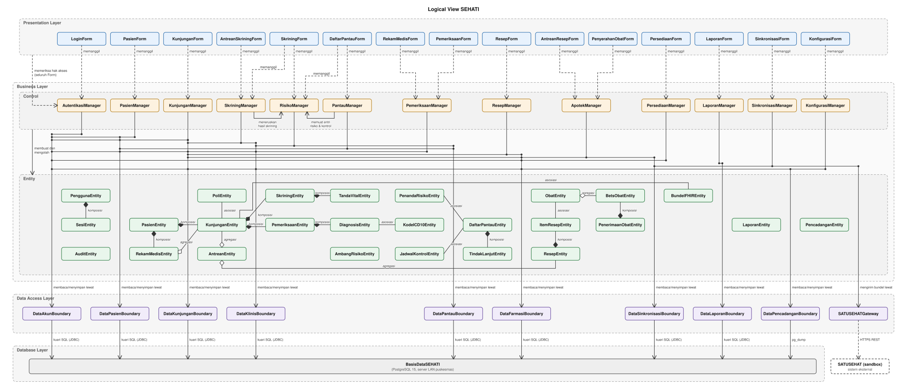
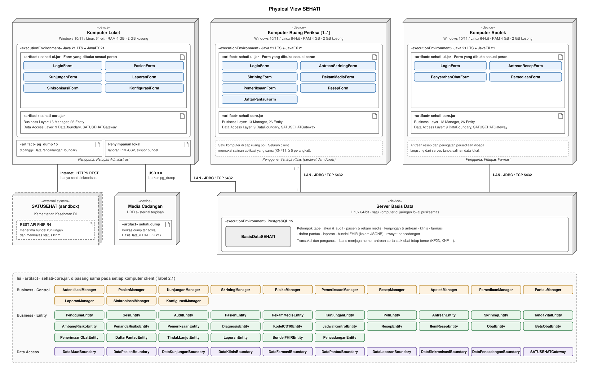

<h1>
IF2150 REKAYASA PERANGKAT LUNAK
 
TUGAS 6
 
ARSITEKTUR PERANGKAT LUNAK (APL)
</h1>
 

## SEHATI - Sistem Elektronik Pelayanan Kesehatan Terintegrasi

### Untuk: Made Branenda Jordhy

Dipersiapkan oleh:

| Informasi | Keterangan |
| --- | --- |
| Kelas | K02 |
| Kelompok | G09 |
| Nama Kelompok | Cumlaude |

| NIM | Nama |
| --- | --- |
| 13525008 | Malik Arsyafiandra Madani |
| 13525044 | Steven Vanako |
| 13525071 | Muhammad Adnan Kurniawan |
| 13525074 | Axeleon Justin Algianto |
| 13525110 | Fachry Azriel Fajdwani |

---

 
 

# BAB 1: Style/Pattern Arsitektur Acuan

SEHATI memakai **Layered Architecture** sebagai acuan. Sistem dibagi menjadi empat lapisan yang tersusun dari atas ke bawah. Setiap lapisan hanya memakai layanan dari lapisan tepat di bawahnya, dan lapisan bawah tidak pernah memanggil lapisan di atasnya.

| Lapisan | Peran | Isi pada SEHATI |
| :--- | :--- | :--- |
| *Presentation Layer* | Menampilkan layar kepada aktor, menerima masukan dari papan ketik dan tetikus, lalu meneruskan setiap aksi ke *Business Layer*. Lapisan ini tidak menyimpan aturan bisnis dan tidak menyentuh data. | 15 kelas boundary berakhiran `Form` (Subbab 5.1 SKPL). |
| *Business Layer* | Menjalankan alur kerja tiap *use case* dan aturan bisnisnya, seperti validasi NIK, validasi rentang tanda vital, evaluasi risiko, pemeriksaan stok, dan penyusunan bundel FHIR. Lapisan ini juga memegang objek data domain yang diolah selama alur berjalan. | 13 kelas control berakhiran `Manager` dan 26 kelas entity berakhiran `Entity`. |
| *Data Access Layer* | Menerjemahkan permintaan baca dan tulis dari *Business Layer* menjadi kueri ke basis data, menjaga transaksi tetap atomik, serta menjadi satu-satunya pintu ke sistem di luar P/L. | Sembilan komponen akses data berakhiran `DataBoundary` dan `SATUSEHATGateway`. |
| *Database Layer* | Menyimpan seluruh data pelayanan secara persisten dan menangani penguncian baris saat beberapa petugas mengubah data yang sama. | `BasisDataSEHATI` pada PostgreSQL 15. |

Pembagian ini meneruskan kerangka *Entity-Control-Boundary* pada BAB 5 SKPL. Boundary yang disentuh aktor menjadi *Presentation Layer*, sedangkan control dan entity berada bersama di *Business Layer*. Aturan SKPL bahwa boundary tidak pernah menyentuh entity secara langsung kini menjadi aturan antarlapisan: `Form` hanya memanggil `Manager`, dan hanya `Manager` yang memanggil *Data Access Layer*.

**Alasan pemilihan**

1. **Alur bisnis berupa tahapan dengan aktor berbeda.** Pasien melewati loket, skrining, pemeriksaan, dan apotek (Subbab 2.1 SKPL), dan tiap tahap dilayani aktor yang berbeda pada layar yang berbeda. Layar-layar itu memakai aturan dan data yang sama; `KunjunganEntity`, misalnya, dipakai enam *use case*. Menaruh aturan di *Business Layer* membuat setiap layar menerapkan aturan yang sama tanpa salinan logika.
2. **Kebutuhan keamanan menuntut satu titik pemeriksaan.** KF16, KNF04, dan KNF05 mewajibkan otorisasi berbasis peran pada setiap akses data dan jejak audit pada setiap perubahan. Karena *Presentation Layer* tidak bisa melompati *Business Layer*, setiap akses pasti melewati `AutentikasiManager` dan setiap perubahan pasti ditulis ke `AuditEntity`.
3. **Aturan klinis tidak boleh dilewati.** KNF02 melarang jalan pintas pada validasi tanda vital, dan KF11 menahan resep yang stoknya kurang. Kedua aturan berada di *Business Layer*, sehingga tidak ada layar yang dapat menyimpan data tanpa melewatinya.
4. **Konkurensi dan atomisitas terkumpul di lapisan bawah.** KF23 dan KNF11 menuntut nomor antrean dan stok obat tetap benar saat sedikitnya lima perangkat bekerja bersamaan, sedangkan KNF03 dan KNF13 menuntut bundel dan data tersimpan tetap utuh. Transaksi dan penguncian baris ditangani *Data Access Layer* dan PostgreSQL, sehingga *Business Layer* cukup menyatakan langkah mana yang harus berjalan dalam satu transaksi.
5. **Sistem luar terisolasi.** SATUSEHAT hanya dihubungi lewat `SATUSEHATGateway` di *Data Access Layer*. Pelayanan di lapisan atas tetap berjalan penuh saat internet putus (KF22, KNF09), dan perubahan API SATUSEHAT hanya menyentuh satu komponen.
6. **Pembagian kerja tim.** Anggota yang mengerjakan layar JavaFX dapat bekerja terpisah dari anggota yang mengerjakan aturan bisnis maupun skema basis data, selama antarmuka antarlapisan sudah disepakati.

**Penerapan pada SEHATI**

*\[Gambar 1 menyusul: Penerapan Layered Architecture pada SEHATI\]*

**Lingkungan operasi P/L**

Tabel 1.1. Lingkungan Operasi Perangkat Lunak

| Komponen | Spesifikasi |
| :--- | :--- |
| **Aplikasi / Client** | Aplikasi desktop JavaFX 21 di atas Java 21 LTS. JavaFX menyediakan komponen grafik garis untuk KF08 dan berjalan dalam batas RAM 4 GB pada KNF10. |
| **DBMS** | PostgreSQL 15 pada satu komputer server di jaringan lokal puskesmas. Seluruh komputer client mengaksesnya lewat LAN. Kami memilih PostgreSQL karena MVCC dan isolasi transaksinya memenuhi KF23 dan KNF11, dan tipe JSONB-nya dapat menyimpan bundel FHIR (KF20). |
| **Sistem Operasi** | Windows 10/11 64-bit dan distribusi Linux 64-bit. SEHATI mendukung keduanya (KNF10). |
| **Perangkat Keras** | Komputer dengan RAM 4 GB dan ruang penyimpanan kosong 2 GB (KNF10). |
| **Jaringan** | Jaringan lokal untuk berbagi basis data antarkomputer. SEHATI memakai internet untuk sinkronisasi SATUSEHAT saja. |
| **Lainnya** | Penjadwal pencadangan berbasis `pg_dump` (KF21) dan *worker* sinkronisasi yang memanggil REST API *sandbox* SATUSEHAT (KF20). |

Teknologi pada Tabel 1.1 memetakan langsung ke keempat lapisan.

- **JavaFX 21** mengisi *Presentation Layer*. Tiap `Form` menjadi satu layar JavaFX yang menangani tampilan, grafik garis KF08, dan pintasan papan ketik KF24, lalu memanggil `Manager` yang bersesuaian.
- **Java 21** menjalankan *Business Layer* dan *Data Access Layer* dalam proses aplikasi yang sama pada tiap komputer client. Pemisahan lapisan diwujudkan sebagai pemisahan paket dan kelas, bukan sebagai proses terpisah, sehingga aplikasi tetap muat pada batas RAM 4 GB (KNF10).
- **JDBC ke PostgreSQL 15 lewat LAN** menjadi jembatan antara *Data Access Layer* dan *Database Layer*. Transaksi dan penguncian baris PostgreSQL memenuhi KF23 dan KNF11, dan kolom JSONB menyimpan isi bundel FHIR pada `DataSinkronisasiBoundary`.
- **REST API *sandbox* SATUSEHAT** hanya dipanggil oleh `SATUSEHATGateway`, sedangkan **`pg_dump`** hanya dijalankan oleh `DataPencadanganBoundary`. Keduanya berada di *Data Access Layer* karena berhubungan dengan sumber di luar proses aplikasi.

Secara fisik, aplikasi JavaFX pada komputer loket, ruang periksa, dan apotek berbagi satu server PostgreSQL di jaringan puskesmas. Penempatan ini digambarkan pada Subbab 3.2.

---

# BAB 2: Identifikasi Komponen / Modul / Subsistem

Komponen SEHATI dikelompokkan menurut lapisan pada BAB 1. Seluruh 55 kelas SKPL tercakup: 15 boundary berakhiran `Form` di *Presentation Layer*, 13 control dan 26 entity di *Business Layer*, serta `SATUSEHATGateway` di *Data Access Layer*. Sepuluh komponen lain tidak berasal dari diagram kelas. Sembilan `DataBoundary` dan `BasisDataSEHATI` ditambahkan karena *Data Access Layer* dan *Database Layer* membutuhkan komponen tersendiri. Komponen tambahan ini tidak menambah fitur di luar SKPL; masing-masing hanya menyimpan dan membaca entity yang sudah ada.

Tabel 2.1. Identifikasi Komponen/Modul/Subsistem

| Nama Komponen/Modul/Subsistem | Jenis | Penjelasan |
| :--- | :--- | :--- |
| LoginForm | Presentation Layer | Menampilkan layar masuk, menerima nama pengguna dan kata sandi, lalu meneruskannya ke AutentikasiManager. |
| PasienForm | Presentation Layer | Menampilkan kolom pencarian dan formulir data pasien di loket, lalu meneruskan pencarian, pendaftaran, dan penyuntingan ke PasienManager. |
| KunjunganForm | Presentation Layer | Menampilkan pilihan poli dan tiket antrean, lalu meneruskan permintaan kunjungan ke KunjunganManager. |
| AntreanSkriningForm | Presentation Layer | Menampilkan antrean skrining terurut nomor antrean dan meneruskan perintah "Panggil Berikutnya" ke SkriningManager. |
| SkriningForm | Presentation Layer | Menampilkan formulir keluhan dan tanda vital, meneruskan isian ke SkriningManager, lalu meminta penanda risiko dari RisikoManager dan menampilkan peringatan rentang serta penanda risikonya. |
| RekamMedisForm | Presentation Layer | Menampilkan ringkasan rekam medis dan grafik tren tanda vital yang disusun PemeriksaanManager. |
| PemeriksaanForm | Presentation Layer | Menampilkan formulir anamnesis, diagnosis ICD-10, tindakan, dan jadwal kontrol, lalu meneruskan isiannya ke PemeriksaanManager. |
| ResepForm | Presentation Layer | Menampilkan formulir resep beserta indikator stok, lalu meneruskan item resep ke ResepManager. |
| AntreanResepForm | Presentation Layer | Menampilkan antrean resep apotek terurut waktu masuk dan meneruskan pilihan resep ke ApotekManager. |
| PenyerahanObatForm | Presentation Layer | Menampilkan rincian resep dan meneruskan konfirmasi "Obat Diserahkan" ke ApotekManager. |
| PersediaanForm | Presentation Layer | Menampilkan formulir obat masuk dan dasbor peringatan persediaan, lalu meneruskan penerimaan ke PersediaanManager. |
| DaftarPantauForm | Presentation Layer | Menampilkan daftar pantau beserta penyaringnya, meneruskan penyaring dan catatan tindak lanjut ke PantauManager, serta mengambil entri risiko aktif dari RisikoManager. |
| LaporanForm | Presentation Layer | Menampilkan pemilihan rentang tanggal dan pratinjau rekapitulasi, lalu meneruskan permintaan ekspor ke LaporanManager. |
| SinkronisasiForm | Presentation Layer | Menampilkan status setiap bundel dan indikator koneksi, lalu meneruskan perintah sinkronisasi atau "Ekspor Bundel" ke SinkronisasiManager. |
| KonfigurasiForm | Presentation Layer | Menampilkan manajemen akun, data master, dan status pencadangan, lalu meneruskan perubahan ke KonfigurasiManager. |
| AutentikasiManager | Business Layer | Memeriksa kredensial terhadap hash kata sandi, membuka dan mengakhiri sesi (termasuk batas diam 15 menit), serta memeriksa hak akses peran untuk setiap layar. |
| PasienManager | Business Layer | Menjalankan pencarian parsial, memvalidasi NIK 16 digit dan keunikannya, menerbitkan nomor rekam medis, dan memutakhirkan data pasien. |
| KunjunganManager | Business Layer | Membuka kunjungan, menolak kunjungan ganda, dan menerbitkan nomor antrean berurutan per poli per hari. |
| SkriningManager | Business Layer | Memanggil pasien terdepan, memvalidasi rentang fisiologis tanda vital tanpa jalan pintas, menyimpan hasil skrining, lalu meneruskannya ke RisikoManager. |
| RisikoManager | Business Layer | Membandingkan tanda vital terhadap ambang dan riwayat tiga kunjungan, menerbitkan penanda risiko, dan memasukkan pasien ke daftar pantau. |
| PemeriksaanManager | Business Layer | Menyusun ringkasan rekam medis dan seri tren, menyimpan pemeriksaan dan diagnosis ICD-10 khusus dokter, serta menjadwalkan kontrol. |
| ResepManager | Business Layer | Menyusun item resep, memeriksa kecukupan stok, dan meneruskan resep yang lolos ke antrean apotek. |
| ApotekManager | Business Layer | Melayani resep, lalu dalam satu transaksi memotong stok, menandai resep selesai, menutup kunjungan, dan menyusun bundel FHIR. |
| PersediaanManager | Business Layer | Mencatat obat masuk, menambah stok, dan menerbitkan peringatan stok di bawah ambang atau bets 90 hari menjelang kedaluwarsa. |
| PantauManager | Business Layer | Menyaring daftar pantau menurut jenis risiko, tanggal, dan status, lalu mencatat hasil tindak lanjut. |
| LaporanManager | Business Layer | Menghitung rekapitulasi kunjungan dan diagnosis terbanyak per rentang tanggal, lalu menghasilkan berkas PDF dan CSV. |
| SinkronisasiManager | Business Layer | Mengelola antrean bundel, memeriksa koneksi lewat SATUSEHATGateway, lalu mengirim bundel saat daring atau mengekspornya sebagai berkas saat luring. |
| KonfigurasiManager | Business Layer | Mengurus akun staf, data master obat, poli, dan ambang risiko, serta menjadwalkan pencadangan dan memantau hasilnya. |
| PenggunaEntity | Business Layer | Merepresentasikan akun staf beserta hash kata sandi, peran, dan status aktifnya. |
| SesiEntity | Business Layer | Merepresentasikan sesi kerja pengguna sejak masuk sampai keluar atau habis waktu. |
| AuditEntity | Business Layer | Merepresentasikan catatan jejak audit berisi pelaku, waktu, dan deskripsi perubahan. |
| PasienEntity | Business Layer | Merepresentasikan data diri pasien beserta NIK dan nomor rekam medisnya. |
| RekamMedisEntity | Business Layer | Merepresentasikan riwayat klinis pasien: diagnosis lampau, riwayat obat, dan penanda risiko aktif. |
| KunjunganEntity | Business Layer | Merepresentasikan satu kedatangan pasien ke poli beserta nomor antrean dan statusnya. |
| PoliEntity | Business Layer | Merepresentasikan data master poli beserta urutan antrean terakhir hari itu. |
| AntreanEntity | Business Layer | Merepresentasikan daftar urut pada titik layanan skrining, poli, atau apotek. |
| SkriningEntity | Business Layer | Merepresentasikan hasil skrining satu kunjungan beserta keluhan awalnya. |
| TandaVitalEntity | Business Layer | Merepresentasikan nilai tekanan darah, berat, tinggi, suhu, nadi, dan gula darah, termasuk perhitungan IMT. |
| AmbangRisikoEntity | Business Layer | Merepresentasikan data master ambang klinis tiap jenis risiko. |
| PenandaRisikoEntity | Business Layer | Merepresentasikan penanda risiko yang melekat pada kunjungan beserta jenisnya. |
| PemeriksaanEntity | Business Layer | Merepresentasikan anamnesis, tindakan, dan status kunci hasil pemeriksaan dokter. |
| DiagnosisEntity | Business Layer | Merepresentasikan diagnosis kunjungan dalam kode ICD-10. |
| KodeICD10Entity | Business Layer | Merepresentasikan data master kode ICD-10 yang dicari dokter saat mengisi diagnosis. |
| JadwalKontrolEntity | Business Layer | Merepresentasikan rencana kunjungan ulang pasien. |
| ResepEntity | Business Layer | Merepresentasikan resep elektronik satu kunjungan beserta status pelayanannya. |
| ItemResepEntity | Business Layer | Merepresentasikan satu obat pada resep beserta dosis, jumlah, dan aturan pakai. |
| ObatEntity | Business Layer | Merepresentasikan data master obat beserta saldo stok dan ambang minimumnya. |
| BetsObatEntity | Business Layer | Merepresentasikan satu bets obat beserta jumlah dan tanggal kedaluwarsanya. |
| PenerimaanObatEntity | Business Layer | Merepresentasikan catatan obat masuk beserta nomor faktur dan tanggal terimanya. |
| DaftarPantauEntity | Business Layer | Merepresentasikan entri pasien berisiko atau terjadwal kontrol beserta status tindak lanjutnya. |
| TindakLanjutEntity | Business Layer | Merepresentasikan satu upaya menghubungi pasien: jenis kontak, hasil, dan status kedatangan. |
| LaporanEntity | Business Layer | Merepresentasikan hasil rekapitulasi beserta rentang tanggal dan format berkasnya. |
| BundelFHIREntity | Business Layer | Merepresentasikan bundel HL7 FHIR R4 satu kunjungan beserta status pengirimannya. |
| PencadanganEntity | Business Layer | Merepresentasikan catatan satu pencadangan beserta waktu, status, dan lokasi medianya. |
| DataAkunBoundary | Data Access Layer | Membaca dan menyimpan PenggunaEntity, SesiEntity, dan AuditEntity. Catatan audit hanya dapat ditambah, tidak dapat diubah atau dihapus. |
| DataPasienBoundary | Data Access Layer | Menjalankan pencarian parsial berindeks serta membaca dan menyimpan PasienEntity dan RekamMedisEntity. |
| DataKunjunganBoundary | Data Access Layer | Membaca dan menyimpan KunjunganEntity, PoliEntity, dan AntreanEntity, serta mengunci baris urutan poli saat nomor antrean diterbitkan. |
| DataKlinisBoundary | Data Access Layer | Membaca dan menyimpan SkriningEntity, TandaVitalEntity, AmbangRisikoEntity, PenandaRisikoEntity, PemeriksaanEntity, DiagnosisEntity, KodeICD10Entity, dan JadwalKontrolEntity. |
| DataFarmasiBoundary | Data Access Layer | Membaca dan menyimpan ResepEntity, ItemResepEntity, ObatEntity, BetsObatEntity, dan PenerimaanObatEntity, serta mengunci baris stok saat pemotongan agar tidak terjadi *lost update*. |
| DataPantauBoundary | Data Access Layer | Membaca dan menyimpan DaftarPantauEntity dan TindakLanjutEntity beserta kueri penyaringnya. |
| DataLaporanBoundary | Data Access Layer | Menjalankan kueri agregasi kunjungan dan diagnosis, menyimpan LaporanEntity, dan menulis berkas PDF dan CSV ke penyimpanan lokal. |
| DataSinkronisasiBoundary | Data Access Layer | Membaca dan menyimpan BundelFHIREntity dengan isi bundel pada kolom JSONB, serta menulis berkas ekspor bundel saat luring. |
| DataPencadanganBoundary | Data Access Layer | Menjalankan `pg_dump` sesuai jadwal ke media penyimpanan terpisah dan menyimpan PencadanganEntity. |
| SATUSEHATGateway | Data Access Layer | Memeriksa koneksi internet dan mengirim bundel ke REST API *sandbox* SATUSEHAT, lalu mengembalikan status pengiriman ke SinkronisasiManager. |
| BasisDataSEHATI | Database Layer | Basis data PostgreSQL 15 di server LAN puskesmas yang menyimpan seluruh tabel data pelayanan secara persisten dan menangani transaksi serta penguncian baris. |

Tabel 2.2 menelusuri setiap *use case* SKPL ke komponen yang menjalankannya pada tiap lapisan. Seluruh dua belas *use case* tercakup.

Tabel 2.2. Pemetaan Use Case ke Komponen

| ID UC | Presentation Layer | Business Layer (Control) | Data Access Layer |
| :--- | :--- | :--- | :--- |
| UC01 | LoginForm | AutentikasiManager | DataAkunBoundary |
| UC02 | PasienForm | PasienManager | DataPasienBoundary, DataAkunBoundary |
| UC03 | KunjunganForm | KunjunganManager | DataKunjunganBoundary, DataPasienBoundary, DataAkunBoundary |
| UC04 | AntreanSkriningForm, SkriningForm | SkriningManager, RisikoManager | DataKunjunganBoundary, DataKlinisBoundary, DataPantauBoundary |
| UC05 | RekamMedisForm, PemeriksaanForm | PemeriksaanManager | DataPasienBoundary, DataKlinisBoundary, DataKunjunganBoundary, DataAkunBoundary |
| UC06 | ResepForm | ResepManager | DataFarmasiBoundary, DataKunjunganBoundary |
| UC07 | AntreanResepForm, PenyerahanObatForm | ApotekManager | DataFarmasiBoundary, DataKunjunganBoundary, DataSinkronisasiBoundary |
| UC08 | PersediaanForm | PersediaanManager | DataFarmasiBoundary, DataAkunBoundary |
| UC09 | DaftarPantauForm | PantauManager, RisikoManager | DataPantauBoundary, DataPasienBoundary, DataKlinisBoundary |
| UC10 | LaporanForm | LaporanManager | DataLaporanBoundary |
| UC11 | SinkronisasiForm | SinkronisasiManager | DataSinkronisasiBoundary, SATUSEHATGateway |
| UC12 | KonfigurasiForm | KonfigurasiManager | DataAkunBoundary, DataKunjunganBoundary, DataKlinisBoundary, DataFarmasiBoundary, DataPencadanganBoundary |

Seluruh `Form` juga memanggil AutentikasiManager untuk memeriksa hak akses peran sebelum layar dibuka (KF16), dan seluruh komponen *Data Access Layer* kecuali SATUSEHATGateway membaca dan menulis BasisDataSEHATI.

---

# BAB 3: Model Arsitektur Perangkat Lunak

Arsitektur SEHATI digambarkan lewat dua *view* dari model 4+1 Kruchten. *Logical View* memperlihatkan pembagian fungsi dan relasi antarkomponen pada tiap lapisan, sedangkan *Physical View* memperlihatkan di mana komponen-komponen itu dijalankan. Kedua *view* memakai nama komponen yang sama dengan Tabel 2.1.

## 3.1 Logical View

*Logical View* menggambarkan SEHATI sebagai kumpulan komponen fungsional beserta layanan yang saling dipakai antarkomponen untuk memenuhi kebutuhan fungsional. *View* ini tidak membahas di komputer mana komponen dijalankan. Yang diperlihatkan adalah lapisan tempat setiap komponen berada, komponen yang dipanggilnya, dan data domain yang diolahnya.

Kami memilih *Logical View* karena 12 *use case* dan 24 KF SEHATI tersebar ke 65 komponen. Pembaca perlu melihat `Form` mana memanggil `Manager` mana, serta `DataBoundary` mana yang dipakai tiap `Manager` untuk membaca dan menyimpan data. Tabel 2.2 sudah mencatat pemetaan itu per *use case*, tetapi baru dalam *view* ini terlihat bahwa seluruh relasi mematuhi aturan antarlapisan pada BAB 1: semua panah antarlapisan mengarah ke bawah, tidak ada `Form` yang melompat ke *Data Access Layer*, dan SATUSEHAT hanya tersentuh lewat `SATUSEHATGateway`.

<i>Gambar 2. Logical View SEHATI</i>

Gambar 2 berbentuk *block diagram* yang memuat seluruh komponen Tabel 2.1, dikelompokkan ke empat lapisan BAB 1. *Business Layer* dibagi lagi menjadi sub-kelompok *Control* dan *Entity*. Panah putus-putus berlabel "memanggil" menghubungkan tiap `Form` ke `Manager`-nya, dan satu panah dari seluruh *Presentation Layer* ke `AutentikasiManager` menandai pemeriksaan hak akses sebelum layar dibuka (KF16). Dua relasi antar-`Manager` diambil dari diagram kelas SKPL: `SkriningManager` meneruskan hasil skrining ke `RisikoManager`, dan `PantauManager` memuat entri risiko dan jadwal kontrol dari `RisikoManager`. Panah "membuat dan mengolah" dari *Control* ke *Entity* menandai bahwa objek domain hanya dibuat dan diubah oleh `Manager`. Garis dari tiap `Manager` turun ke jalurnya sendiri, lalu bercabang ke `DataBoundary` yang dipakainya sesuai Tabel 2.2. Titik hitam menandai percabangan, sedangkan garis yang bersilangan tanpa titik tidak saling terhubung. Relasi antar-*entity* (komposisi, agregasi, dan asosiasi) disalin dari diagram kelas keseluruhan SKPL. Di lapisan bawah, setiap `DataBoundary` menjalankan kueri SQL lewat JDBC ke `BasisDataSEHATI`. `DataPencadanganBoundary` menjalankan `pg_dump`, dan `SATUSEHATGateway` mengirim bundel lewat HTTPS ke SATUSEHAT (*sandbox*), sistem luar yang digambar dengan garis putus-putus.

## 3.2 Physical View

*Physical View* menggambarkan pemetaan komponen P/L ke *node* perangkat keras tempat komponen itu dijalankan, beserta jalur komunikasi antar-*node*. Bila *Logical View* menjawab komponen mana memanggil komponen mana, *Physical View* menjawab komponen itu terpasang di komputer mana, berjalan di atas lingkungan eksekusi apa, dan lewat jaringan apa datanya berpindah.

Kami memilih *Physical View* karena sebagian besar KNF SEHATI adalah kebutuhan tentang penempatan, bukan tentang fungsi. SEHATI dipasang di beberapa komputer sekaligus (loket, ruang periksa, dan apotek) yang berbagi satu basis data di LAN puskesmas, dan KNF11 menuntut sistem tetap benar saat sedikitnya lima perangkat bekerja bersamaan. Pelayanan juga harus berjalan penuh tanpa internet (KF22, KNF09), sedangkan internet hanya dipakai untuk sinkronisasi ke SATUSEHAT (KF20), dan pencadangan harus disimpan ke media terpisah (KF21). Hal-hal ini hanya terlihat jelas bila komponen digambar di atas komputer tempat ia berjalan. *View* ini juga menjadi bentuk visual Tabel 1.1, karena setiap baris tabel itu (aplikasi, DBMS, sistem operasi, perangkat keras, jaringan, dan pencadangan) muncul sebagai *node*, lingkungan eksekusi, atau jalur komunikasi.

<i>Gambar 3. Physical View SEHATI</i>

Gambar 3 berbentuk *deployment diagram* UML. Ada tiga jenis «device» client, yaitu Komputer Loket, Komputer Ruang Periksa, dan Komputer Apotek, masing-masing dengan spesifikasi minimum KNF10. Komputer Ruang Periksa diberi multiplisitas `1..*` karena tiap ruang poli memiliki komputernya sendiri. Setiap client menjalankan lingkungan eksekusi Java 21 LTS dan JavaFX 21 yang berisi dua *artifact*. `sehati-ui` memuat seluruh `Form`, tetapi yang dapat dibuka di tiap komputer hanya `Form` milik peran penggunanya (KF16), sehingga gambar menuliskan `Form` yang aktif per *node*. `sehati-core.jar` memuat *Business Layer* dan *Data Access Layer* dan isinya sama di setiap client. Rincian isi `sehati-core.jar` dituliskan sekali pada panel bawah agar seluruh 65 komponen Tabel 2.1 tetap tercakup tanpa ditulis berulang.

Seluruh client terhubung ke «device» Server Basis Data lewat jalur berlabel "LAN · JDBC / TCP 5432". Server menjalankan PostgreSQL 15 yang berisi `BasisDataSEHATI`, dan transaksi serta penguncian barisnya menjaga nomor antrean dan stok obat saat beberapa client menulis bersamaan (KF23, KNF11). Hanya Komputer Loket yang memiliki jalur keluar ke internet. Jalur "Internet · HTTPS REST" dipakai `SATUSEHATGateway` saat Petugas Administrasi menjalankan sinkronisasi, dan SATUSEHAT (*sandbox*) digambar dengan garis putus-putus karena berada di luar puskesmas. Bila jalur ini putus, hanya sinkronisasi yang tertunda, sedangkan jalur LAN yang dipakai pelayanan tetap berjalan (KNF09). Komputer Loket juga menyimpan berkas laporan PDF/CSV dan berkas ekspor bundel di penyimpanan lokal, serta menjalankan `pg_dump` lewat `DataPencadanganBoundary`. Hasil *dump* ditulis ke «device» Media Cadangan berupa HDD eksternal yang terhubung lewat USB, terpisah dari server basis data (KF21).

---

# Referensi

- Sommerville, I. (2016). *Software Engineering* (10th ed.). Pearson. Chapter 6: *Architectural Design*: [https://software-engineering-book.com/slides/](https://software-engineering-book.com/slides/)
- Kruchten, P. B. (1995). The 4+1 View Model of Architecture. *IEEE Software*, 12(6), 42–50. [https://doi.org/10.1109/52.469759](https://doi.org/10.1109/52.469759)
- Kelompok K02-G09. (2026). *Spesifikasi Kebutuhan Perangkat Lunak SEHATI* (Tugas 5), `docs/M5/K02_G09_SKPL.md`. Dirujuk pada BAB 1 (Tabel 1.1, KF, dan KNF) dan BAB 2 (55 kelas dan 12 *use case*).
- Diagram arsitektur: [https://www.drawio.com/](https://www.drawio.com/), [https://staruml.io/](https://staruml.io/)
