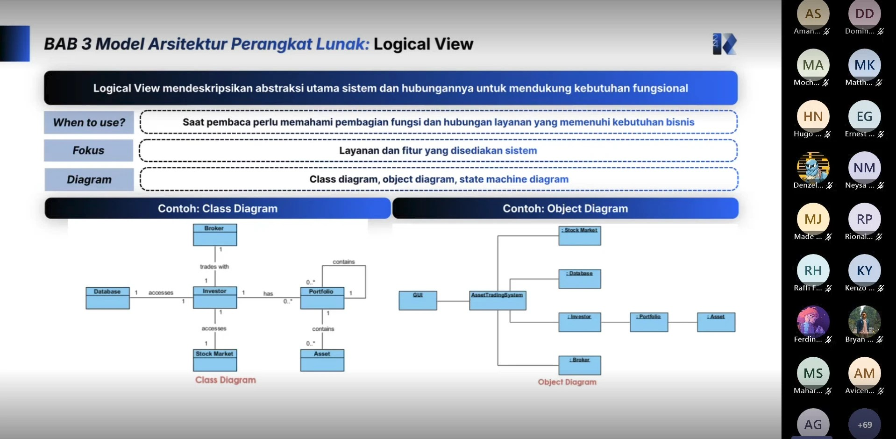

# Form Asistensi

## Tugas Besar IF2150 - Rekayasa Perangkat Lunak

| Informasi | Keterangan |
| --- | --- |
| **Hari** | Jumat |
| **Tanggal** | 02/10/2026 |
| **Kelas** | K02 |
| **Nomor Kelompok** | G09 |
| **Nama Kelompok** | Cumlaude |
| **Nama Perangkat Lunak** | SEHATI (Sistem Elektronik Pelayanan Kesehatan Terintegrasi) |
| **Dokumen** | K02_G09_APL.md (Tugas 6 - Arsitektur Perangkat Lunak), Asistensi Akbar |

### Anggota Kelompok

| NIM | Nama |
| --- | --- |
| 13525008 | Malik Arsyafiandra Madani |
| 13525044 | Steven Vanako |
| 13525071 | Muhammad Adnan Kurniawan |
| 13525074 | Axeleon Justin Algianto |
| 13525110 | Fachry Azriel Fajdwani |

### Catatan

| Catatan |
| --- |
| 1. SKPL adalah baseline final; ketiga bab APL menjelaskan satu rancangan yang sama (BAB 1 pattern, BAB 2 komponen, BAB 3 relasi). |
| 2. Pilih minimal satu style/pattern. MVC cenderung terlalu dangkal bila dipakai sendirian; Layered cocok bila UI, aturan bisnis, dan penyimpanan perlu batas yang jelas. |
| 3. Diagram BAB 1 diisi nama komponen dan kelas milik P/L sendiri, dan Tabel 1.1 disalin persis dari Subbab 2.5 SKPL. |
| 4. Tabel 2.1: kolom Jenis mengikuti pattern, seluruh kelas SKPL tercakup, dan seluruh use case dapat dijalankan. |
| 5. BAB 3 minimal satu view (Logical, Process, Development, atau Physical) untuk keseluruhan sistem, memuat seluruh komponen Tabel 2.1 dengan relasi berlabel. |

## Dokumentasi

<!--  -->

  

  <i>Gambar 1. Dokumentasi kegiatan asistensi.</i>

